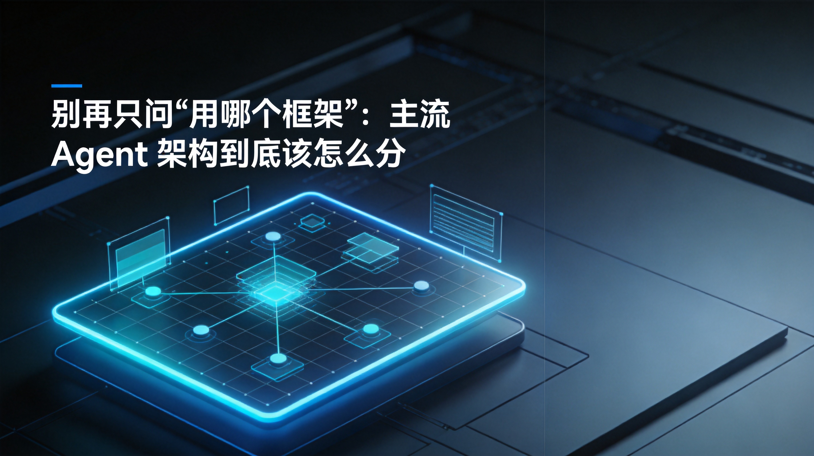
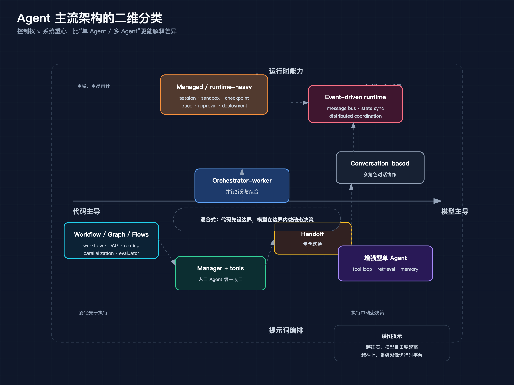
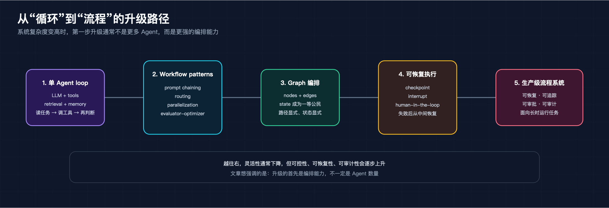
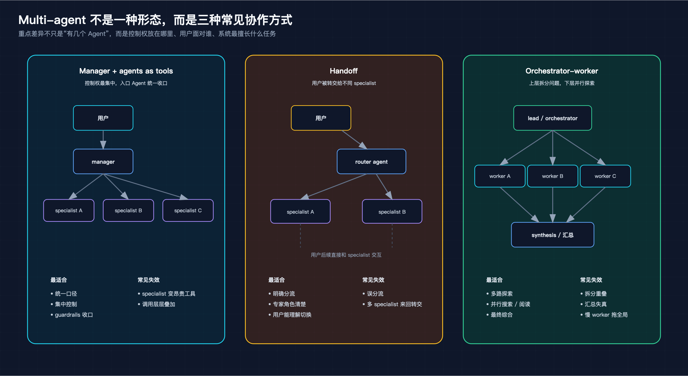
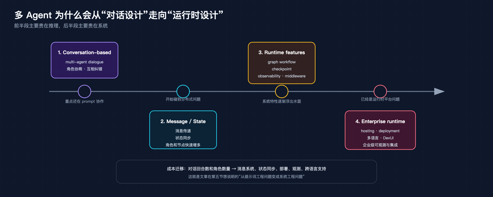
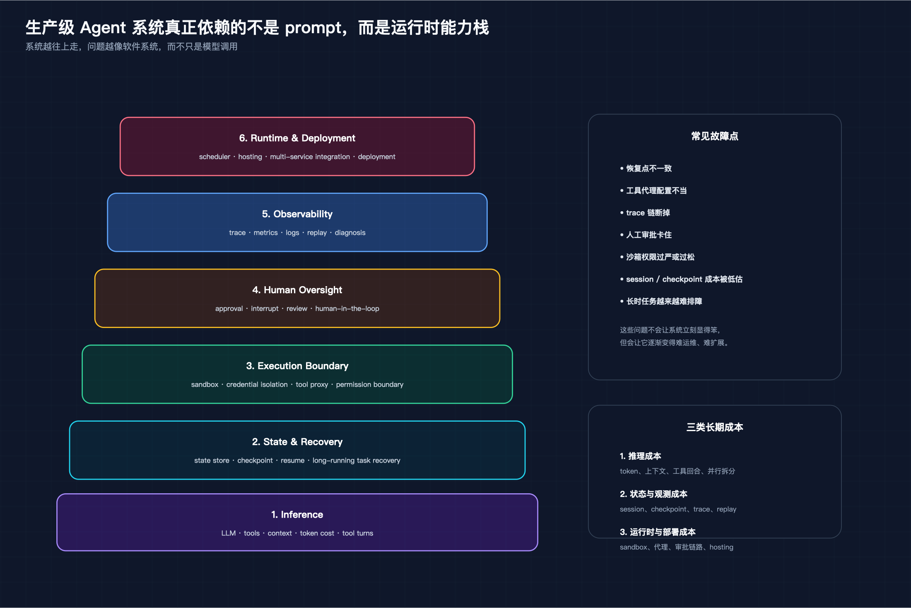

# 别再只问“用哪个框架”：主流 Agent 架构到底该怎么分

关于 Agent 架构，最常见的问题是：该做单 Agent，还是多 Agent？

这个问法不算错，但经常会把讨论带偏。现实里的系统很少沿着“1 个到 N 个”这条线演化。真正变化的，往往是流程由谁控制、状态放在哪里、失败后怎么恢复，以及系统究竟还停留在提示词编排，还是已经长成一个带运行时能力的应用。

也因此，只看框架名字很容易误判。OpenAI Agents SDK、LangGraph、AutoGen、CrewAI、Microsoft Agent Framework 看起来都在做 Agent，但它们解决的问题并不一样。把这些东西放进同一张“框架排行榜”里比较，通常不会得到什么有用结论。

如果要给主流 Agent 架构找一套更稳的分类坐标，我更愿意先看两条主轴：

1. **控制权在代码还是模型**
2. **系统重心在提示词编排还是运行时能力**

第一条轴决定下一步谁说了算，第二条轴决定系统到底有没有开始像一个应用平台。把这两条轴放在一起，很多原本搅在一起的问题就容易看清了。

> 这张图把全文的主论点压成一张矩阵：横轴看控制权，纵轴看系统重心，比“单 Agent / 多 Agent”更容易看清各类系统的差异。

---

## 一、第一层分类：控制权到底在代码还是模型

先看第一条轴：**谁决定下一步做什么**。

最左边是代码主导（code-first）。这类系统里，路径主要由代码定义。流程先被写成一条确定的路，再让模型填其中若干环节。典型形态是 workflow、DAG、graph、flows。Anthropic 在《Building Effective AI Agents》里列出的 prompt chaining、routing、parallelization、evaluator-optimizer，本质上都属于这一类。

最右边是模型主导（model-first）。路径不是先写死，而是让模型在循环里根据环境反馈自己决定。单 Agent loop、autonomous agent 都是这一路。你给模型工具、上下文和目标，它边看结果边判断下一步是继续搜索、调用工具，还是结束任务。

中间还有一大片现实里最常见的区域，可以叫混合式。代码先定义边界，模型在边界内做动态决策。很多生产系统最后都会落到这里：你不会把流程完全交给模型，也不会把每一步都写死。OpenAI Agents SDK 里 manager 调 specialist 的模式、LangGraph 里带状态的图式编排，都有这种混合特征。

这条轴之所以重要，是因为它直接决定系统的性格。

控制权更多在代码，系统通常更稳、更好测、更容易审计，但灵活性会低一些；控制权更多在模型，系统通常更灵活，能处理更开放的问题，但成本、调试难度和不确定性也会一起上来。很多团队选型时，嘴上问的是“要不要多 Agent”，真正该问的其实是：**这个问题，到底值不值得把更多控制权交给模型。**

---

## 二、最基础的形态：增强型单 Agent 循环

很多人一谈复杂系统就想到 multi-agent，好像问题一复杂，架构就必须立刻分成多个角色。多数系统的起点其实没那么戏剧化，还是增强型单 Agent 循环。

它的结构很朴素：一个 LLM、一组工具，再加上可选的 retrieval 和 memory。运行方式也简单，就是一个循环：读任务、想下一步、调工具、读结果、继续往下走。

Anthropic 把这类系统概括成 augmented LLM。这个说法很准，因为它提醒了一个事实：很多所谓的 Agent，并不需要复杂架构。只要把模型和工具接口接好，把上下文组织好，就已经能完成大量任务。

这种形态的优点也很直接。第一是简单，系统边界清楚；第二是调试成本低，出了问题更容易定位；第三是起步成本低，适合先验证场景价值。很多编码助手、轻量客服、个人效率工具，走到这一步其实已经够用了。

它的成本结构也最直白。主要成本集中在两层：一层是推理本身，也就是上下文变长之后的 token 消耗；另一层是工具回合数，工具调用越多、重试越多，单次任务的价格和时延就涨得越快。相比之下，它的基础设施成本最低，因为几乎不需要额外的调度、持久化和跨节点协作。

这类系统的失败方式也很典型：工具文档不清，模型就会来回试错；局部任务一旦卡住，就可能不断重试；上下文被一轮轮工具结果撑大之后，结果不是答非所问，就是成本失控。单 Agent 不是不能失败，只是它通常失败得更直接，也更容易被看见。

它的边界同样明确。一旦任务开始变宽、变长、变并行，单 Agent loop 就会吃力。所谓“宽”，是问题要同时向多个方向探索；所谓“长”，是任务链条很长，中间还要保存大量状态；所谓“并行”，是系统要同时处理多个子任务并在最后汇总。再往前走，单个 Agent 的上下文压力会越来越大，错误也更容易叠加。

所以单 Agent loop 的价值，不只是简单，而是它能先帮你回答一个更关键的问题：**这个场景到底需不需要更复杂的架构。** 如果一个增强型单 Agent 已经能把问题解决到八十分，那么继续往上堆多 Agent、图式编排、分布式运行时，很多时候不是工程优化，而是把复杂度提前透支。

---

## 三、从“循环”到“流程”：Workflow、Graph、Flows

当单个循环开始不够用时，很多系统真正需要的第一步升级，并不是更多 Agent，而是更强的编排。

Anthropic 那篇文章最有价值的一点，就是把几种常见的 workflow pattern 单独拎了出来。prompt chaining 适合固定顺序的多步任务；routing 适合把不同类型的问题送进不同路径；parallelization 适合把可独立的子任务并行展开；evaluator-optimizer 适合需要反复打磨、反复评审的场景。它们的共同点很清楚：**路径先于执行而存在。**

LangGraph 把这条路往前推进了一大步。它不只是画流程图，而是把状态当作一等公民来建模。节点和边负责定义执行结构，state 负责保存上下文，checkpoint 负责让任务在失败后恢复，interrupt 一类机制又让人类可以在中途插手。到了这一步，系统已经不只是“让模型按顺序做几步事”，而是在往一个可运行、可恢复、可审计的应用靠拢。

CrewAI 的 Flows 也很有代表性。它把 Flows 和 Crews 明确拆成两层：Flows 负责 orchestration，Crews 负责执行。这提醒了一个经常被忽略的事实：很多所谓多 Agent 系统，核心并不是 Agent 本身，而是**上层流程控制和下层 Agent 执行之间的关系**。如果这层关系没理顺，Agent 再多也只会让系统更乱。

这类架构的强项，是把路径、状态和人工介入点都显式化。它们特别适合阶段明确、质量要求高、需要人工审批或可追踪的场景，比如企业流程、文档处理、合规链路、长时运行任务。

它们的成本结构和单 Agent 不一样。这里最大的成本，往往不在模型多跑了几轮，而在前期建模：流程怎么拆、状态怎么存、哪些节点能并行、哪些节点要人工确认，都得先设计清楚。跑起来之后，推理成本通常比自由 Agent 更可预测，但会新增持久化、状态管理、审批节点和恢复机制的维护成本。

这类系统最常见的失败方式，也不是模型乱跑，而是流程设计和真实任务不匹配：路由条件切错、分支太多导致维护困难、checkpoint 接错状态、人工审批点变成系统瓶颈。它通常失败得更工程化，不是答错一句话，而是整条流程在某个节点开始变脆。

它们的边界也很明显。workflow、graph、flows 的可控性很强，但代价是灵活性下降。对于新奇度很高、很难预定义结构的任务，过早把路径写死，反而会把系统束住。你会得到一个很稳的流程，但不一定得到一个足够聪明的系统。

> 这张图对应第三节：系统变复杂时，先升级的通常是编排能力，再往后才是更重的运行时和更多角色协作。

---

## 四、多 Agent 的第一条主线：Manager、Handoff 和 Orchestrator-Worker

说到 multi-agent，很多文章会把所有形态混成一类。其实至少有三种差别很大的协作方式，它们适合的也不是同一种问题。

第一种是 **manager + agents as tools**。OpenAI Agents SDK 把这种模式讲得很清楚：manager Agent 始终掌握全局，specialist Agent 只是被调用来完成受限子任务。specialist 不接管用户面对的会话，它更像一个能力模块，只不过这个模块本身也是 Agent。这个模式的优点是控制权集中、输出口径统一、guardrails 容易收拢，适合你希望“一个大脑统一收口”的系统。

第二种是 **handoff**。这里不是 manager 调一个内部工具，而是入口 Agent 识别当前问题属于哪个 specialist，然后把后续交互直接交给后者。这样做的好处是角色边界更清晰，specialist 的 prompt 可以更聚焦，用户面对的也是更明确的“专家”。它很适合客服分流、销售转技术支持、通用入口转专项处理这类场景。它的风险也很直观：如果 handoff 设计得不好，系统就会在不同 Agent 之间来回踢皮球。

第三种是 **orchestrator-worker**。这条路线在 Anthropic 的多智能体研究系统里体现得最完整。上层 lead Agent 先理解问题，再把问题拆成多个可以并行探索的方向，下层 subagents 各自去搜索、阅读、整理，最后把结果回传给上层做综合。这个模式真正擅长的不是“更像团队”，而是“更能并行”。它把一个大问题展开成多个可以同时推进的小问题，因此特别适合宽任务。

三种模式的差异，说到底还是控制权和用户面的差异。manager 模式里，控制权最集中；handoff 模式里，控制权会在角色之间转移；orchestrator-worker 模式里，控制权集中在上层，但执行被大规模并行展开。它们都属于多 Agent，但并不回答同一个问题。

它们的成本结构也不一样。manager 模式的额外成本主要来自 specialist 调用和上下文复制；handoff 的成本主要来自角色切换后的会话延续和 prompt 重建；orchestrator-worker 的成本最高，因为它天然会把 token 开销从单条链路放大成“拆分、并行执行、汇总”三层。

失败模式也各不相同。manager 模式容易把 specialist 用成昂贵的内部工具，导致调用层层叠加；handoff 容易误分流，或者在多个 specialist 之间来回转交；orchestrator-worker 最常见的问题则是拆分重叠、汇总失真，以及某个慢 worker 把整条链路拖住。

如果任务重点是统一口径和集中控制，manager 模式更合适；如果重点是角色切换和专业分流，handoff 更合适；如果重点是多路探索和结果综合，orchestrator-worker 更合适。把这三件事混成同一种“multi-agent 能力”，通常就是系统设计开始失控的起点。

> 这张图把 manager、handoff、orchestrator-worker 并排放在一起，读者可以直接看到它们在控制权、用户界面和失效方式上的差异。

---

## 五、多 Agent 的第二条主线：Conversation-based 到 Event-driven Runtime

除了 manager、handoff、orchestrator-worker 这条线，还有另一条完全不同的 multi-agent 演进路线：**把对话本身当作协作协议**。

AutoGen 论文最早把这件事讲得很明确。它的核心思想不是 workflow，也不是 graph，而是让多个 Agent 通过对话来协作。这里，conversation 不只是交互形式，而是架构机制。Agent 可以互相提问、互相补充、互相纠错，问题分解和信息交换都发生在多轮对话里。

这和单 Agent tool loop 的差异很大。单 Agent tool loop 里，决策中心通常是单一的，工具调用也是线性展开；AutoGen 这一派则把问题求解过程分散到多个角色之间，让“谁来做、怎么做、怎么协调”都在对话中展开。这类系统更接近一个协作网络，而不是一个中心化流水线。

但这条路线继续往前走，很快就会从提示词工程问题变成系统工程问题。因为一旦 Agent 变多、角色变多、节点变多，你很快就会开始关心新的事情：消息怎么传、状态怎么存、失败怎么恢复、部署怎么做、跨语言怎么支持、trace 怎么打通。

这也是为什么从 AutoGen 再看到 Microsoft Agent Framework，会明显感觉到重心变了。后者依然做多 Agent 和工作流，但它强调的已经不是“让几个 Agent 对话起来”本身，而是 graph workflows、checkpoint、observability、middleware、hosting、DevUI、多语言支持这些更像运行时的东西。换句话说，这条路的自然终点不是“让对话更聪明”，而是“把多 Agent 协作变成一个企业可运行、可部署、可观测的系统”。

所以 AutoGen 和 LangGraph 不该被简单看成谁替代谁。它们更像是在不同问题上，把不同维度推到了前面：一个强调 conversation-based coordination，一个强调显式状态和运行时能力。Microsoft Agent Framework 则代表了一个更进一步的工程化方向，把这些能力收编成更完整的框架。

这条路线的成本，前半段主要花在对话回合数和角色数量上，后半段则会迅速转成运行时成本：消息系统、状态同步、部署、观测、跨语言支持，都会成为新的开销来源。也就是说，conversation-based multi-agent 一开始贵在推理，event-driven runtime 往后贵在系统。

它的失败方式也更分层。前期常见的是对话失控：角色重复劳动、讨论拉长、决策迟迟不收敛；后期则更像分布式系统问题：消息顺序错乱、状态不一致、某个节点失败后整条协作链难以回放。

> 这张图强调的是一条能力演进线：多 Agent 一开始像对话设计，往后走就会越来越像系统工程。

---

## 六、真正的分水岭：运行时能力开始成为主角

如果只从 prompt 和 Agent 数量来理解主流架构，很容易漏掉这几年最重要的变化：**越往生产走，系统讨论的重心越会从编排转向运行时。**

所谓运行时能力，不只是“这个框架支不支持 memory”这么简单。真正关键的是：state 是否外置，checkpoint 是否可靠，任务失败后能否从中间恢复，工具执行是否被隔离，凭证是否能留在沙箱外，人类是否能在中途介入，整个系统是否有足够好的 trace、metrics、middleware 和部署能力。

LangGraph 代表的是把状态、恢复和人工介入做成一等能力。Microsoft Agent Framework 代表的是把图式工作流、观测和企业部署能力一起推进。Anthropic 在多智能体研究系统和 Managed Agents 方向上反复体现出的，则是另一种更平台化的思路：session、harness、sandbox 分离，状态和执行环境解耦，安全边界和恢复路径从一开始就放进架构设计里。

这意味着很多看起来像“Agent 框架差异”的问题，最后都会落到更底层：

- 状态到底在 prompt 里，还是在系统里
- 执行失败是重来，还是恢复
- 工具是模型直连，还是通过代理和权限边界封装
- 人类是在结果出来后审核，还是可以在流程中间插手
- 系统出了问题，是看日志猜，还是有完整 trace 可回放

一旦你开始问这些问题，就说明系统已经不再只是一个“会调工具的 LLM”，而是在向真正的应用平台靠拢。

到了这一层，成本结构已经不再只是模型账单，而是至少有三部分：推理成本、状态与观测成本、运行时与部署成本。前两年很多团队低估的，恰恰是后两项。模型调用贵不贵大家看得见，session 存储、checkpoint、trace、sandbox、代理、审批链路这些长期成本，往往是在系统跑起来以后才开始持续吞预算。

运行时层的失败方式也和 prompt 层不一样。这里更常见的不是一句话答错，而是系统状态出了偏差：恢复点不一致、工具代理配置不当、trace 链断掉、人工审批卡住、沙箱权限过严或过松。这些问题不会让系统立刻显得笨，但会让它逐渐变得难运维、难排障、难扩展。

> 这张图把第六节压成一个分层结构：越往上，问题越像软件系统本身，而不只是模型调用。

---

## 七、适用范围：每种架构到底什么时候开始失效

讨论架构时，只讲优点没什么用。真正有价值的是知道它从哪里开始失效。

增强型单 Agent 循环最适合任务短、目标清晰、工具少而稳定的场景。它从问题变宽、需要多路探索，或者需要强恢复能力时开始失效。很多系统不是做不到，而是继续堆下去会越来越不经济。

Workflow、Graph、Flows 最适合阶段明确、想把系统做稳、需要人工审批和可恢复能力的场景。它们的边界在于任务新奇度太高，结构很难预定义。一旦问题本身还没被理解清楚，就先把流程写死，系统会稳，但也会变笨。

Handoff 适合角色边界清楚、用户也能理解角色切换的场景。它开始失效，通常是因为 specialist 之间其实高度耦合，问题并不能真正分段完成。看上去在切角色，实际上是在不断把上下文撕碎。

Orchestrator-worker 最适合可并行搜索、可并行阅读、需要多路探索再汇总的任务。它的失效边界是强共享上下文任务和严格串行依赖任务。问题如果本质上必须在一个统一上下文里连续推进，那把它切成多个 worker，只会制造协调成本。

Conversation-based multi-agent 适合研究和实验性场景，尤其是多角色协作本身就是求解方法一部分的时候。它不太适合高稳定、高可审计的生产系统，因为自然语言协商本身就是一种更松散的协议。

Event-driven 或 distributed runtime 适合真正的企业系统集成，适合多服务、多语言、多节点协作。它的边界也很明确：对于小团队、小项目、验证期原型来说，这类架构通常太重。你本来想解决业务问题，最后却先花大量时间在解决运行时复杂度。

所以对架构边界最朴素的理解是：**不是越高级越好，而是谁的失效边界离你的问题更远。**

---

## 八、框架地图：不要再把框架选择当成架构选择

如果把前面的分析落到具体框架上，会发现一个很重要的事实：很多框架本身就横跨多种架构形态。

Anthropic 提供了两个关键坐标点。一个是《Building Effective AI Agents》，它把 workflow 和 Agent 的边界讲清楚了；另一个是多智能体研究系统，它展示了 orchestrator-worker 在生产场景下怎样成立。它更像是方法论和工程实践的组合，而不是一个单一框架。

OpenAI Agents SDK 的特点，是用一组最小 primitives 搭出从单 Agent 到多 Agent 的渐进路径：agent、tools、handoff、guardrails、traces，再加上 agents as tools 和 handoff 这两种不同协作方式。它更适合那些希望逐步增加复杂度，而不是一步进入重型运行时的系统。

LangGraph 则把图式工作流、持久化状态、恢复和 human-in-the-loop 放到了非常核心的位置。它强调的不是“更多 Agent”，而是“更稳的执行”。

AutoGen 代表 conversation-based multi-agent 这一派，后来又逐渐往更完整的运行时方向推进。Microsoft Agent Framework 则更明显地把这种方向工程化、企业化了。

CrewAI 很有意思，因为它把 workflow orchestration 和 Agent execution 显式分层：Flows 管流程，Crews 干活。它提醒我们，很多系统根本不是在“二选一”，而是在做组合。

所以真正有用的问题不是“哪个框架最强”，而是：

- 你的控制权想放在哪里
- 你的协作方式更像 manager、handoff、worker，还是 conversation
- 你的系统问题到底是编排问题，还是运行时问题

只有先回答这些，框架选择才会变得有意义。

---

## 九、结尾：Agent 架构不是一棵树，而是一个矩阵

回到一开始那个问题：为什么“单 Agent 还是多 Agent”这个问法不够好？

因为它把真正重要的分歧藏起来了。

主流 Agent 架构并不是一棵从简单到复杂、从单个到多个不断分叉的树，它更像一个矩阵。一条轴是控制权：代码主导、模型主导，或者两者混合；另一条轴是系统重心：停留在提示词编排，还是已经进入运行时设计。

现实里的框架和系统，大多是这两个维度上的不同折中。有人把更多自由交给模型，换取灵活性；有人把更多路径写进代码，换取稳定性；有人把重点放在多 Agent 协作，有人把重点放在 checkpoint、trace、sandbox 和 deployment。它们都在做 Agent，但并不在回答同一个工程问题。

如果一定要给一个最朴素的建议，还是那句老话：**先用最简单能跑通的架构。**

先让问题被解决，再让系统变复杂。只有当复杂度带来明确收益时，多 Agent、Graph、Distributed Runtime、Managed Runtime 才真的有意义。否则，你得到的往往不是更强的 Agent，而是一个更重的系统。

---

## 参考来源

- [Anthropic — Building Effective AI Agents](https://www.anthropic.com/research/building-effective-agents)
- [Anthropic Engineering — How we built our multi-agent research system](https://www.anthropic.com/engineering/multi-agent-research-system)
- [OpenAI Agents SDK](https://openai.github.io/openai-agents-python/)
- [OpenAI Agents SDK — Agent Orchestration](https://openai.github.io/openai-agents-python/multi_agent/)
- [LangGraph](https://github.com/langchain-ai/langgraph)
- [AutoGen Paper — Enabling Next-Gen LLM Applications via Multi-Agent Conversation](https://arxiv.org/abs/2308.08155)
- [Microsoft AutoGen](https://microsoft.github.io/autogen/stable/index.html)
- [Microsoft Agent Framework](https://github.com/microsoft/agent-framework)
- [CrewAI — Flows](https://docs.crewai.com/en/concepts/flows)
- [CrewAI](https://github.com/crewAIInc/crewAI)
