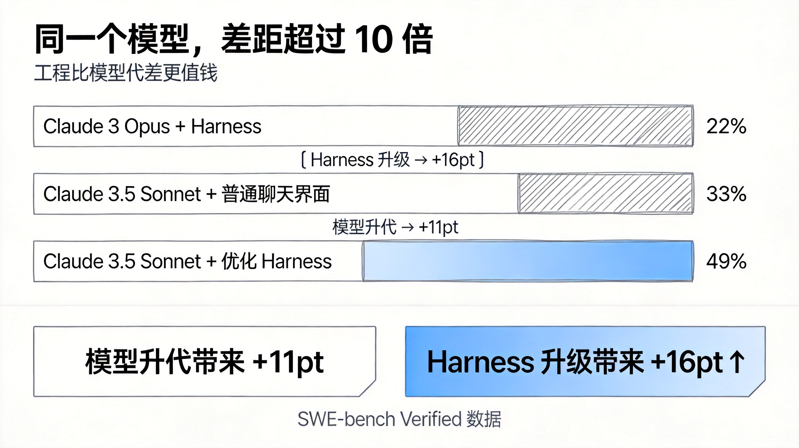
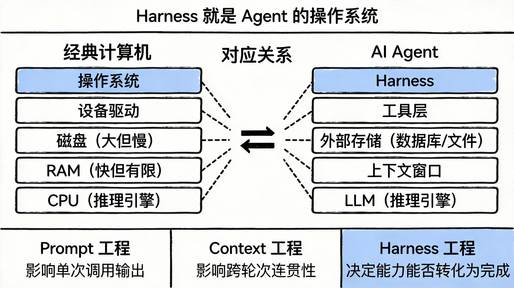
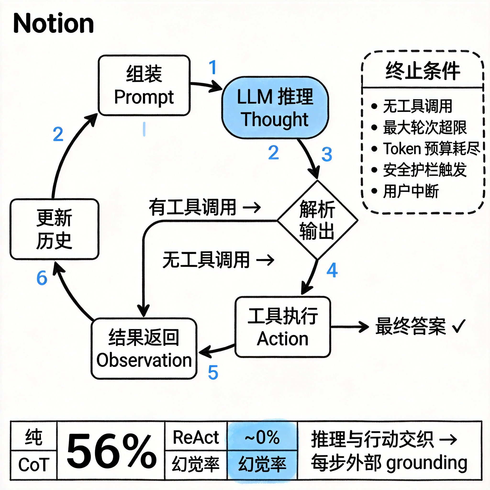
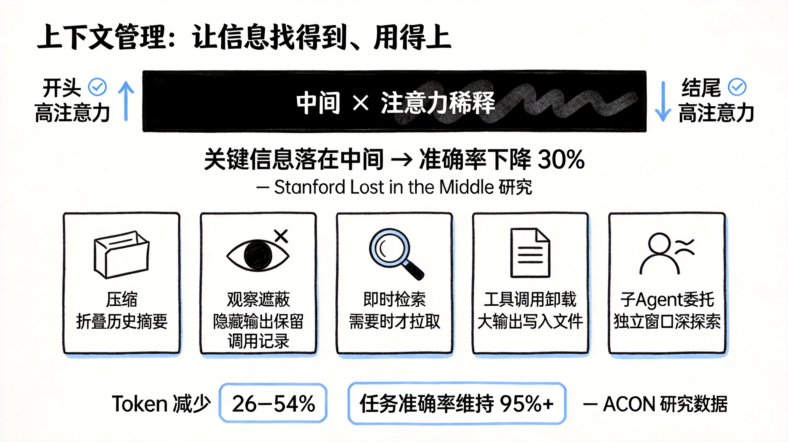
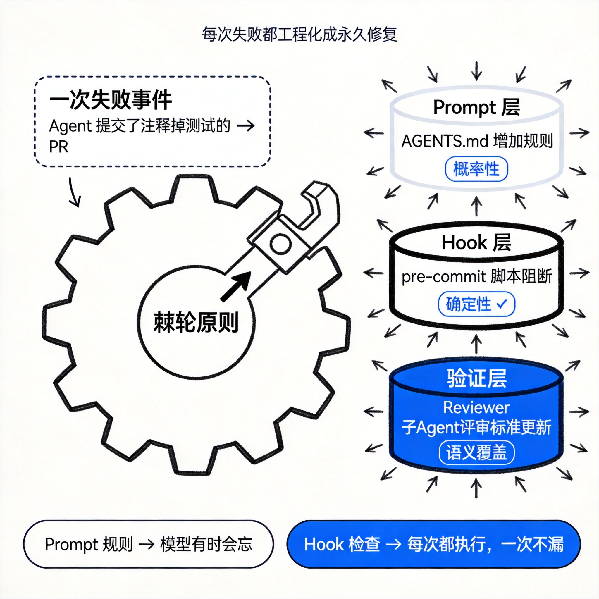
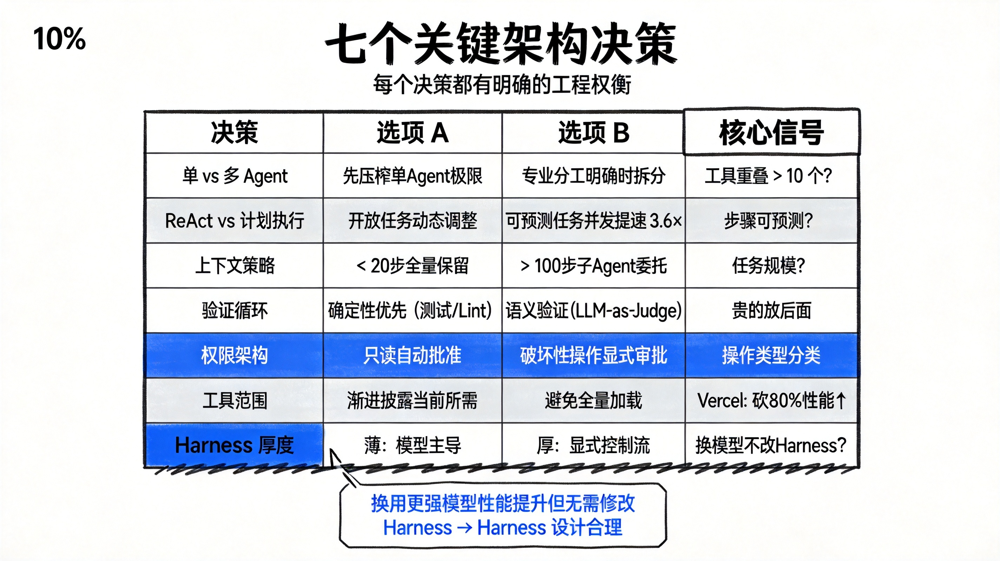

## 同一个模型，为什么差距超过 10 倍

2024 年，Princeton 团队做了一个实验。他们把 GPT-4 扔进一个标准的代码修复基准 SWE-bench，让它解决真实的 GitHub
Issue。模型没变，训练数据没变，只有一件事不同：把模型接入的那套基础设施，重新设计了一遍。

结果：通过率从 3.8% 跳到了 12.5%。

同年，Anthropic 的工程团队把 Claude 3.5 Sonnet 接入一套两个工具的精简框架——Bash 加 Edit——再加上一个强制使用绝对路径的约束。SWE-bench
Verified 得分：49%。

而用同一个 Claude 3.5 Sonnet，接入一个普通的聊天界面：33%。

接入更老的 Claude 3 Opus：22%。

也就是说，模型换代从 Opus 到 Sonnet 带来了 11 个百分点的提升。但同一个 Sonnet，换一套基础设施，带来了 16 个百分点的提升。

**工程比模型的代差更值钱。**



LangChain 的故事更极端。他们只改动了包裹 LLM 的基础设施——模型权重一字未动——在 TerminalBench 2.0 上，从榜单第 30 名开外直接跳到第
5 名。

这件事有一个名字，刚刚在 2026 年初被正式命名：**Agent Harness**。

Addy Osmani 的定义直接：

> "The gap between what today's models can theoretically do and what you actually see them doing is largely a harness
> gap."

模型的理论能力和你实际看到的表现之间，本质上差的是 Harness。

这篇文章要讲清楚这个距离从哪来，以及怎么缩短它。

***

## 第一部分：Harness 是什么

### 定义

三个来自业界的等价定义：

Anthropic 的 Claude Code 官方文档写道："the SDK is the agent harness that powers Claude Code"。OpenAI 的 Codex 团队把 "
agent" 和 "harness" 当同义词用，指代模型以外的全部基础设施。LangChain 的 Vivek Trivedy 给出了最简洁的公式：

> **"If you're not the model, you're the harness."**

具体来说，一个 Harness 包含：

* 系统提示、CLAUDE.md、AGENTS.md、技能文件、子 Agent 指令
* 工具、技能、MCP 服务器及其技术描述
* 打包的基础设施：文件系统、沙箱、无头浏览器
* 编排逻辑：生成子 Agent、处理交接、路由模型
* Hooks 和中间件：确定性执行，如 lint 检查、上下文压缩
* 可观测性工具：日志、追踪、成本和延迟计量

**Agent** 是涌现的行为，用户交互的那个目标导向、使用工具、能自我纠错的实体；**Harness** 是产生这个行为的机器。当有人说"我搭了一个
Agent"，他的意思是他搭了一个 Harness，然后把它对准了一个模型。

Claude Code、Cursor、Codex、Aider、Cline——这些都是 Harness。底层用的可能是同一个模型，但你体验到的行为差异，主要来自 Harness
的差异。

### 一个更古老的比喻

2023 年，AI 研究员 Beren Millidge 写了一篇文章，标题叫《Scaffolded LLMs as Natural Language Computers》。他的观察是：

> "We have reinvented the Von Neumann architecture."

因为这是任何信息处理系统自然收敛到的抽象。

| 经典计算机组件   | Agent 等价物       |
|-----------|-----------------|
| CPU       | LLM 本身（推理引擎）    |
| RAM（快但有限） | 上下文窗口           |
| 磁盘（大但慢）   | 外部数据库、向量存储、文件系统 |
| 设备驱动      | 工具集成层           |
| **操作系统**  | **Harness**     |

一个裸 LLM 就是一颗没有 RAM、没有磁盘、没有 I/O 的 CPU。它能做推理，但它不知道时间，不记得昨天发生了什么，也没有办法操作外部世界。Harness
是让它能运转的操作系统。

### 三层工程的区别

围绕模型，有三个同心层级：

**Prompt 工程**：给模型写什么指令。精心设计的系统提示、少样本示例、Chain-of-Thought 引导——都在这一层。这一层影响模型在单次调用中输出什么。

**Context 工程**：管理模型在什么时候看到什么内容。决定什么信息进窗口、什么信息排除在外、以什么顺序排列。这一层影响模型跨越多轮时的连贯性。

**Harness 工程**：包含以上两者，加上整个应用基础设施。工具编排、状态持久化、错误恢复、验证循环、安全执行、生命周期管理——全在这一层。这一层决定模型的能力能否实际转化为任务完成。

Harness 工程不是 Prompt 工程的一个子集，它是一个独立的工程学科。



***

## 第二部分：Harness 的 12 个组件

综合 Anthropic、OpenAI、LangChain 的实践，一个生产级 Agent Harness 有 12 个明确的组件。理解每一个，才能知道自己搭的 Harness
为什么有时好用、有时崩溃。

### 组件一：编排循环

这是 Harness 的心跳。

实现的是 Thought-Action-Observation 循环，也叫 ReAct 循环：组装 Prompt → 调用 LLM → 解析输出 → 执行工具调用 →
把结果喂回去 → 重复，直到任务完成或触发终止条件。

从代码角度，这通常只是一个 while 循环：

```python
while True:
    prompt = assemble(system, tools, memory, history, user_msg)
    output  = llm(prompt)
    if not output.tool_calls:
        return output.text          # 无工具调用 → 最终答案
    for call in output.tool_calls:
        result = execute(call)      # 沙箱执行
        history.append(call + result)
    if steps > MAX_STEPS or tokens > MAX_TOKENS:
        break                       # 安全停止
```

循环本身并不复杂。Anthropic 把运行时描述为"dumb loop"——所有智能在模型里，Harness 只管理轮次。

**为什么循环结构比模型更能决定幻觉率？**

2023 年，Yao 等人发表的 ReAct 论文提供了最清晰的证据。他们在 HotpotQA 多跳问答任务上对比两种方法：纯
Chain-of-Thought（只推理，不行动）和 ReAct（推理与行动交织）。

在 Chain-of-Thought 模式下，模型倾向于编造中间步骤，幻觉率约 56%。

在 ReAct 模式下，每一步推理都要有外部 grounding（查询维基百科），幻觉率降至接近 0%。

关键不是"要不要推理"，而是推理和行动必须**交织**
：推理帮助模型归纳和更新行动计划，行动为下一步推理提供真实的外部信息。只有推理，模型在封闭的文字循环里越走越偏；有了行动，每一步都在检验推理的质量。

循环的另一个关键问题是**终止条件的设计**。终止条件通常是分层的：

* 模型输出了没有工具调用的文本（自然结束）
* 达到最大轮次限制
* Token 预算耗尽
* 安全护栏触发
* 用户主动中断
* 安全拒绝被返回

一个简单的问题可能只需要 1-2 轮；复杂的代码重构任务，可能跨越数十次工具调用。终止条件设计不当，任务未完成就停了，或者永远跑不停，都是
Harness 的问题，不是模型的问题。



### 组件二：工具层

工具是模型的手。

在技术上，工具以 schema 的形式注入 LLM 的上下文：名称、描述、参数类型。模型看到这些 schema，决定要不要调用、调什么参数。工具层本身负责：注册、schema
验证、参数提取、沙箱执行、结果捕获，以及把结果格式化为模型可读的 Observation 返回到循环里。

Claude Code 的工具跨越六类：文件操作、搜索、执行、Web 访问、代码智能、子 Agent 生成。OpenAI Agents SDK 支持三种：原生函数工具（通过
`@function_tool`），托管工具（WebSearch、CodeInterpreter、FileSearch），以及 MCP 服务器工具。

**工具定义是文档工程，不是 API 封装。**

Anthropic 在《Building Effective Agents》里说得很直接：工具定义值得和整体 Prompt 同等量级的精心设计。一个好的工具定义，就像给初级开发者写的文档：

* 名称：动词加名词，明确意图（`read_file`，不是 `file_op`）
* 描述：用途而非实现（"读取文件内容返回字符串"，不是"打开文件句柄并读取字节"）
* 参数 schema：类型、约束、枚举值都要标清楚
* 使用示例：1-2 个具体例子
* 错误行为：失败时返回什么，边界情况如何处理
* 与相邻工具的边界：什么时候用这个而不是那个

SWE-bench 的 Anthropic 实现发现了一个细节：要求模型使用**绝对路径**
，而不是相对路径。就这一个约束，消灭了模型切换目录后找不到文件的整类错误。通过约束参数结构让错误难以发生，而不是依赖模型记住一条规则。

**工具数量悖论：更多工具不等于更强 Agent。**

Vercel 把 v0 的工具数量砍了 80%，性能反而提升了。Claude Code 通过懒加载实现了 95% 的上下文缩减。

原因是工具描述本身占用上下文。30 个工具的完整描述可以轻松消耗数千 token，而这些 token
原本可以放任务相关的上下文。更糟的是，工具数量超过认知阈值后，模型开始在工具之间产生混淆，误选率和参数错误率随之上升。

实践原则：每个步骤只暴露当前步骤所需的工具集合，而不是启动时加载全量工具。这个原则叫**渐进披露（Progressive Disclosure）**。

还有一个安全盲点容易被忽视：工具描述直接注入 Prompt。如果接入了未经验证的第三方 MCP 服务器，那个服务器的工具描述可以在
Agent 开始工作之前就向 Prompt 注入恶意内容——提示注入攻击的一种变体。十个高度专注的工具始终优于五十个有重叠的工具，这既是性能原因，也是安全原因。

### 组件三：记忆

记忆解决的是 LLM 的本质限制：它只知道权重里的内容，以及当前上下文里的内容。上下文窗口有限，权重不会实时更新。记忆层是 Harness
填补这个缺口的机制。

**三个时间尺度：**

**短期记忆**是单次会话内的对话历史。它活在上下文窗口里——快，但受窗口大小限制，会话结束就消失。

**长期记忆**跨会话持久化。各家实现不同：

* Anthropic：CLAUDE.md 项目文件（人类写的项目知识），加上 Agent 自动生成的 MEMORY.md 文件
* LangGraph：用命名空间组织的 JSON Store，通过 `get_store()` 访问
* OpenAI：Sessions，可以用 SQLite 或 Redis 作存储后端

**Claude Code 的三层记忆层级**解决了一个根本矛盾：记忆要有用，就得能被找到；但每次把所有记忆全部加载进上下文，又会把窗口撑爆。

三层的设计是：

1. **轻量索引**：每个条目约 150 字符，始终加载。相当于一本目录
2. **详细主题文件**：完整内容，按需拉取。只有当当前任务需要时才进上下文
3. **原始记录**：完整的历史记录，只通过搜索访问，从不整体加载

这个设计背后有一个关键原则：**Agent 要把自己的记忆当作提示，而不是事实**。行动之前验证实际状态，不要直接信任记忆里写的东西，因为记忆可能过时，文件系统才是当前真相的来源。

### 组件四：上下文管理

上下文管理是很多 Agent 静默失败的地方。

**上下文腐化（Context Rot）**是核心问题。Stanford 的研究"Lost in the Middle"发现：当关键信息落在上下文窗口的中间位置时，模型的信息提取准确率下降超过
30%。模型更擅长处理出现在开头和结尾的信息。

这意味着什么？即使你有百万 token
的上下文窗口，随着历史越堆越多，早期注入的重要指令和约束会被淹没在窗口中间，悄悄失效。上下文窗口变大解决了"装不下"
的问题，但没有解决"找不到"和"注意力稀释"的问题。

**五种生产级上下文管理策略：**

**压缩（Compaction）**：当上下文接近上限时，把对话历史摘要化，折叠成一段精炼的描述，再注回上下文。关键在于压缩什么、保留什么。Claude
Code 的压缩策略：保留架构决策和未解决的 Bug，丢弃冗余的工具输出细节。这个判断需要 Harness
设计者提前想清楚，什么信息具有跨时间的价值，什么信息只是过渡性噪音。

**观察遮蔽（Observation Masking）**：JetBrains 的 Junie
采用的方式——在上下文里保留工具调用记录（模型调用了什么工具），但隐藏工具返回的具体输出。模型能看到自己做过什么，但不需要每次都把几千行的
JSON 结果重新处理一遍。

**即时检索（JIT Retrieval）**：不是预先把可能需要的内容全装进来，而是维护一套轻量的指针或索引，在实际需要时才动态拉取。Claude
Code 用 grep、glob、head、tail 等工具按需读取文件片段，而不是把整个代码库加载进上下文。

**工具调用卸载（Tool-call Offloading）**：当一个工具的输出极其庞大（比如一份 2000
行的日志），不把完整内容放进上下文——而是写入文件系统，上下文只保留关键的头部和尾部摘要，以及文件路径引用。模型知道完整内容在哪，需要时自己去取。

**子 Agent 委托**：把长任务拆分给子 Agent，每个子 Agent 在独立的上下文窗口里深入探索。关键约束：子 Agent 返回的摘要被限制在
1000-2000 token，而不是把整个探索过程的上下文都传回来。广泛探索，但压缩汇报。

ACON 研究提供了量化支撑：通过优先保留推理链而非原始工具输出，token 减少了 26-54%，任务准确率维持在 95%
以上。上下文里大多数工具输出在第一次使用后就成了噪音，而推理链——模型怎么理解这个结果的——才有持久价值。Anthropic 在 Context
Engineering 指南里把目标定义为：找到能最大化期望输出的最小高信号 token 集合。



### 组件五：Prompt 构建

每一轮循环的开始，Harness 都要组装模型实际看到的输入。这个组装过程是有层次的。

OpenAI Codex 的优先级栈从高到低是：

1. 服务端控制的系统消息（最高权限，开发者无法覆盖）
2. 工具定义
3. 开发者指令
4. 用户指令（级联的 AGENTS.md 文件，32 KiB 上限）
5. 对话历史（最低优先级，遇到冲突以上层为准）

**定位原则**来自"Lost in the Middle"的推论：关键内容要放在 Prompt 的开头和结尾，不要让它们漂移到中间。如果系统提示里有五条最重要的约束，它们应该在开头，不是藏在第三段第七条。

这听起来简单，但实践中容易被违反：随着时间推移，系统提示越写越长，早期添加的关键规则被越来越多的说明文字挤到了中间，Agent
开始"忘记"遵循那些规则——不是因为它不懂，而是因为注意力分配上，那些规则已经淡入了背景。

### 组件六：输出解析

现代 Harness 依赖**原生工具调用**：模型返回结构化的 `tool_calls` 对象，而不是需要解析的自由文本。判断逻辑因此变得很干净：

* 有 `tool_calls`？执行它们，把结果塞回去，继续循环
* 没有 `tool_calls`？这就是最终答案，结束

对于需要强制结构化输出的场景，OpenAI 和 LangChain 都支持通过 Pydantic 模型约束输出 schema，让模型只能返回符合预设格式的内容。

但解析失败的情况依然会发生。传统的兜底方案是 `RetryWithErrorOutputParser`：把原始
Prompt、失败的补全结果、以及解析错误描述，一起喂回给模型，让它重试。这个模式粗暴但有效，适合边缘情况的兜底。

### 组件七：状态管理

Agent 在执行过程中积累的所有中间状态——当前任务进度、已完成的步骤、未解决的问题——需要某种方式持久化。如果 Agent
崩溃了、上下文窗口满了、或者用户第二天继续工作，这些状态要能恢复。

不同框架的选择方向各异：

**LangGraph** 把状态建模为类型化字典流过 graph node，用 reducer 函数合并更新。在 super-step 边界自动打
checkpoint，支持任意时刻的恢复，也支持"时间旅行调试"——回滚到任意历史状态重新执行。

**OpenAI** 提供四种互斥策略：应用层自己管理内存、SDK 级别的 Sessions（支持 SQLite 或 Redis）、服务端的 Conversations
API、以及轻量的 `previous_response_id` 链式引用。

**Claude Code** 用最简单直接的方式：git commit 作检查点，进度文件记录当前状态和下一步计划。文件系统就是状态存储，git
历史就是检查点记录。零额外依赖，对开发者完全透明，还自带 diff 工具方便审查。

### 组件八：错误处理

这里有一个关键的数学事实：

**0.99^10 = 0.904**

如果每一步的成功率是 99%，一个 10 步的任务，端到端成功率只有 90.4%。如果每步成功率是 95%，10 步任务的完成率就跌到
59.9%。错误在长链中以指数方式复合，没有错误处理就会系统性失败。

LangGraph 把错误分四类，每类处理策略不同：

* **瞬时错误**（网络超时、API 限速）：指数退避自动重试
* **LLM 可恢复**（工具参数错误、格式不对）：把错误信息作为 `ToolMessage` 返回循环，让模型看到错误然后自我调整
* **用户可修复**（需要额外信息、权限不够）：中断循环，等待人工输入
* **意外错误**（未知异常）：向上冒泡，用于调试

Anthropic 的做法：在工具处理器内部捕获所有失败，把失败转化为错误结果返回给循环，而不是抛出异常让循环崩溃。模型能看到错误，有机会自我纠正，而不是整个任务直接中止。

Stripe 的生产 Harness 设置了一个简单的边界：对同一个错误最多重试两次。超过这个阈值，就不再是"瞬时错误"，需要人工介入。

### 组件九：护栏、Hooks 与安全

**Hooks 是 Harness 的执法层。**

Addy Osmani 的表述最清晰：Hooks 填补了"请求执行一个动作"和"强制执行该动作"之间的空白。它们在生命周期的特定节点触发：工具调用前、文件编辑后、git
commit 前。

Hook 的工作：

* 阻断破坏性命令（防止意外删除、生产数据库写操作）
* 强制自动格式化（节省 token，保持一致性）
* 触发测试套件（在 Agent 继续之前验证代码正确）

**黄金设计原则：成功沉默，失败冗长（Silent on success, verbose on failure）。** 类型检查通过，Agent
什么都听不到，直接继续。类型检查失败，完整的错误信息立刻注入循环，供模型定位问题、自我纠正。成功时不需要"已通过"
的确认消息占位，失败时要足够具体让模型能采取行动。

Hook 和 Prompt 里规则的本质区别：**Hook 是确定性的，Prompt 是概率性的**。在 AGENTS.md 里写"不要注释掉测试"，模型有时会遵守，有时会忘记。在
pre-commit hook 里写一个检测 `.skip(` 的脚本，它每次都会检查，一次不会漏。需要百分百执行的约束，放 Hook；软性建议，放 Prompt。

在安全架构层面，Anthropic 坚持一个原则：权限执行与模型推理在架构上分离。**模型决定它想做什么，工具系统决定是否允许。** Claude
Code 独立管控约 40 个工具能力，每次工具调用前都要过三道关：信任建立（项目加载时）、权限检查（调用前）、高风险操作显式确认（涉及文件删除、生产部署等操作）。

OpenAI SDK 的三层护栏提供了互补的覆盖：输入护栏作用于首个
Agent（过滤恶意输入），输出护栏作用于最终答案（防止有害输出），工具护栏在每次工具调用时触发（细粒度操作控制）。任何一层触发 "
Tripwire"，Agent 立刻停止，不继续执行。

### 组件十：验证循环

这是把 Demo 和生产级 Agent 真正分开的组件。

没有验证循环的 Agent 是盲目的：它执行动作，但不知道结果是不是想要的。它会在错误的方向上越走越深，直到任务失败或用户发现不对。

Anthropic 推荐三种验证方式，各有适用场景：

**基于规则的验证**（测试、Linter、类型检查）：确定性的真实。通过就是通过，失败就是失败，没有歧义。适合代码正确性的验证。

**视觉反馈**（Playwright 截图）：针对 UI 任务。Agent 修改了前端代码，让 Playwright 截图，然后（通过视觉模型或人工）检查渲染结果是否符合预期。

**LLM-as-Judge**（独立子 Agent 评估）：针对语义问题。当"正确与否"不能被自动化规则覆盖时（如文案质量、设计合理性），用一个独立的子
Agent 来评估当前 Agent 的输出。关键是"独立"——评估者和执行者必须分离，防止模型对自己的输出有系统性的正向偏差。

Claude Code 作者 Boris Cherny 的观察值得记住：给模型一种验证自己工作的方式，任务质量提升 2-3
倍。这不是在给模型增加负担，而是给它一面镜子——输出不再是单向的，而是有反馈的。

Martin Fowler 把这套机制分为两种：**Guides**（前馈），在动作发生之前提供引导；**Sensors**（反馈），在动作发生之后观察结果。完善的验证循环两种都要有。

### 组件十一：子 Agent 编排

单个 Agent 的上下文窗口有限，专注单一任务的能力也有限。子 Agent 编排让多个 Agent 协作处理超出范围的任务。

Claude Code 支持三种子 Agent 执行模型：

**Fork**：字节级完整复制父 Agent 的上下文，创建一个完全知情的子 Agent。适合需要完整父上下文的任务。

**Teammate**：子 Agent 在独立的终端面板里运行，通过文件信箱（file-based mailbox）与父 Agent 通信。相互独立，通过文件交换信息。

**Worktree**：子 Agent 拥有独立的 git worktree 和独立的分支。多个子 Agent 可以同时在代码库的不同部分工作，不会互相干扰。

OpenAI SDK 提供两种模式：**agents-as-tools**（子 Agent 作为父 Agent 的工具，处理有边界的子任务，完成后控制权回到父 Agent）和
**handoffs**（父 Agent 把完整控制权交给子 Agent，适合有明确专业分工的场景）。

**何时拆多 Agent** 是一个常被高估价值的决策。Anthropic 和 OpenAI 的共识：先最大化单 Agent 的能力，多 Agent 系统增加了路由的
LLM 调用开销和 Handoff 时的上下文损失。只有当工具集合重叠超过约 10 个，或者任务域之间有非常清晰的专业分工，才值得引入多
Agent 架构。

### 组件十二：可观测性

生产级 Harness 需要能看见自己在做什么。这包括：每次 LLM 调用的 token
消耗、工具调用的延迟分布、错误率和错误类型分布、每个任务的总成本、以及完整的执行轨迹（tracing）用于事后调试。

可观测性不是"有就更好"的功能，在复杂 Agent 系统里它是必须品。没有它，你不知道上下文溢出发生在哪一步，不知道哪个工具调用是成本黑洞，不知道验证循环的命中率是多少。无法量化的系统无法改进。

***

## 第三部分：棘轮原则——让 Harness 越用越好

上面的 12 个组件描述了 Harness 是什么。但 Harness 工程真正与众不同的地方，在于它是**持续演进的工艺**，而不是一次性的架构决策。

Addy Osmani 把这个工程哲学命名为"棘轮原则"（The Ratchet）：

> "Whenever an agent fails, you engineer a permanent solution so it never makes that exact mistake again."

每次 Agent 失败，都要转化成永久的改进，确保同样的错误不会再发生。

假设你的 Agent 提交了一个注释掉测试用例的 PR，被合并进了主干。棘轮原则下，你不能只是"下次注意"：

**第一步**：AGENTS.md 增加一条明确规则："永远不要注释掉测试；要么修复它，要么删除它。"

**第二步**：在 pre-commit hook 里添加一个脚本，自动检测 diff 里的 `.skip(` 或者测试注释模式，有就阻止 commit。

**第三步**：如果你有 Reviewer 子 Agent，更新它的评审标准，把注释掉的测试加入阻断条件。

三个层次的修复：Prompt 层（告诉模型不应该这样做）、Hook 层（确定性地阻断）、验证层（独立审查）。三层都到位，这个错误就从系统里消失了，不依赖模型记住一条规则。



**AGENTS.md** 应该像飞行员的检查清单，不是风格指南。检查清单很短，每一条都是为了防止一个已知的具体灾难；风格指南很长，很多条只为美观和一致性。前者每次都被仔细执行，后者经常被跳过。

把 AGENTS.md 当成风格指南来写，它会越写越长，越长越被模型稀释，越稀释关键规则越容易被忽略。每一条规则都应该能回答：这是为了防止哪一次具体的历史失败？如果回答不出来，那条规则不应该在那里。

**每个团队的正确 Harness 都不一样。** 一个处理金融合规的 Agent，历史失败是"引用了错误的监管条例版本"；写代码的
Agent，历史失败是"没有处理 edge case"；管理工单的 Agent，历史失败是"在客户邮件里使用了内部 ID"。这些失败历史各不相同，塑造出来的
AGENTS.md、Hook 集合、验证循环也各不相同。正确的 Harness 从具体的失败历史中生长出来，不是从最佳实践文档复制来的。

***

## 第四部分：一轮循环的完整追踪

来追踪一次循环从头到尾的完整过程，把所有组件串起来。

**步骤一：Prompt 组装**

循环开始，Harness 把以下内容组装成模型实际接收的输入：

* 系统提示（最高权限，不可被用户覆盖）
* 工具 schema（当前步骤需要的工具，而不是全量）
* 记忆文件（轻量索引始终加载，详细文件按需拉取）
* 对话历史（经过压缩处理的，不是原始全量）
* 当前用户消息或上一轮的任务继续指令

定位策略：最关键的内容（核心约束、当前任务目标）放在开头和结尾，而不是中间。

**步骤二：LLM 推理**

组装好的 Prompt 送到模型 API。模型生成输出：可能是纯文本，可能是工具调用请求，可能是两者混合。这一步 Harness
是完全被动的，它只是提供输入和等待输出。

**步骤三：输出分类**

Harness 解析输出：

* 只有文本，没有工具调用 → 循环结束，这是最终答案
* 包含工具调用 → 进入步骤四
* 包含 Handoff 请求 → 切换活跃 Agent，从步骤一重新开始
* 触发了 Tripwire → 立刻停止，不执行任何工具

**步骤四：工具执行**

对每个工具调用，Harness 按序执行：

1. 验证参数类型和约束（schema 验证）
2. 检查权限（Hook 层，这个操作是否被允许）
3. 在沙箱环境里执行
4. 捕获结果（包括异常）

只读操作（文件读取、搜索）可以并发执行。写操作（文件修改、命令执行）必须串行。

**步骤五：结果打包**

工具返回的原始结果，格式化成模型可读的形式，加入到对话历史。关键设计：

* 成功结果直接打包返回
* 失败结果也打包返回——作为错误信息，而不是让循环崩溃。模型看到错误，有机会调整策略重试

对于超大的工具输出（比如完整的日志文件），只提取头部和关键摘要放进上下文，完整内容写到文件系统，附上文件路径引用。

**步骤六：上下文更新**

新的工具调用和结果追加进历史。Harness 检查当前上下文大小：

* 在安全阈值内 → 直接继续
* 接近窗口上限 → 触发压缩流程（摘要历史，保留关键决策，丢弃冗余工具输出）

**步骤七：循环**

回到步骤一，用更新后的历史重新组装 Prompt，开始下一轮。

重复，直到满足终止条件：无工具调用 / 最大轮次超限 / token 预算耗尽 / 安全触发 / 用户中断。

***

## 第五部分：七个关键架构决策

在搭建 Harness 时，有七个决策点几乎每次都会遇到。每个都有明确的工程权衡，没有绝对正确答案，但有可以参考的实证数据。



**决策一：单 Agent vs 多 Agent**

直觉上，多个专业 Agent 协作听起来比单个通用 Agent 更强。但 Anthropic 和 OpenAI 的共识是：**先把单 Agent 压到极限，再考虑拆分
**。

多 Agent 系统有隐性成本：每次 Handoff 都需要额外的 LLM 调用来做路由判断，每次上下文切换都会丢失部分信息，编排逻辑本身也增加了调试复杂度。

一个粗略的信号：工具集合里有超过约 10 个功能重叠的工具，或者任务领域之间有非常清晰的专业分工（比如代码生成和安全审计），才值得认真考虑多
Agent。否则，复杂度增加的代价很可能大于协作带来的收益。

**决策二：ReAct vs 计划 - 执行**

ReAct（Thought-Action-Observation 交织）在每一步都会推理然后立刻行动，适合开放性任务，因为计划会随着观察动态调整。代价是每步成本较高，整体延迟积累明显。

计划 - 执行（先生成完整计划，再执行）适合任务结构清晰、步骤可预测的场景。LLMCompiler 研究报告显示，对比顺序 ReAct，计划 -
执行模式可以实现 3.6 倍的加速（通过并发执行独立子任务）。

两者不互斥。很多成熟的 Harness 用分层方式：高层用计划 - 执行（决定"做什么"），低层用 ReAct（决定"怎么做"）。

**决策三：上下文管理策略**

五种策略（压缩、观察遮蔽、即时检索、工具调用卸载、子 Agent 委托）不是竞争关系，而是针对不同情况的工具箱。

一个简单的决策框架：

| 任务规模     | 推荐策略                             |
|----------|----------------------------------|
| <20 步    | 全量保留，无需干预                        |
| 20-100 步 | 即时检索 + 工具调用卸载 + 压缩触发             |
| >100 步   | 子 Agent 委托 + 检查点 + Ralph Loop 模式 |

**决策四：验证循环设计**

验证的核心权衡是**确定性 vs 语义完备性**：测试和 Linter 是确定性的，但覆盖不了语义层面的问题；LLM-as-Judge
能处理语义，但增加了延迟和额外成本，而且不是确定性的。

成熟的 Harness 通常分层：先跑确定性验证（快速、低成本，覆盖大多数错误），只有确定性验证通过之后，才触发语义验证（昂贵，但必要）。把贵的验证放在便宜的验证后面。

**决策五：权限与安全架构**

宽松策略（自动批准大多数操作）：响应快，适合受控的内部环境。风险是破坏性操作没有缓冲。

严格策略（每个操作都需要明确批准）：安全，适合面向用户的生产环境。代价是频繁的人工中断打断 Agent 的工作流。

中间地带：对操作类型分类，只读操作自动批准，写操作需要确认，破坏性操作（删除、部署）需要显式的人工审批。

**决策六：工具范围策略**

核心原则是"最小工具集"：每个步骤只暴露这个步骤实际需要的工具，而不是"提供所有可能用到的工具"。渐进披露不只是节省
token，更是帮助模型聚焦——更少的选择意味着更少的错误选择。Vercel v0 砍掉 80% 工具后性能提升，就是这个原则最直接的验证。

**决策七：Harness 厚度**

Anthropic 押注薄 Harness：提供最小的基础设施，把尽可能多的判断交给模型。当新模型版本释放出更强的能力，薄 Harness
能更快受益，不需要大改设计。Claude Code 定期删除 Harness 里的规划步骤，因为新模型已经内化了这个能力，外部规划变成了多余的。

LangGraph 等 graph-based 框架的押注是厚 Harness：用显式的控制流编码复杂的任务逻辑，让 Harness
更可预测、更易调试。代价是模型能力提升时，需要手动去删除已经过时的显式逻辑。

没有哪个选择天然正确。一个实用的检验标准：**当你换用更强的模型，性能提升了，但你不需要修改 Harness——这说明 Harness 设计得合理
**。如果每次换模型都要大改 Harness，说明 Harness 里编码了太多"模型应该做但现在做不到"的补偿逻辑，这些逻辑是会过时的。

***

## 第六部分：各框架实现对比

| 框架                | 循环模型                                 | 状态管理                         | 工具模型                    | 设计哲学           |
|-------------------|--------------------------------------|------------------------------|-------------------------|----------------|
| Anthropic SDK     | `query()` 异步迭代器                      | git + 进度文件                   | 6 类工具 + MCP             | 薄 Harness，模型主导 |
| OpenAI Agents SDK | `Runner`（async/sync/stream）          | Sessions / Conversations API | function / hosted / MCP | 代码优先，Python 原生 |
| LangGraph         | state graph（node + conditional edge） | super-step checkpoint        | graph node 封装           | 显式控制流，可调试      |
| CrewAI            | 角色制多 Agent                           | Crew 级状态                     | 按角色分配工具                 | 协作导向           |
| AutoGen           | 对话驱动编排                               | Magentic 动态任务台账              | 五种编排模式                  | 群聊 + 动态协调      |

**Anthropic SDK** 把循环包装成 `query()` 函数返回异步迭代器，流式输出每一步的消息。运行时是"dumb loop"——所有智能在模型里，SDK
只管理轮次。和 Claude Code 共用同一套工具系统，模型经过了专门为这套工具定义训练的。

**OpenAI Agents SDK** 三种运行模式（同步、异步、流式）覆盖不同使用场景。工作流逻辑用原生 Python 表达，不需要额外的 DSL。Codex
团队在此基础上加了三层架构：Codex Core（Agent 代码 + 运行时）、App Server（双向 JSON-RPC API）、以及多个客户端界面（CLI、VS
Code、Web）。所有界面共享同一个 Harness，这是为什么"Codex 模型在 Codex 界面里比在通用聊天窗口里表现更好"。

**LangGraph** 把 Harness 建模为显式 state graph。最简单的形式是两个 node（`llm_call` 和 `tool_node`）加一条 conditional
edge：有工具调用，路由到 `tool_node`；没有，路由到 END。state graph 的优势是可调试性——每个 node 的输入输出都是显式的，执行轨迹可以追踪，可以在任意
checkpoint 暂停和恢复。它从 LangChain 的 `AgentExecutor` 演化而来，后者在 v0.2 被弃用，因为难以扩展且不支持多 Agent。

**Harness 和底层模型之间存在双向绑定关系**，这是一个经常被忽视的设计约束。当前的模型往往在特定 Harness 的配合下进行后训练——模型学会了用那套
Harness 的具体工具定义工作。更改工具的实现方式，即使功能不变，也可能降低性能，因为模型已经对旧的工具定义形成了依赖。Harness
不是随时可以无损替换的中间层，它是训练数据的一部分。

***

## 第七部分：落地实践

### 最小可运行 Harness

去掉所有非必要组件，骨架是这样的：

```python
import anthropic

client = anthropic.Anthropic()
tools = [...]  # 工具定义列表
history = []
MAX_STEPS = 50
MAX_TOKENS = 100_000

system_prompt = """..."""  # 系统提示

while True:
    response = client.messages.create(
        model="claude-opus-4-5",
        max_tokens=4096,
        system=system_prompt,
        tools=tools,
        messages=history
    )

    # 追加模型响应到历史
    history.append({"role": "assistant", "content": response.content})

    # 检查终止条件
    if response.stop_reason == "end_turn":
        print(response.content[0].text)
        break

    if response.stop_reason == "tool_use":
        # 执行所有工具调用
        tool_results = []
        for block in response.content:
            if block.type == "tool_use":
                result = execute_tool(block.name, block.input)
                tool_results.append({
                    "type": "tool_result",
                    "tool_use_id": block.id,
                    "content": str(result)
                })

        # 把工具结果追加到历史
        history.append({"role": "user", "content": tool_results})

    # 安全停止
    total_tokens = sum(
        msg.get("usage", {}).get("input_tokens", 0) 
        for msg in history if isinstance(msg, dict)
    )
    if len(history) > MAX_STEPS * 2 or total_tokens > MAX_TOKENS:
        break
```

这个骨架没有压缩，没有错误分类，没有 Hook，没有可观测性。但它可以运行，而且每个缺失的组件都可以在不改变核心结构的前提下加上去。

### 工具定义的黄金标准

工具定义里什么都不能省。一个生产级的工具定义模板：

```python
{
    "name": "read_file",  # 动词 + 名词，意图清晰
    "description": (
        "读取指定路径的文件内容并返回字符串。"
        "适用于需要查看代码、配置文件或文档内容的场景。"
        "如果需要查看大文件的特定行范围，优先使用 read_file_range。"
        # ↑ 明确与相邻工具的边界
    ),
    "input_schema": {
        "type": "object",
        "properties": {
            "path": {
                "type": "string",
                "description": "文件的绝对路径，例如 /home/user/project/src/main.py"
                # ↑ 示例值，poka-yoke：强制绝对路径
            }
        },
        "required": ["path"]
    }
}
```

错误行为需要在实现层面而不仅是定义层面处理：

```python
def read_file(path: str) -> str:
    try:
        with open(path, 'r') as f:
            return f.read()
    except FileNotFoundError:
        return f"Error: File not found at {path}. Verify the path is correct and the file exists."
    except PermissionError:
        return f"Error: Permission denied for {path}. You may need elevated privileges."
    except Exception as e:
        return f"Error: Unexpected error reading {path}: {str(e)}"
    # 注意：返回错误字符串，而不是抛出异常
    # 让模型看到错误并自我纠正，而不是让循环崩溃
```

### AGENTS.md 的写法

**错误的写法**（风格指南型）：

```markdown
# 代码规范

- 使用 4 空格缩进
- 函数名使用小写下划线
- 类名使用驼峰命名
- 注释要清晰描述函数用途
- 避免过深的嵌套
- 每个函数不应超过 50 行
```

**正确的写法**（检查清单型，每条规则有来源）：

```markdown
# Agent 工作规则

## 代码修改

- 永远不要注释掉测试；要么修复，要么删除
  （来源：2024-03 PR #847 合并了注释掉的集成测试）
- 提交前必须跑 `npm run type-check`
  （来源：2024-05 部署了类型错误的代码导致生产故障）

## 文件操作

- 始终使用绝对路径，不使用相对路径
  （来源：目录切换后相对路径失效导致的系统性错误类别）

## 外部 API

- 调用第三方 API 前检查现有封装
  （来源：重复实现了已有的 Stripe 封装，引入不一致的错误处理）
```

每一条规则都能回答：这是为了防止哪一次具体的失败？

### 长任务跨窗口：Ralph Loop 模式

对于需要跨越多个上下文窗口的长任务，Anthropic 总结的两阶段模式：

**初始化 Agent**（只在任务开始时运行一次）：

1. 分析任务，拆解功能列表
2. 创建进度文件（`progress.md`），记录所有子任务和当前状态
3. 建立基础文件结构
4. 初始 git commit，包含任务描述

```markdown
# progress.md（示例）

## 任务：重构认证模块

### 状态：进行中（开始于 2026-05-12）

### 已完成

- [x] 分析现有认证流程
- [x] 设计新的 Token 刷新逻辑

### 进行中

- [ ] 实现 OAuth2 集成（当前焦点）
    - 完成了 Google OAuth
    - 待完成：GitHub OAuth、Apple OAuth

### 待办

- [ ] 迁移旧用户数据
- [ ] 更新 API 文档
- [ ] 集成测试

### 关键决策记录

- 选择 JWT 而非 Session 的原因：支持无状态横向扩展
- Token 过期时间设为 15 分钟：基于安全审计建议 #2024-sec-review
```

**编码 Agent**（每个后续会话开始时）：

1. `git log --oneline -20` → 了解最近做了什么
2. 读取 `progress.md` → 找到当前焦点和未完成的子任务
3. 选择优先级最高的未完成任务
4. 完成任务，提交
5. 更新 `progress.md`（标记完成，更新当前焦点）

文件系统（`progress.md`）和 git 历史（`git log`）共同提供了跨上下文窗口的连续性。每次 Agent
重新开始，都能从这两个来源重建足够的上下文，而不需要依赖上一个会话的对话历史。

### 常见错误清单

| 错误                | 后果                  | 修复                              |
|-------------------|---------------------|---------------------------------|
| 工具描述过于简短          | 模型猜测参数含义，参数错误率上升    | 写完整的文档：用途、示例、边界、相邻工具区别          |
| 工具数量不加控制          | 上下文被工具描述稀释，误选率上升    | 渐进披露：每步只暴露当前需要的工具集合             |
| 使用相对路径            | 切换目录后路径失效，整类错误出现    | poka-yoke：强制绝对路径，在 schema 里写明示例 |
| 空输出无反馈            | 模型误判为成功，沿错误方向继续     | 显式返回 "No results found for ..." |
| 无终止条件             | 无限循环，成本失控           | 最大轮次 + token 预算双重保险             |
| 错误信息不结构化          | 模型无法定位问题，recover 失败 | 错误返回包含类型、位置、建议操作                |
| 跨会话无状态            | 每次从零开始，无法处理长任务      | 进度文件 + git 检查点                  |
| 关键规则在 Prompt 中间   | 随着历史增长，规则被淹没失效      | 关键约束置于 Prompt 开头和结尾             |
| Hook 依赖 Prompt 执行 | 需要百分百执行的约束靠模型记忆     | 强约束放 Hook，软建议放 Prompt           |
| 接入未验证的 MCP 服务器    | 工具描述注入恶意内容（提示注入）    | 审查所有外部 MCP 服务器的工具定义             |

***

## 尾声：Harness 不会消失，只会迁移

技术进步容易催生一个直觉：随着模型变强，Harness 会慢慢变得多余。

这个直觉不完全错，但不完整。更准确的说法是：Harness 不会消失，它只会迁移。

最近一代模型大幅降低了对"上下文焦虑"类缓解措施的需求——百万 token 的上下文窗口出现之前，很多 Harness
的复杂度都用于管理上下文稀缺。这部分复杂度确实减少了。

但模型变强同时意味着：以前不可能完成的任务变得可能了。新任务带来新的失败模式，新的失败模式需要新的 Harness
组件覆盖。地板在上升，天花板也在上升。

Manus 在六个月内重建了五次，每次都删掉了复杂度——复杂的工具定义变成了通用的 shell 执行，"管理 Agent"变成了简单的结构化
Handoff。Anthropic 定期删除 Claude Code Harness 里的规划步骤，因为新模型已经内化了这个能力，外部规划成了多余的开销。

这是正确的方向：**每个 Harness 组件都编码了一个假设——"模型单独做不到这件事"。当模型进化使这个假设失效，那个组件就应该被移除。
** 残留的过时组件不只是浪费，它们可能实际上干扰更强的模型，因为模型现在能做的反而被 Harness 绕开了。

**行业趋势是从 LLM API 到 Harness API。**

早期，你调用 LLM API 获得补全，然后自己搭循环、工具、上下文管理。现在，SDK 直接提供运行时：循环、工具系统、上下文管理、Hooks、沙箱，开箱即用。你专注于两件事：领域特定的
Prompt 工程，和领域特定的工具定义。

这不是说 Harness 工程变简单了。它的意思是：通用的 Harness 基础设施正在商品化，差异化越来越来自领域特定的设计——工具定义有多贴合任务，AGENTS.md
有多精确地编码了领域知识，验证循环有多完善地覆盖了你关心的质量维度。

最后一个视角：**Harness 正在从静态配置文件变成编译器。**

当前，Harness 是人工配置的——你写 AGENTS.md，你定义工具，你设计验证循环。未来的开放问题是：如果 Agent 能分析自己的执行轨迹，识别出哪个
Harness 层面的设计导致了失败，然后自动修复——那个 Harness 就从配置文件变成了持续优化自身的系统，更像一个编译器，不断用历史数据改进代码生成质量。

***

你的 Agent 下次失败的时候，第一个问题不应该是"换哪个模型"，而应该是：

**Harness 的哪个组件没有到位？**

***

## 延伸阅读

以下资料是本文的直接来源，读完这篇想要更深入的，这六篇就够了：

1. **The Anatomy of an Agent Harness**（Akshay Pachaar，2026）— 最全面的框架综合，本文结构的主要骨架。推荐起点。
2. **Harness Engineering**（Addy Osmani，2026）— 棘轮原则、Hook 设计、Harness Gap 概念的原始来源。
3. **SWE-agent: Agent-Computer Interfaces Enable Automated Software Engineering**（arXiv:2405.15793，Princeton，2024）— 3.8%
   vs 12.5% 的实验来源，ACI 设计原则最有说服力的实证。
4. **Building Effective Agents**（Anthropic Engineering）— 工程实践原则，Poka-yoke 设计、工具定义规范的来源。
5. **ReAct: Synergizing Reasoning and Acting in Language Models**（arXiv:2210.03629，ICLR 2023）— 执行循环的理论基础，理解为什么推理和行动必须交织。
6. **Cognitive Architectures for Language Agents (CoALA)**（arXiv:2309.02427，2023）— 最完整的概念框架，给 Harness
   每个组件提供了精确的词汇表。
