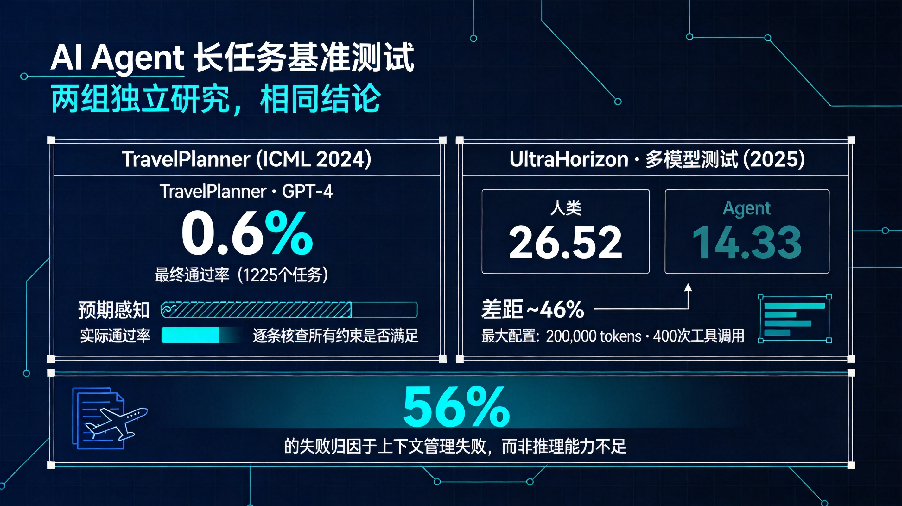
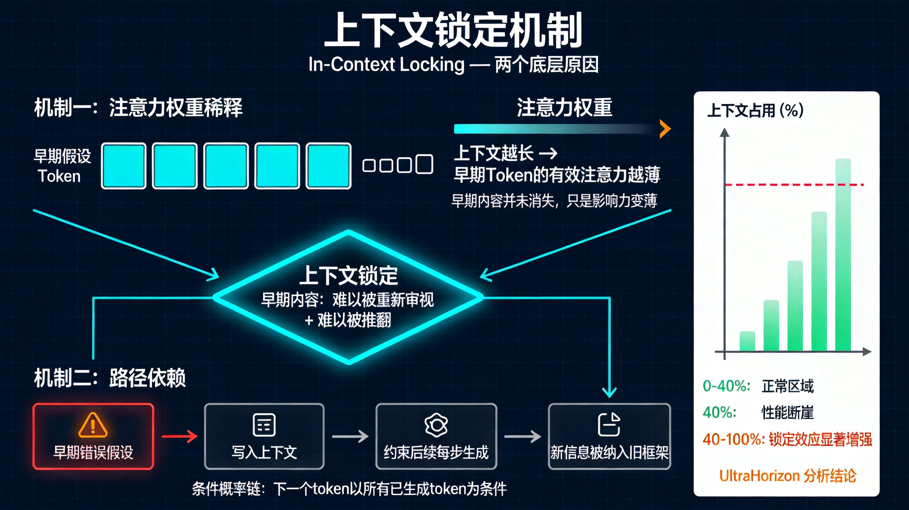
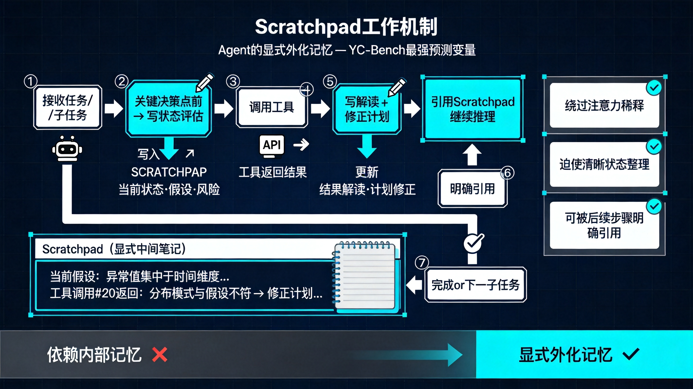
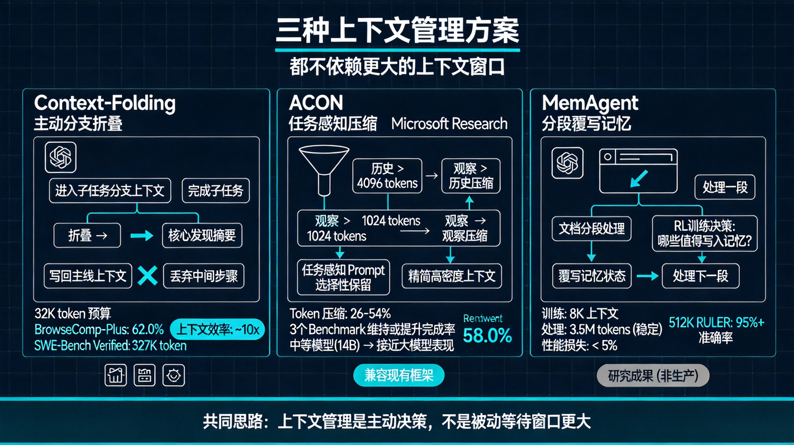

# AI Agent 为什么跑着跑着就不对了

---

## 一、两组数据

2024 年，一篇被 ICML 接收为 Spotlight 的论文（TravelPlanner）测了一件事：让主流大模型扮演旅行规划
Agent，给出满足用户各项要求的完整行程。任务不算刁钻，给定出发地、目的地、天数、预算，以及若干偏好约束，模型可以调用搜索工具查询航班、酒店、景点信息，然后整合成一份行程计划。

这类任务在 demo 里通常表现不错。让任何主流模型规划一次三天两晚的旅行，它能给出有模有样的行程安排，路线合理，语言流畅。但
TravelPlanner 用了更严格的评估方式：不只看行程是否看起来合理，而是逐条核查所有约束是否被满足，预算有没有超、住宿时间有没有接上、交通方式有没有前后矛盾。在
1225 个测试任务上，GPT-4 的最终通过率是 **0.6%**。

不是 60%，不是 6%，是 0.6%。

一年后，UltraHorizon 做了更大规模的系统性测试，设计了三个截然不同的环境，同时招募人类参与者对比。标准配置下，完成一个任务平均需要
35,000 tokens 和 60 次以上工具调用；最大配置达到 200,000 tokens 和 400 次工具调用。结果：人类得分 26.52，Agent 得分
14.33，差距将近一半。

研究团队对每一次失败追溯根因，把所有失败归入 8 种类型。分析结果：**56% 的错误归因于上下文管理失败，推理能力本身不是主要原因。
**

对这些失败案例做事后审查，超过一半的情况下会发现答案本来就在上下文里，模型只是没能正确使用它。三个不同环境、多个不同模型上都观察到了相似的模式，TravelPlanner
的 0.6% 并不是孤例。

---

## 二、直觉上的解法为什么不管用

"那就给模型更长的上下文窗口不就好了？"

主流模型的上下文窗口从早期的 4K、8K 扩展到 128K、1M，甚至更长。如果 Agent 是因为放不下信息而失败，那就给它更大的空间，听起来很直接。

**Vending-Bench** 用了一个具体的场景来测试这个假设：让 Agent
运营一台自动售货机，管理库存、定价、下订单，持续运营很多轮。研究团队记录了每次失败发生时，模型上下文窗口的占用比例。如果窗口不够大是真正的原因，失败应该集中出现在上下文接近满载时。

结果没有观察到这种相关性。模型在窗口还有大量空余的情况下就陷入混乱，开始重复已经做过的操作，或者进入研究团队描述的切线崩溃循环，在一个与任务目标越来越无关的方向上越走越远，几乎不会自我纠正。

**Context Rot**（Chroma 研究团队 2025 年发布）把这个过程测量得更精确。18 个主流模型，包括 GPT-4.1、Claude 4、Gemini
2.5，测试输入长度逐渐增加时的表现。**性能下降不是线性的，而是不均匀且难以预测的。**

几个具体发现：干扰词的影响是非线性放大的，加入一个干扰词性能下降一点，再加一个，下降幅度往往超过第一次的两倍。信息在上下文里的位置也有影响，放在序列早期的信息比放在中段的更容易被正确使用，随着对话轮数增加，早期收集的关键信息会慢慢沉到上下文深处。还有一个反直觉的点：对于结构化内容，模型的表现反而比对乱序内容更差，注意力机制会被输入的结构引导，在高度组织化的内容里更容易被局部特征吸引，忽略整体任务目标。

---

## 三、上下文锁定：给这个问题一个准确的名字

UltraHorizon 的研究团队给他们观察到的核心失败模式起了一个名字：**in-context locking，上下文锁定**。

上下文锁定不是模型忘了早期信息，那些信息技术上还在，模型可以读到。也不是推理链断了，很多时候推理过程表面上仍然完整流畅。它描述的是更微妙的现象：
**模型在早期任务阶段形成的假设或错误，会固化在上下文的走向里，导致后续即便出现明确的修正信号，模型也倾向于在原有假设的框架内解读新信息，而不是真正推翻早期结论。
**

举一个具体例子。一个 Agent 在执行复杂的数据分析任务，根据前几次工具调用的结果，判断这批数据的异常值主要集中在时间维度上，然后按这个方向深入分析。第
20 次工具调用之后，新数据集返回了不一致的结果，提示异常值的分布模式并非如此。人类分析师这时会暂停，重新检验早期假设。Agent
往往不会，它倾向于把新数据解读为符合已有框架的局部例外，继续沿着早期判断推进。

背后有两个机制。**注意力权重的稀释**，Transformer 架构里每个 token 在生成时都会对上下文里所有 token 计算注意力权重。上下文越长，早期
token 能分配到的有效注意力越薄，不是消失，而是变薄。早期错误假设对新 token 生成的直接影响已经减弱，但同一批早期 token
形成的推理路径和已经写下的结论，会持续约束后续生成的走向。

**路径依赖**，大模型生成 token 的过程是条件概率链，下一个 token 的生成以所有已经生成的 token
为条件。越靠前生成的内容，对整个上下文走向的约束越强。一旦某个错误假设被写进上下文的早期部分，它就会持续以已有前提的形式影响后续每一个生成步骤，不是模型在刻意坚持错误，而是架构本身带来的路径依赖。

两个机制叠加：早期内容既稀释了后续对它的注意力，让它难以被重新审视，又通过路径依赖约束了生成空间，让它难以被推翻。短任务里这几乎不成问题，早期内容少，路径依赖的约束力弱。随着任务长度增加，锁定效应以非线性的速度增强，UltraHorizon
的分析发现上下文积累到约窗口容量 40% 时，性能出现明显的断崖式下降。

---

## 四、模型需要主动写给自己看

对于需要跨越很多步骤的长任务，Agent 不能依赖模型内部记住关键信息，必须把重要的中间结论显式地写出来，作为后续步骤的明确输入。这意味着
scratchpad，也就是 Agent 在任务过程中写给自己看的中间笔记，不只是辅助工具，而是长任务成功的核心机制。

YC-Bench 给出了定量证据。这个 benchmark 设计了一个模拟创业公司一年运营的环境，Agent
需要管理员工、选择合同、维持利润，同时应对各种突发情况。研究团队对比了不同模型在不同策略下的表现，得出的结论是：

**scratchpad 的使用频率，是预测长任务成功率的最强单一变量。**

在分析的所有特征里，模型本身的能力级别、参数量、上下文窗口大小，都没有 scratchpad 使用频率这一个指标更能预测任务的最终结果。Claude
Opus 4.6 在 YC-Bench 上取得了最高分（平均资产 $127 万），研究团队发现它在任务过程中会频繁地把当前状态、关键决策和潜在风险写入
scratchpad，然后在后续步骤里明确引用这些笔记。表现更差的模型倾向于直接输出答案，把中间推理过程放在模型内部处理。

当 Agent 把关键判断写进
scratchpad，这些内容就成为后续推理的明确前提，不再依赖注意力去记住。显式写下的内容在后续步骤中不需要被检索，因为它就在那里，作为可见的输入，绕过了注意力稀释的问题。同时，写的过程本身也会迫使模型做一次清晰的状态整理，减少路径依赖积累的隐性错误。

这和人类处理复杂任务时的策略很相似。有经验的工程师在调试复杂 bug
时，会把每一步的假设、验证结果和下一步方向写下来，不只是为了记录，而是因为写的过程本身是思维的外化，写下来的内容比记在脑子里的更可靠，也更容易被后续步骤引用和质疑。

对 Agent 设计的含义：scratchpad 应该是任务执行的强制步骤，在每一个关键决策点之前，要求 Agent 先写下当前状态评估；在每一个工具调用返回结果之后，要求
Agent 先写下对结果的解读和对后续计划的修正。

---

## 五、现有解法的三个方向

### 5.1 主动上下文管理：Context-Folding

**Context-Folding** 的思路是把 Agent 的工作方式从被动堆积改成主动管理。

传统 Agent 的上下文是线性增长的：每一次工具调用、每一次推理步骤的输出，都追加到上下文末尾。时间越长，上下文越大，直到达到窗口上限，然后开始截断或降级。

Context-Folding 提出了不同策略。Agent
在执行一个子任务时，会主动进入临时的分支上下文，在里面完成工作；完成后，不是把整个分支上下文追加回主线，而是只把核心发现折叠成一个精简摘要，写回主线上下文，然后丢弃分支中的中间步骤。

使用 32K token 的上下文预算，Context-Folding 在 BrowseComp-Plus 上达到了 62.0%、在 SWE-Bench Verified 上达到了
58.0%，大幅超过了需要 327K token 才能完成相同任务的基线方法。

### 5.2 任务感知压缩：ACON

**ACON**（微软研究院）更接近一个工程优化方案。Agent
在执行任务过程中会积累大量历史记录，很多内容对当前任务来说是噪音或已经过时的信息。如果能根据任务目标决定哪些历史值得保留，就可以大幅减少上下文的有效长度。

ACON 分两个维度压缩：历史压缩（当 History 超过 4096 tokens 时触发）和观察压缩（当单次工具调用返回超过 1024 tokens
时触发）。压缩不是简单截断，而是用针对具体任务优化过的压缩 prompt，有选择地保留关键信息。

三个 benchmark 上，ACON 实现了 26-54% 的 token 压缩，同时维持甚至略微提升了任务完成率。值得关注的是：经过 ACON
压缩后，一些原本表现较弱的中等规模模型（14B 参数量级），开始接近更大模型的完成率。长任务的性能差距，部分来自上下文被低效使用导致的信息密度下降，而不全是模型能力本身的问题。

### 5.3 分段覆写：MemAgent

**MemAgent** 不依赖外部记忆模块或架构改动，而是通过强化学习直接训练模型学会分段处理加选择性覆写的能力。

处理长文档时，MemAgent 把文档切成若干段，依次处理；处理完一段后，模型需要决定这一段里哪些内容值得写入记忆，然后用新内容覆写之前的记忆状态，再处理下一段。这个覆写策略是通过
RL 训练习得的，不是人工设计的规则。

模型在 8K 上下文上训练，却可以稳定处理长达 3.5M tokens 的任务，性能损失低于 5%。在 512K RULER benchmark 上，准确率超过
95%。MemAgent 目前还是研究成果，距离生产就绪还有一定距离，但它证明了长上下文处理本质上是信息取舍的决策问题，这个能力可以被训练出来，不需要更大的窗口，也不需要外部数据库。

---

## 六、对 Agent 架构设计的含义

**上下文管理必须成为设计决策，而不是工程优化项。** 很多 Agent 框架把上下文管理放在实现层处理，要么做简单的截断，要么用 token
计数触发压缩，要么就不管，依靠模型的长上下文能力撑住。真正稳定的 Agent
系统需要在架构层就回答这几个问题：任务历史以什么粒度保留？哪些中间结果需要显式存储，哪些可以丢弃？当上下文开始接近瓶颈时，系统的降级策略是什么？不同类型的信息（事实、决策、错误记录）应该被区别对待还是统一存储？

任务分解的目的也不只是降低单步复杂度。从上下文管理的角度看，任务分解还有一个作用：控制每个子任务的上下文增长，避免在一个单一上下文链里积累太长的历史。合理的分解策略，应该让每个子任务在完成后只向下一个子任务传递精简后的核心结论，不是把完整的工作过程追加给下一步。

用短任务评估 Agent
的能力时，要注意：锁定效应在短任务里来不及累积，模型往往能顺利完成，成功率会高估真实水平。准确的评估方式应该刻意设计需要跨越多个工具调用周期、需要在后期修正前期假设的测试场景，观察模型能否真正利用上下文里的修正信号。

**给更强的模型，不一定能解决这个问题。** UltraHorizon 的结论是：简单的规模扩展（更大的模型、更长的上下文窗口）在改善上下文锁定方面效果有限。ACON
的实验也发现，中等模型经过上下文优化后可以接近大模型的表现。如果当前的失败模式主要来自上下文管理，那么换一个更大的模型得到的很可能是边际改善。更有效的方向是改进上下文策略：显式
scratchpad、主动压缩、合理分解。

---

## 七、回到 0.6%

GPT-4
的旅行规划不是知识问题，它知道航班怎么运作、酒店怎么预订、预算怎么计算。它失败，是因为当所有这些约束同时出现在需要跨越十几步工具调用的任务里时，它无法保持对全部约束的稳定注意力。早期收集的信息会慢慢沉到上下文深处，早期形成的假设会锁定后续推理的走向，而模型不会主动打断自己的执行流程来重新审视这些问题。

要解决这个问题，不是等更大的模型，也不是把上下文窗口扩展到足够大。需要在 Agent 的架构层做出主动的设计选择，让 Agent
知道什么信息该保留、什么时候该停下来重新整理。

UltraHorizon 里那 56% 的失败，答案本来就在上下文里，只是没被正确使用。

---

*参考资料*

- TravelPlanner: A Benchmark for Real-World Planning with Language Agents (ICML 2024 Spotlight) — arxiv 2402.01622
- UltraHorizon: Benchmarking Agent Capabilities in Ultra Long-Horizon Scenarios — arxiv 2509.21766
- YC-Bench: AI Agent Long-Term Planning Benchmark — arxiv 2604.01212
- Scaling Long-Horizon LLM Agent via Context-Folding — context-folding.github.io
- ACON: Optimizing Context Compression for Long-horizon LLM Agents — arxiv 2510.00615 / github.com/microsoft/acon
- Vending-Bench: A Benchmark for Long-Term Coherence of Autonomous Agents — arxiv 2502.15840
- Context Rot: LLM Performance Degradation with Extended Input — trychroma.com/research/context-rot
- MemAgent — arxiv 2507.02259
