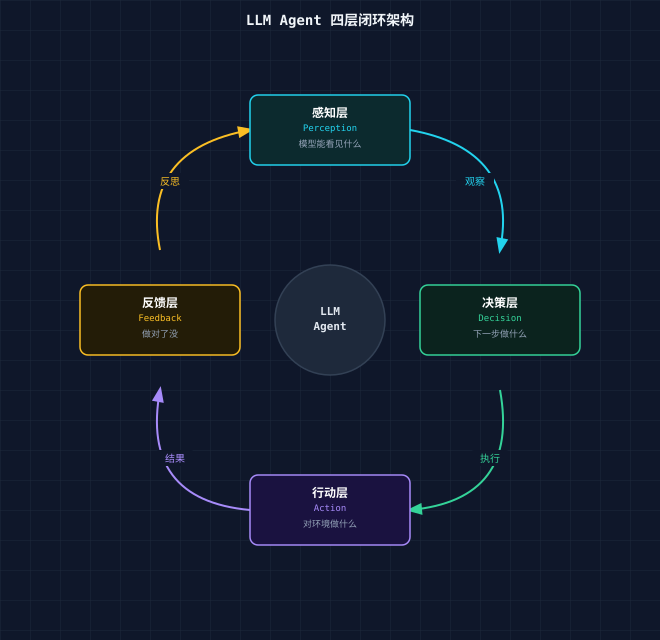
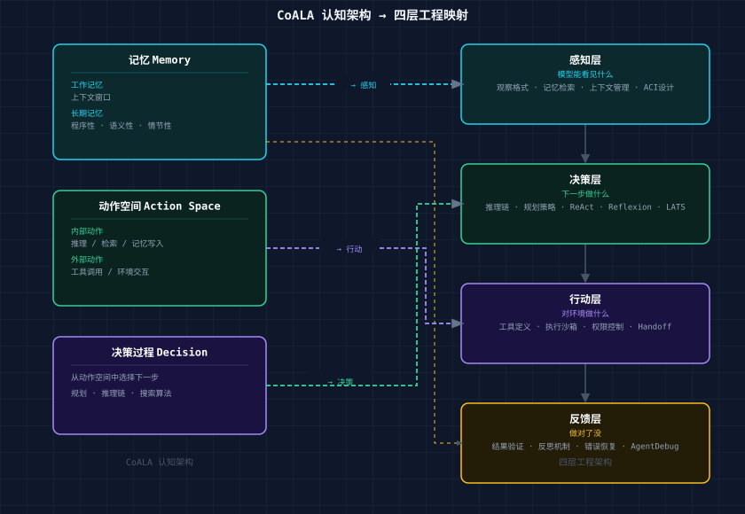
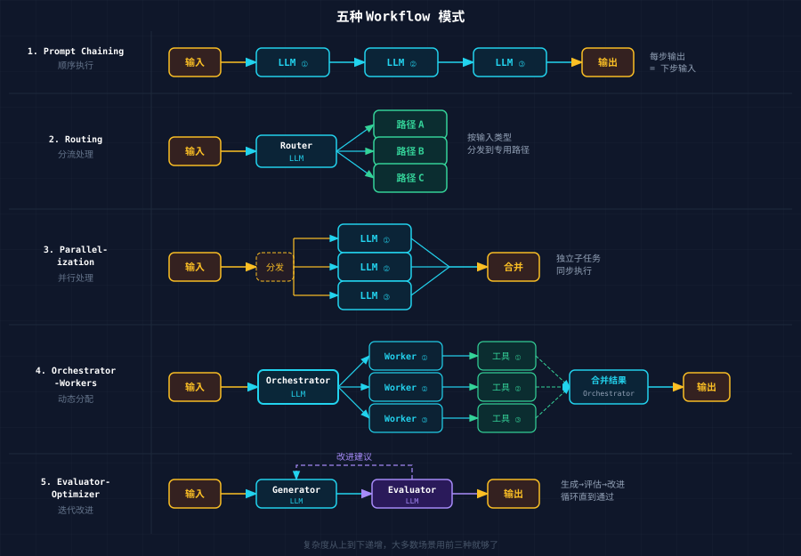
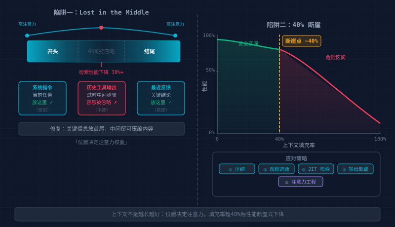
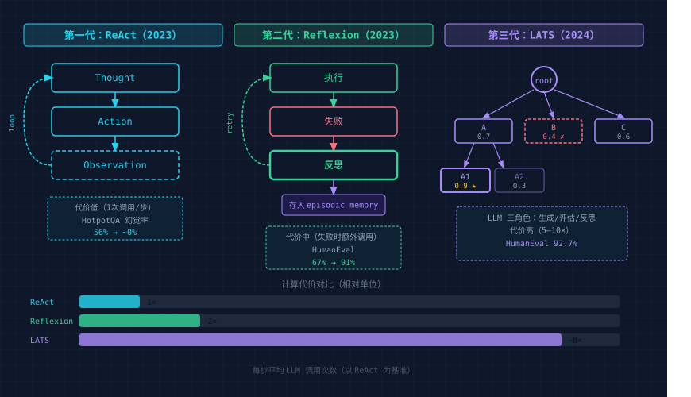
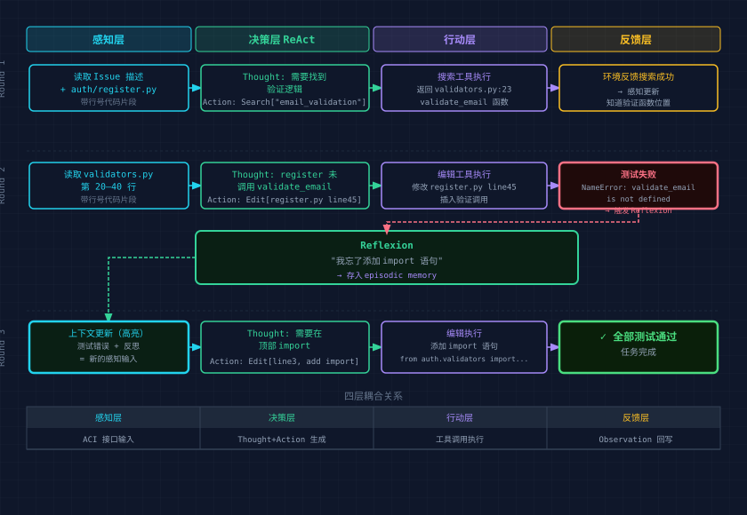

# Agent 架构全景：感知层、决策层、行动层、反馈层的原理拆解与工程实现

---

## Agent 不是 ChatBot + 工具

2024 年，Princeton 团队做了一个实验：把 GPT-4 接入 SWE-bench（一个真实的 GitHub Issue
修复基准），模型没换，训练数据没动，只改了一件事——接入模型的那套接口重新设计了一遍。

通过率从 3.8% 跳到了 12.5%。

同年，Anthropic 把 Claude 3.5 Sonnet 接入一套精简框架，两个工具（Bash + Edit）加一条约束（强制绝对路径）。SWE-bench Verified
得分：49%。

同一个模型，从 3.8% 到 49%。差距不在模型，在结构。

Agent 不是"聊天机器人加了几个工具"。它是一个控制系统。核心问题不是怎么生成更好的回答，而是怎么在开放环境中持续完成目标。

控制系统有一个经典结构：传感器采集信息 → 控制器做出决策 → 执行器改变环境 →
反馈回路检验效果。这个结构在工业控制、机器人、自动驾驶中反复出现，因为它是任何需要在不确定环境中持续运行的系统的最小完备架构。

LLM Agent 也收敛到了同样的结构：

```
感知 → 决策 → 行动 → 反馈 → 感知 → ...
```



这篇文章拆解这四层：每一层在做什么，为什么这么设计，工程上怎么落地。

---

## 1. 全局框架：CoALA 与四层闭环

### 1.1 CoALA：给 Agent 一个形式化的骨架

2023 年，CoALA（Cognitive Architectures for Language Agents）试图回答一个问题：所有 LLM Agent 的共同结构是什么？

答案是三个组件：

**记忆**，分为工作记忆（当前上下文窗口里的内容）和长期记忆（外部存储）。长期记忆又分三种：

- 程序性记忆：怎么做事（技能、流程）
- 语义记忆：知道什么（事实、知识库）
- 情节性记忆：经历过什么（过去的成功和失败）

**动作空间**，Agent 能做的所有事情，分为内部动作（推理、检索、写入记忆）和外部动作（调用工具、与环境交互）。

**决策过程**，从动作空间中选择下一步的机制。

三者组合起来构成一个完整的认知架构。任何 Agent 系统，不管它用什么框架、什么模型，都可以用这套词汇来描述和分析。

### 1.2 四层映射

CoALA 的形式化与控制论的四层闭环之间存在清晰的对应：

| 层  | CoALA 对应  | 核心问题    | 工程关注点           |
|----|-----------|---------|-----------------|
| 感知 | 工作记忆的输入   | 模型能看见什么 | 观察格式、记忆检索、上下文管理 |
| 决策 | 决策过程      | 下一步做什么  | 推理链、规划策略、搜索算法   |
| 行动 | 外部动作空间    | 对环境做什么  | 工具定义、执行沙箱、权限控制  |
| 反馈 | 观察 → 记忆更新 | 做对了没    | 结果验证、反思机制、错误恢复  |

四层各有独立的工程问题，也有跨层的耦合关系，后面逐层展开，最后再讲耦合。



### 1.3 Workflow vs Agent：什么时候用哪个

Anthropic 在工程指南中做了一个关键区分：

**Workflow**（编排型），LLM 和工具通过预定义的代码路径编排，步骤确定，开发者写死了流程，适合定义清晰的任务。

**Agent**（自主型），LLM 动态决定自己的执行路径和工具使用，步骤不可预测，模型自己选择下一步，适合开放式问题。

选择原则：从最简单的方案开始。Workflow 提供可预测性和一致性；Agent 提供灵活性，但代价是更高的成本、更难调试、错误会复利累积。只在复杂度确实需要时才升级到
Agent。

五种 Workflow 模式（复杂度递增）：

1. **Prompt Chaining**：顺序执行，每步的输出是下一步的输入
2. **Routing**：根据输入类型分发到不同处理路径
3. **Parallelization**：拆成独立子任务并行处理
4. **Orchestrator-Workers**：中心 LLM 动态拆任务、分配、合并
5. **Evaluator-Optimizer**：一个生成，一个评估，迭代改进



大多数生产系统用 Workflow 就够了，能解决的问题就不要上 Agent。

---

## 2. 感知层：模型能看见什么

**核心矛盾：上下文窗口有限，而环境信息无限。**

模型不能直接"看见"环境，它看见的是喂给它的文本。感知层的设计决定了模型能理解什么、会忽略什么、在哪里犯错。

### 2.1 观察格式设计：Agent-Computer Interface

SWE-agent 的实验揭示了一个反直觉的事实：同一个模型，仅仅改变它与环境交互的接口格式，性能就能翻倍。

这个发现催生了一个概念：**ACI（Agent-Computer Interface）**。就像 HCI 为人类设计界面，ACI 为 LLM
设计界面。两者的需求完全不同：人类需要视觉、空间、交互；LLM 需要文本、顺序，且受限于上下文窗口。

三条设计原则：

**最小认知开销**，用模型在训练数据中自然见过的格式。Markdown 表格比自定义 XML 好，带行号的代码比纯代码好，结构化错误信息比
raw stack trace 好。

**先给上下文，再要求精确输出**，不要上来就问"第 47 行应该改成什么"——先展示第 40-55 行的代码，再问。模型需要足够的 token
看清楚才能给出精确答案。

**防错设计**，强制绝对路径，消灭相对路径错误；用枚举参数替代自由文本；在工具定义里写清楚"不要做 X"。Anthropic 在 SWE-bench
开发中发现：花在工具接口设计上的时间，比花在 prompt 上的时间更有价值。

一个具体的例子是文件浏览：给模型看整个 2000 行文件，它会迷失在中间；给它一个分页查看器，每次 100 行，带行号，带当前位置标记，它能准确定位问题。这就是
ACI 设计的差距。

### 2.2 记忆架构：三层模型

Lilian Weng 在综述中提出了 Agent 记忆的三层模型，对应人类认知科学中的记忆分类：

**感知记忆**（Sensory Memory），原始输入的第一层处理。对 Agent 来说，就是 API 返回的 raw
JSON、终端输出的原始文本、截图的像素数据。持续时间极短，很快要么进入短期记忆，要么被丢弃。

**短期记忆**（Short-term / Working Memory），也就是上下文窗口，快但有限。128K token 看起来很多，但对一个需要跨越几十个文件、几百次工具调用的长任务来说，很快就不够了。

**长期记忆**（Long-term Memory），外部存储，包括向量数据库、文件系统、结构化数据库。容量无限但检索有延迟，且检索质量不稳定。

工程实现上，每层对应不同的技术方案：

| 层    | 实现                    | 特点        |
|------|-----------------------|-----------|
| 感知记忆 | 工具输出格式化               | ACI 设计管这里 |
| 短期记忆 | 上下文窗口管理               | 压缩、裁剪、摘要  |
| 长期记忆 | RAG / 文件系统 / KV Store | 需要检索策略    |

Agent Patterns Atlas 提供了几个记忆相关的工程模式：

- **Filesystem as Context**：把工作状态写入文件，每次读取最新版本。文件系统本身就是一种外部记忆。Voyager
  的技能库就是这个模式——成功的代码写入文件，按描述索引，下次检索复用。
- **Variables Manager**：显式追踪关键状态变量（当前目标、已完成步骤、待验证假设），而不是让模型从整个对话历史中隐式推断。
- **RAG**：语义检索，适合知识库查询，但对状态追踪不太适用。

### 2.3 上下文管理：对抗信息腐化

上下文窗口有一个不直觉的性质：不是越长越好。



Stanford 的"Lost in the Middle"研究发现，当关键信息落在长上下文的中间位置时，模型检索性能下降 30%
以上。即使窗口足够大，模型的注意力分布也不均匀——开头和结尾的信息更容易被注意到。

更严重的问题是：上下文超过窗口容量约 40% 后，性能开始急剧下降，不是线性衰减，是断崖式。Agent 在长任务中"跑着跑着就不对了"
，很多时候不是推理能力退化，而是上下文已经腐化——充满了过时的工具输出、无关的中间步骤、早期的错误假设。

五种生产级上下文管理策略：

**1. 压缩**，把历史对话摘要化，保留关键决策和未解决问题，丢弃冗余的工具输出。ACON
研究表明：优先保留推理链（Thought）而非原始工具输出（Observation），token 减少 26-54%，准确率保持 95% 以上。

**2. 观察遮蔽**，JetBrains 的 Junie 实践：隐藏旧的工具输出内容，但保留工具调用记录可见。模型知道"我之前运行了测试"
，但不需要再看一遍完整的测试输出。

**3. JIT 检索**，不预加载整个代码库，需要看文件时用 grep/glob/head 按需拉取。Claude Code 的实践：95% 的上下文节省来自按需加载而非全量预加载。

**4. 工具输出卸载**，2000 行的日志不塞进上下文，写入文件系统，上下文里只保留一句摘要和文件路径，需要时再读取特定部分。

**5. 注意力工程**，把最关键的信息放在 prompt 的开头和结尾。系统指令放最前面，当前任务放最后面，中间是可以被"忽略"的历史。

---

## 3. 决策层：模型怎么选择下一步

**核心矛盾：搜索空间指数爆炸，而计算预算有限。**

每一步决策，模型面对的是一个巨大的动作空间：调用哪个工具、传什么参数、还是先推理一下、还是回头检查之前的假设。决策层的设计决定了
Agent 在这个空间里怎么搜索、搜索多深、什么时候停下来。

### 3.1 执行循环的三代演化

Agent 的决策机制经历了三代演化，每代增加了计算成本，也抬高了能力上限。



**第一代：ReAct（2023）**

ReAct 确立了至今所有 Agent 的基础循环：Thought → Action → Observation。

```
Thought: 我需要找到这个函数的定义
Action: Search["def calculate_total"]
Observation: Found in src/billing.py, line 47-62
Thought: 看到了，问题在第 53 行的类型转换
Action: Edit[src/billing.py, line 53, ...]
Observation: File updated successfully
```

推理和行动必须交替进行。纯推理（Chain-of-Thought）会产生幻觉，模型编造不存在的事实；纯行动（无 Thought
直接调用工具）会盲目执行，模型不知道为什么要做这一步。ReAct 通过显式的 Thought 步骤迫使模型先说清楚"我为什么做这一步"，再通过
Observation 用真实的环境反馈纠正推理。

HotpotQA 上的幻觉率从 56% 降到接近 0%。

但 ReAct 有一个局限：它是单线的，每一步做完就往前走，不回头。如果某一步走错了，后面所有步骤都建立在错误的基础上。

**第二代：Reflexion（2023）**

Reflexion 在 ReAct 的基础上加了一层：如果任务失败了，不是简单重试，而是先反思"为什么失败了"，把反思结果写入记忆，下次避免同样的错误。

```
Trial 1: 尝试 → 失败（测试不通过）
    ↓
反思: "我没有考虑到空数组的边界情况"
    ↓
存入 episodic memory
    ↓
Trial 2: 读取反思 → 调整方案 → 尝试 → 成功
```

这是一种"语言强化学习"——不需要更新模型权重，用自然语言作为学习的介质。HumanEval（代码生成）的 pass@1 从 67% 提升到 91%。

但 Reflexion 也有局限：它只能在失败后学习。对于需要在行动前就深度规划的问题（比如博弈、优化），它仍然是被动的。

**第三代：LATS（2024）**

LATS（Language Agent Tree Search）把蒙特卡洛树搜索（MCTS）引入 Agent 决策。

不再是单线执行，而是构建一棵搜索树：

```
Root: 当前状态
├── Action A (评估分: 0.7)
│   ├── Action A1 (0.9) ← 最佳路径
│   └── Action A2 (0.3) ← 被剪枝
├── Action B (0.4) ← 低分，不展开
└── Action C (0.6)
    └── ...
```

LLM 承担三个角色：

- 生成候选动作（树的展开）
- 评估状态好坏（价值函数）
- 失败时生成反思（指导未来搜索方向）

HumanEval 达到 92.7% pass@1。但代价是巨大的——每一步决策需要多次 LLM 调用（生成 + 评估 + 可能的反思），成本是 ReAct 的 5-10
倍。

**三代对比**：

| 代 | 方法        | 循环结构                  | 计算代价       | 适用场景    |
|---|-----------|-----------------------|------------|---------|
| 1 | ReAct     | Think → Act → Observe | 低（1次调用/步）  | 常规任务    |
| 2 | Reflexion | 执行 → 失败 → 反思 → 重试     | 中（失败时额外调用） | 需从错误中学习 |
| 3 | LATS      | 多路搜索 + 评估 + 回溯        | 高（多次调用/步）  | 高价值复杂决策 |

### 3.2 任务分解：把大问题变成小问题

一个复杂任务（"修复这个 bug"）如果不拆分，模型要在一个巨大的搜索空间中找到完整路径。拆分后（"1. 定位错误 2. 理解原因 3. 写修复
4. 写测试 5. 验证"），每一步的搜索空间大幅缩小。

几种分解策略：

**Orchestrator-Workers**，一个中心 LLM 负责拆任务和分配，多个 worker 执行具体子任务，最后中心 LLM
合并结果，适合子任务之间相对独立的情况（如多文件修改）。

**极端分解**（Agent Patterns Atlas），每一步只做一件最小的、可验证的事。不是"实现登录功能"，而是"创建 login 函数签名 →
实现参数验证 → 实现数据库查询 → 实现返回值 → 写测试"，每步完成后立刻验证，错误不会累积。

**自动课程**（Voyager），Agent 自己生成下一个目标，不需要人类预定义任务列表。Voyager 在 Minecraft
中根据当前状态和已有技能，自动生成"下一个值得尝试的事情"，灵活但也最难控制。

**Routing**，根据输入类型分流到不同的专用路径。客服系统根据问题类型（退款/技术/咨询）路由到不同的处理 Agent。

### 3.3 规划的工程权衡

过度规划是一个常见错误。

模型花了 10 步生成了一个完美的计划，然后第 2 步的执行结果就偏离了计划的假设，后面 8 步全部作废。

Anthropic 的工程原则直接：**从最简单的方案开始**。

实际的选择逻辑：

- 任务步骤固定？→ 用 Prompt Chaining（确定性流程）
- 步骤不固定但可收敛？→ 用 ReAct（单步循环，随时调整）
- 子任务明确可独立？→ 用 Orchestrator-Workers（分治）
- 高价值且可回溯？→ 用 LATS（搜索树）
- 完全开放式？→ 用自动课程（让 Agent 自己定义目标）

一条经验规则：如果 Agent 花了 30% 以上的 token 在"规划"上而不是"执行"上，规划粒度可能太细了，降低粒度，让执行层的反馈来指导后续方向。

---

## 4. 行动层：模型能对环境做什么

**核心矛盾：工具越多能力越强，但误选率也越高。**

行动层定义了 Agent 的"手"——它能触达什么、改变什么。工具设计的好坏直接影响 Agent 能否把正确的决策转化为正确的执行。

### 4.1 工具设计原则

Anthropic 在 SWE-bench 开发中积累了一条核心经验：**花在工具设计上的时间应该超过花在 prompt 上的时间**。

五条设计原则：

**1. 格式自然**，用模型训练数据中高频出现的格式。Markdown 比自定义 DSL 好，JSON 比 YAML 好（出现频率更高）。函数名用英文动词+名词（
`search_files` 而不是 `fs_query_op`）。

**2. 文档完整**，工具描述不是给人看的，是给模型看的。它需要：一句话说清用途、参数的类型和约束、1-2
个使用示例、失败时返回什么、和相邻工具的区别（"用 `edit_file` 修改已有文件，用 `create_file` 创建新文件，不要混用"）。

**3. 防错设计**，强制绝对路径（消灭"当前目录是哪里"的歧义），参数用枚举而不是自由文本（`mode: "append" | "overwrite"` 而不是
`mode: string`），必填参数和可选参数明确区分。

**4. 输出可读**，工具的返回值是 Agent 的感知输入。一个返回 5000 行 raw JSON 的工具，等于给 Agent 塞了一堆噪音。结构化、摘要化、只返回
Agent 需要的信息。

**5. 边界清晰**，每个工具做一件事，工具之间不重叠。如果两个工具的使用场景模糊（"什么时候用 search 什么时候用 grep？"），模型就会出错。

可用工具超过 30 个时，模型的工具选择准确率开始明显下滑。改用动态加载（每步只暴露 Top 5-10 个最相关的工具），准确率提升约 30%。

### 4.2 动态工具管理

在一个复杂的 Agent 系统中，可能有几十个甚至上百个工具。全部塞进 prompt，上下文爆炸；全部隐藏，Agent 不知道自己能做什么。

几种平衡策略：

**静态全量暴露**，简单，适合工具数 < 10 的场景。所有工具的 schema 始终在 prompt 里，模型随时知道自己的全部能力；但随着工具增加，prompt
越来越长，噪音越来越大。

**动态加载**，根据当前任务阶段，只暴露相关的工具子集。写代码时暴露文件操作工具，运行测试时暴露执行工具，搜索时暴露搜索工具。Vercel
在 v0 中删掉了 80% 的工具，反而得到了更好的结果。

**Skill Discovery**（Agent Patterns Atlas），Agent 运行时自行发现可用工具，不是预定义工具列表，而是通过查询一个工具注册表来获取当前可用的能力，适合工具集合会动态变化的场景（如
MCP 服务器连接/断开）。

**技能库**（Voyager），最激进的方案：Agent 不仅使用预定义工具，还能创造新工具。Voyager 把执行成功的代码片段自动存入技能库，下次遇到类似任务时检索复用，工具集合随着
Agent 的经验增长而增长。

### 4.3 行动的安全边界

Agent 能做的事越多，出错的后果就越严重，行动层必须有安全机制。

**沙箱执行**，文件操作限制在特定目录，网络请求限制白名单，代码执行在容器中，Agent 不能触达它不应该触达的东西。

**权限最小化**（Constrained Tool Use），Agent 只能用完成当前任务所需的最小工具集，不需要删除文件的任务就不暴露删除工具。

**不可逆操作确认**，删除、发布、支付这类操作在执行前必须经过人类确认。错误的代价不对称，这是结构性要求，不是信任问题。

**Handoff 机制**（OpenAI Agents SDK），当一个 Agent 判断当前任务超出自己能力范围时，把控制权转移给另一个更合适的
Agent，转移时携带完整的对话历史，确保上下文不丢失。

### 4.4 代码即行动

Voyager 引入了一种不同于 JSON 工具调用的行动方式：直接生成可执行代码。

传统方式：

```json
{
  "tool": "move_to",
  "args": {
    "x": 100,
    "y": 64,
    "z": 200
  }
}
{
  "tool": "mine_block",
  "args": {
    "block_type": "diamond_ore"
  }
}
```

Voyager 方式：

```javascript
async function mineDiamonds(bot) {
  await bot.navigate(100, 64, 200);
  const block = bot.findBlock('diamond_ore', 5);
  if (block) await bot.dig(block);
}
```

代码的优势：

- **组合性**：复杂行为由简单函数组合，不需要为每种组合定义新工具
- **可验证**：代码可以运行、可以测试、可以 type check
- **可存储**：成功的代码直接入库，变成新的技能

代价是需要更严格的沙箱。JSON 工具调用的安全边界很清晰（参数验证就够了）；代码执行的安全边界需要容器级别的隔离。

---

## 5. 反馈层：模型怎么知道做对了

**核心矛盾：即时反馈便宜但浅层，深层反馈有价值但贵。**

没有反馈的 Agent 是一个开环系统，它不知道自己的行动产生了什么效果，只能盲目前进，错误会累积，一步错步步错。反馈层闭合了这个环路，让
Agent 能够感知行动的结果并据此调整。

### 5.1 反馈信号的层次

不同类型的反馈，在延迟、成本和可靠性上差异巨大：

| 类型   | 来源             | 延迟    | 可靠性       | 成本 |
|------|----------------|-------|-----------|----|
| 执行反馈 | 编译器、测试、API 返回码 | 即时    | 高（确定性）    | 低  |
| 环境反馈 | 状态变化观察         | 秒级    | 中         | 低  |
| 评估反馈 | 另一个 LLM 评判     | 秒级    | 中（有偏差）    | 中  |
| 反思反馈 | 模型自我审视         | 秒级    | 低（可能过度纠正） | 中  |
| 人类反馈 | 用户确认/纠正        | 分钟~小时 | 高         | 高  |

工程原则：**能用确定性验证就不用 LLM 判断，能用 LLM 判断就不打扰人类**。

### 5.2 验证机制

Anthropic 推荐三类验证方式：

**规则验证**，测试通过了吗？类型检查过了吗？Linter 有没有报错？这是最可靠的反馈——确定性的、无偏差的、成本几乎为零。代码任务几乎都有规则验证的条件，优先用它。

**视觉验证**，UI 任务中，用 Playwright 截图，让模型或另一个评估器判断"界面是否符合预期"，适合无法用代码断言的视觉结果。

**语义验证**（LLM-as-Judge），用一个独立的 LLM（最好是不同的模型或不同的 prompt）来评估结果质量，适合开放式任务（"
这段代码的可读性好不好？"）。

Claude Code 的实践验证了这一点：给模型一种验证自己工作的方式（哪怕只是运行测试），质量提升 2-3 倍。

**Evaluator-Optimizer 模式**：把验证做成迭代循环。一个 LLM 生成结果，另一个 LLM 评估并给出改进建议，然后第一个根据建议修改，适合翻译、写作等需要打磨的任务。

### 5.3 自我反思：强大但危险

Reflexion 证明了自我反思的价值——Agent 在失败后生成文本反思，存入记忆，下次避免同样的错误。HumanEval 从 67% 到 91%。

但反思有一个被低估的风险：**过度自我纠正**。

研究发现，当模型被指示"再检查一下你的答案"时，在 58% 的情况下，它会把原本正确的答案改成错误的。这不是
bug，而是反思机制的结构性问题——模型倾向于"找到问题"来证明反思是有意义的，即使实际上没有问题。

工程实践中的约束：

- **限制反思次数**：最多 2-3 次，无限反思不会收敛，只会震荡。
- **区分"信心低"和"确认出错"**：信心低但无外部证据表明出错，就不反思；只有外部反馈（测试失败、用户否定）明确表明出错时才触发反思。
- **外部验证优先**：能用测试验证的就跑测试，不要让模型"自己判断自己对不对"。编译器永远比内省可靠。

### 5.4 错误恢复：不要从头重来

AgentDebug（2025）的核心洞察：当 Agent 失败时，不要从头重跑整个任务，先定位失败点在执行链的哪个位置，然后只从那个点重新执行。

两类根因：

- **记忆错误**：Agent 忘了关键信息（上下文被截断、检索没命中）→ 修复：补充记忆，从遗忘点重跑
- **推理错误**：Agent 从正确信息中得出了错误结论 → 修复：换推理策略，从错误决策点重跑

效果：成功率提升 26%。

错误分类决定恢复策略：

| 错误类型 | 策略        | 示例                    |
|------|-----------|-----------------------|
| 瞬态   | 重试（指数退避）  | API 超时、限流             |
| 语义   | 换策略       | 模型被内容过滤阻断 → 改写 prompt |
| 规划   | 从当前状态重新规划 | 原计划不可行                |
| 记忆   | 重新检索上下文   | 关键信息丢失                |
| 不可恢复 | 升级到人类     | 任务本身不可能               |

**VIGIL**（2025）更进一步：运行时持续监控 Agent 行为，检测到异常（循环、延迟飙升、输出退化）时自动诊断并生成修复方案，不需要等到任务完全失败。

### 5.5 人机协作：架构的一部分，不是兜底

Human-in-the-Loop 不是"Agent 不行了找人帮忙"，它是架构设计的一部分——在特定的节点上，人类介入是比自动化更优的选择。

何时交给人类：

- **不可逆操作前**：删除数据、发布上线、发送邮件
- **信心低于阈值**：模型不确定但又无法通过更多计算变得确定
- **检测到异常模式**：循环、矛盾、持续失败（Red-Flagging）
- **高价值决策**：影响大但频率低的判断

人类检查点的位置应该预先设计好，而不是"失败了就问人"。好的人机协作像高速公路上的收费站——在关键节点短暂停下确认，而不是随时随地可能被打断。

---

## 6. 四层耦合：一个完整的例子

四层不是独立的，用一个代码修复 Agent 的完整执行过程来展示它们之间的耦合：



**任务**：修复一个 GitHub Issue——"用户注册时邮箱验证不生效"

代码库的初始状态：`auth/register.py` 处理注册逻辑，`auth/validators.py` 里已有 `validate_email` 函数，但 `register.py`
从未调用它。

---

**第一轮循环：**

**感知**：Agent 读取 Issue 描述 + 相关代码文件（`auth/register.py`）。ACI 设计决定了它看到的是带行号的代码片段而不是整个文件。

**决策**（ReAct）：

```
Thought: Issue 提到邮箱验证不生效。我需要找到验证逻辑在哪里。
Action: Search["email_validation" in auth/]
```

**行动**：搜索工具执行，返回 `auth/validators.py:23` 有一个 `validate_email` 函数。

**反馈**：环境反馈（搜索成功返回结果）→ 更新感知（现在知道了验证函数的位置）

---

**第二轮循环：**

**感知**：读取 `auth/validators.py` 的第 20-40 行。

**决策**：

```
Thought: validate_email 函数存在，但 register 函数没有调用它。问题在 register.py 而不是 validators.py。
Action: Edit[auth/register.py, line 45, add: if not validate_email(email): raise ValidationError(...)]
```

**行动**：编辑工具执行修改。

**反馈**：运行测试 → 测试失败。

```
Error: NameError: validate_email is not defined
```

---

**第三轮循环（反思触发）：**

**反馈 → 感知更新**：测试失败的错误信息进入上下文。Agent 同时触发 Reflexion："我忘了添加 import 语句。"

**决策**：

```
Thought: 我需要在文件顶部 import validate_email。
Action: Edit[auth/register.py, line 3, add: from auth.validators import validate_email]
```

**行动**：编辑执行。

**反馈**：运行测试 → 全部通过 ✓

---

**四层耦合关系：**

| 耦合      | 表现                            | 设计影响               |
|---------|-------------------------------|--------------------|
| 感知 × 决策 | 搜索结果的格式直接影响推理质量               | ACI 设计决定了决策层的输入质量  |
| 决策 × 行动 | "添加验证"的规划粒度必须匹配 Edit 工具的能力    | 规划粒度要适配工具粒度        |
| 行动 × 反馈 | Edit 的返回"成功"不够，需要测试才能验证真正的正确性 | 行动结果 ≠ 任务成功，需要独立验证 |
| 反馈 × 感知 | 测试失败的错误信息 + 反思 = 下一轮的新感知      | 反馈质量决定了下一轮感知的信息量   |

**如果四层之间的接口设计不匹配，系统性能会远低于各层单独的能力**。一个优秀的决策层配上一个返回 raw dump
的感知层，整体表现会很差。SWE-agent 的实验证明了这一点——改善感知层的格式（ACI），在不改变决策层的情况下，整体性能翻了 3 倍。

---

## 7. 工程实践 Checklist

### 7.1 架构选择决策树

```
你的任务步骤是否固定？
├── 是 → Workflow
│   ├── 步骤独立？→ Parallelization
│   ├── 步骤有序？→ Prompt Chaining
│   └── 需要分流？→ Routing
└── 否 → 步骤数可预测吗？
    ├── 是 → Orchestrator-Workers
    └── 否 → Agent（自主循环）
        ├── 常规任务 → ReAct
        ├── 需要从失败中学习 → + Reflexion
        └── 高价值复杂决策 → + LATS
```

### 7.2 四层设计清单

**感知层**：

- [ ] 观察格式是否用了模型训练数据中的自然格式？
- [ ] 长期记忆是否有语义检索机制？
- [ ] 是否有上下文压缩/裁剪策略？
- [ ] 关键信息是否放在 prompt 首尾？
- [ ] 工具输出是否结构化（而非 raw dump）？

**决策层**：

- [ ] 循环复杂度是否匹配任务复杂度？（不过度规划）
- [ ] 是否有任务分解（一步不做太多事）？
- [ ] 是否有终止条件（最大轮次 + token 预算）？
- [ ] 失败时是否有回退策略？

**行动层**：

- [ ] 工具定义是否包含示例、边界、失败行为？
- [ ] 工具数量是否控制在 10 个以内（或动态加载）？
- [ ] 是否有执行沙箱？
- [ ] 不可逆操作是否有确认机制？
- [ ] 相似工具之间的边界是否写清楚了？

**反馈层**：

- [ ] 是否有确定性验证（测试/编译/类型检查）？
- [ ] 反思机制是否有次数限制（≤3）？
- [ ] 错误是否分类处理（瞬态/语义/不可恢复）？
- [ ] 是否有人类升级路径？
- [ ] 反馈信息是否足够具体（定位到行/函数/原因）？

### 7.3 常见坑与修复

| 坑     | 症状            | 根因          | 修复                 |
|-------|---------------|-------------|--------------------|
| 感知过载  | 模型忽略关键信息、回答偏题 | 上下文太长或格式混乱  | JIT 检索 + 注意力工程     |
| 规划过深  | 计划完美但执行偏离     | 前几步的假设就错了   | 用 ReAct 替代长期规划     |
| 工具过多  | 频繁选错工具        | 工具描述重叠、数量超限 | 动态加载 Top 5-10      |
| 反思过度  | 正确答案被改成错误     | 无限自我怀疑      | 限 2-3 次 + 外部验证优先   |
| 无终止条件 | 无限循环、成本失控     | 缺少退出机制      | 轮次上限 + token 预算双保险 |
| 反馈缺失  | 错误累积不可逆       | 每步执行后无验证    | 每步验证 + 状态检查点       |
| 层间不匹配 | 各层单独可用但组合表现差  | 接口格式不兼容     | 检查各层的输入输出格式是否对齐    |

### 7.4 一个最小可运行的 Agent 骨架

```python
def run_agent(task: str, tools: list, max_turns: int = 20):
    history = []
    memory = load_long_term_memory(task)
    
    for turn in range(max_turns):
        # 感知层：组装上下文
        context = assemble_context(
            system_prompt=SYSTEM,
            tools=select_relevant_tools(tools, history),  # 动态工具加载
            memory=memory,
            history=compress_if_needed(history),  # 上下文管理
            task=task
        )
        
        # 决策层：模型推理
        response = llm(context)
        
        # 终止条件
        if not response.tool_calls:
            return response.text
        
        # 行动层：执行工具
        for call in response.tool_calls:
            result = sandbox_execute(call)  # 沙箱执行
            history.append({"call": call, "result": result})
        
        # 反馈层：验证
        if should_verify(response.tool_calls):
            verification = run_tests()  # 确定性验证
            if not verification.passed:
                # 触发反思
                reflection = reflect(history, verification.error)
                memory.add_episode(reflection)
    
    return "Max turns reached without completion"
```

这 30 行代码覆盖了四层的核心逻辑。生产级系统在此基础上增加：错误分类与恢复、人机检查点、可观测性（日志/追踪）、持久化（跨会话状态）。

---

## 参考来源

1. **CoALA**（arXiv:2309.02427）— 最完整的 Agent 认知架构形式化。如果你只读一篇理论论文，读这篇，它提供了描述任何 Agent
   系统的统一词汇。

2. **Anthropic: Building Effective Agents** — 最实用的工程原则。Workflow vs Agent 的选择、工具设计、何时不用
   Agent，适合正在做架构决策的团队。

3. **Lilian Weng: LLM Powered Autonomous Agents** — 最全面的综述。Planning + Memory + Tool Use 的三件套框架，适合建立全局视角。

4. **ReAct → Reflexion → LATS** — 决策层三代演化的论文三件套，按顺序读完就理解了执行循环为什么是现在这个样子。
    - ReAct: arXiv:2210.03629
    - Reflexion: arXiv:2303.11366
    - LATS: arXiv:2310.04406

5. **Agent Patterns Atlas**（agents.kour.me）— 30+ 可复用工程模式，含代码示例，适合已经理解原理、需要具体实现参考的开发者。
