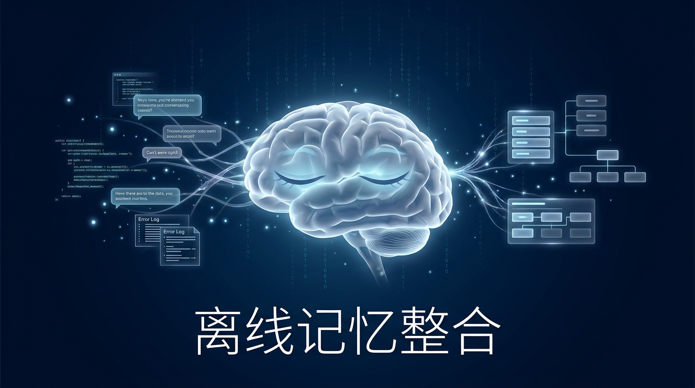
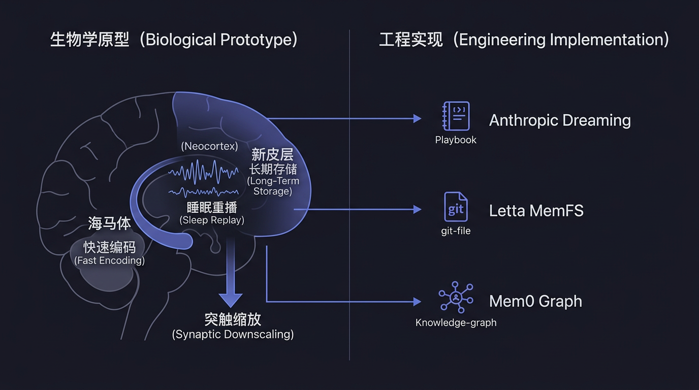
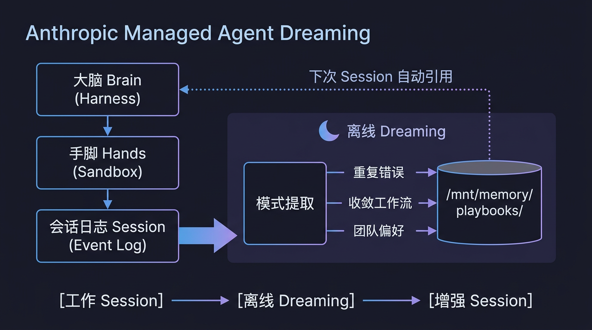
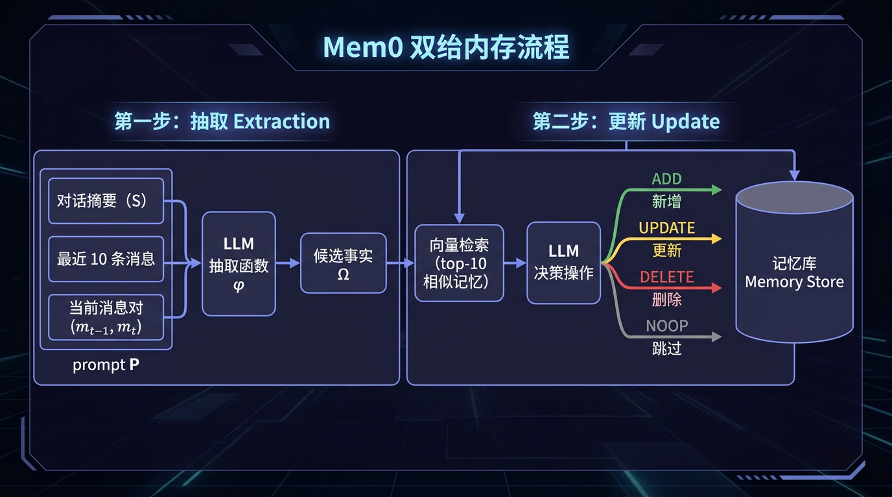
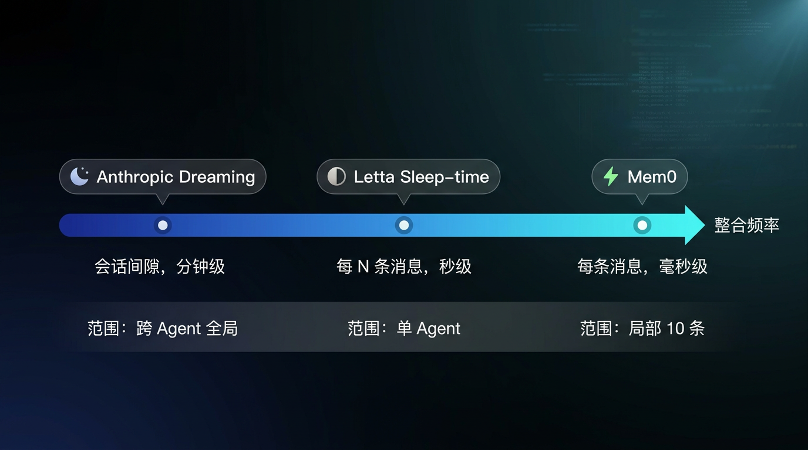
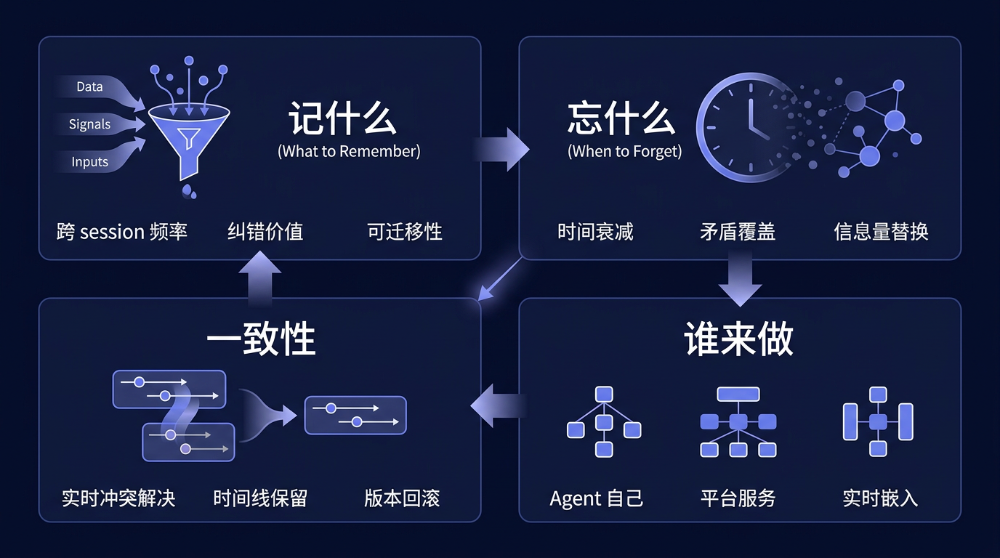
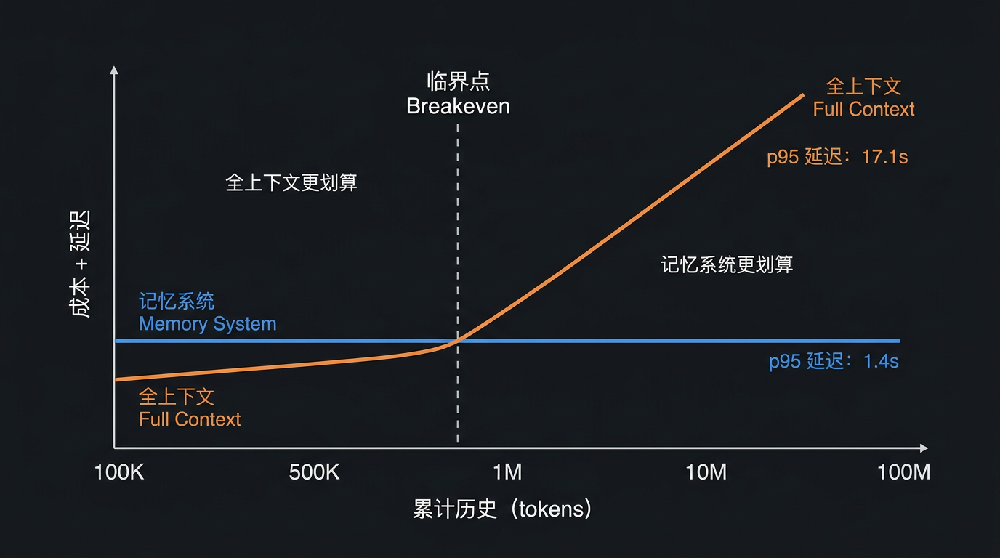

# Agent 不是在工作时变强的：离线记忆整合的三条技术路线

Harvey 是一家用 AI 做法律工作的公司。2026 年 5 月，他们给自己的 Agent 开了一个叫 Dreaming 的功能。没换模型，没改
prompt，任务完成率直接涨了 6 倍。

原因很简单：法律工作里有大量重复性流程错误。Agent 第一次犯了，第二次还犯，第一百次照样犯，因为每次 session
结束后它什么都不记得。Dreaming 做的事情是：在两次 session 之间，回顾一下历史，把反复出现的错误提取成一条规则。下次再遇到同类任务，规则自动生效。

这不是什么新概念。人类的大脑每天都在做类似的事，不是在做事的时候学得最快，而是在睡觉的时候。神经科学里有一个精确的描述：睡眠期间，海马体把白天编码的经历以加速模式重播给新皮层，新皮层在没有新输入干扰的情况下慢慢将其整合成长期知识。

Agent 现在也开始睡觉了。**Agent 在两次工作之间到底要做什么，才能让自己下一次表现更好？**

---

## 生物学原型：大脑在睡觉时做了什么

Anthropic 在 Dreaming 的设计文档中明确对标了海马体记忆整合。这不是一个文学比喻，是架构设计的参考来源。生物学机制中的每个关键节点都能在工程实现中找到对应物。

### 双系统分工

大脑做记忆不是把经历写进一个数据库这么简单。它有两套系统在平行运作：

**海马体**负责快速编码。白天发生的事情，你走过的路、说过的话、做过的决定，先被海马体以高保真度记录下来。编码速度快，容量有限，细节丰富但不稳定。

**新皮层**负责长期存储。知识、规则、模式，开车要先看后视镜、这个客户喜欢简洁的报告，这些是新皮层的地盘。学得慢，但一旦学会就很稳定。

为什么需要两套系统？McClelland 等人在 1995 年提出的 Complementary Learning Systems
理论给了精确回答：如果只有一个系统，快速学习新经历会覆盖掉已有的稳定知识。这在机器学习里叫 catastrophic
forgetting，生物学里早就解决了，方案就是分成两个系统，各干各的。

映射到 Agent：session 中的实时交互是海马体编码，快速、详细、不稳定（session 结束就丢了）。持久化的记忆系统是新皮层，慢、抽象、稳定。中间那一步怎么做，就是本文的核心问题。

### 睡眠重播

人不是在睡觉时什么都不干。睡眠的慢波阶段（NREM sleep），海马体中的神经元会以 5 到 20 倍速重播白天的活动模式。这个过程有几个关键特征：

**不是完整回放。**重播是选择性的，与奖励相关的经历被优先重播（McNamara et al., 2014）。不是每件事都值得记住。

**需要安静的环境。**重播发生在睡眠中是有原因的：新皮层需要在没有新感觉输入干扰的情况下才能安全地整合新信息。如果边接收新输入边整合旧经历，两套信息会互相干扰。整合必须离线做。

**由三层嵌套振荡协调。**慢振荡（<1 Hz）提供时间窗口，睡眠纺锤波（12-16 Hz）促进突触可塑性，海马体 sharp-wave ripples（140-200
Hz）在其中触发具体的重播事件。三者精确地嵌套在一起（Latchoumane et al., 2017 称之为三重锁相）。

### 突触缩放

重播不是唯一的事。睡眠中还发生全局性的突触缩放（synaptic downscaling），所有突触的强度整体下降。

这看起来违反直觉：学习不是要增强连接吗？但缩放的效果是**提高信噪比**。所有连接都降了，只有那些在重播中被反复激活的连接被选择性保留。重要的模式变得更突出，噪音被压下去。

de Vivo et al., 2017 用超微结构证据证实了这一点。Yang et al., 2014 发现学习后的睡眠促进了特定树突分支上的新突触形成，不是随机加强，是精准加强。

### 核心映射



| 生物学     | Agent 系统                                |
|---------|-----------------------------------------|
| 海马体快速编码 | Session 中的实时交互记录                        |
| 睡眠重播    | Dreaming / sleep-time subagent 回顾历史     |
| 选择性重播   | 只提取有价值的 pattern（错误修复、工作流收敛）             |
| 新皮层整合   | 持久化记忆更新（playbook / MemFS / graph store） |
| 突触缩放    | 记忆修剪、过期删除、信息量对比替换                       |
| 离线无干扰   | Session 间隔期，不处理新用户请求                    |

Anthropic 在官方描述中直接说 Dreaming 模仿的就是 hippocampal memory consolidation。

---

## 工程实现：三种做梦的技术路线

2026 年中，三种不同的工程路线正在同时被验证。它们解决的是同一个问题，让 Agent 在 session 间隙变得更好，但做出了不同的设计取舍。

### Anthropic Dreaming：集中式离线审查



Anthropic 的方案最接近生物学原型：显式地在工作和休息之间划了一条线。

**架构基础：Brain-Hands-Session 三层解耦。**要理解 Dreaming，先要理解它运行在什么基础设施上。Anthropic 在 2026 年 4 月将
Managed Agents 重构为三个独立组件：

- **Brain**（Harness）：调用 Claude 的循环逻辑，无状态，可随时重启
- **Hands**（Sandbox）：执行代码的容器，独立于 Brain，通过 `execute(name, input) → string` 接口调用
- **Session**（Event Log）：append-only 的事件日志，独立于 Brain 和 Hands 之外

这个三层解耦是 Dreaming 的前提。Session event log 存储了 Agent 所有行为的完整记录，工具调用、推理过程、错误信息、恢复策略，且不会因为
harness 重启或容器销毁而丢失。Brain 通过 `getEvents()` 按位置切片读取 event stream，通过 `emitEvent(id, event)` 写入持久记录。

Dreaming 的输入就是这个 event log。它不需要 Agent 回忆，历史被完整保留在外部存储里，随时可以被重新审视。

**运行时机与生命周期。**Session 结束后异步启动，不需要手动触发，系统按调度计划执行。持续时间从几分钟到几十分钟不等，取决于需要审查的历史量。

关键点：Dreaming 运行时 Agent 不在工作。这对应生物学中不能边接收新输入边整合旧经历的约束，新皮层需要安静环境才能做整合。如果
Agent 一边处理用户请求一边做 dreaming，两个过程写入同一个记忆空间会产生竞态。

**三类 Pattern 提取。**Dreaming 遍历历史 session 的 transcript，提取：

1. **重复错误**，同样的坑踩了多次。这是最直接的价值来源。一个 Agent 如果在三个不同的 session 里都忘记了生成 DOCX
   前要先检查字体嵌入，dreaming 会把它提取成一条规则。
2. **收敛工作流**，多个 agent 独立摸索出的相似做法。如果团队里 5 个 agent 不约而同都在处理长 PDF
   时先抽取目录再分段阅读，这就是一个有效策略，值得固化为标准流程。
3. **团队偏好**，跨用户 / 跨 agent 共享的模式。比如这个团队的所有用户都要求输出中文、报告格式总是用三级标题。

提取结果以 plain-text notes 或 structured playbook 的形式写入记忆。Playbook 不是随意的文本，它是 Agent 后续 session
中可以被引用的结构化参考。

**控制权设计：人在回路中。**开发者可以选择两种模式：

- 自动模式：Dreaming 发现的 pattern 直接生效，下次 session 自动引用
- 手动审核：pattern 需要人确认才进入长期记忆

这个设计决策背后的逻辑是：Dreaming 本身是一个 LLM 推理过程，它在做归纳，从有限样本中提炼规律。归纳天然可能出错。十次巧合可能被提炼成一条规律，然后持续误导后续的每一个
session。手动审核是安全阀，但也是瓶颈，如果 dreaming 每天产出几十条 pattern，开发者的审核带宽就成了系统的吞吐上限。

**审计与回滚。**所有写入都在 session event stream 中可见。版本控制是不可变的，每次 dreaming 写入产生一个新版本，旧版本永远可访问。如果某个
pattern 后来被发现有问题（误导 Agent 产出错误结果），可以精确定位到是哪次 dreaming 引入的，然后回滚到之前的版本。

在生产环境中，Agent 为什么突然开始犯这个错这类问题的根因追踪，需要精确的变更历史。Anthropic 把记忆系统做成了一个 audit log。

**Memory Tool 的存储位置。**Agent 的持久记忆挂载在容器内的 `/mnt/memory/` 路径。Claude 通过 bash 和 code-execution
工具读写这些文件。存储后端由客户控制，可以是本地文件系统，也可以是 S3。API 使用需要 beta header
`context-management-2025-06-27`。

记忆不是 Anthropic 的黑箱，而是客户基础设施的一部分。开发者可以直接检查 Agent 记忆的内容、修改它、用脚本批量更新。Dreaming
写入的 playbook 也存在这里，开发者可以 `cat /mnt/memory/playbooks/` 直接看到 dreaming 产出了什么。

**Harvey 的 6x 为什么在法律领域特别有效。**法律流程的特点是：步骤高度固定、错误具有系统性、同类任务的重复率极高。一个忘记检查管辖区要求的错误可能在
50 个不同的案件中以完全相同的方式出现，不是因为 Agent 不懂，而是因为它没有一个持久化的检查清单来提醒自己。

Dreaming 发现这个 pattern 后，一条规则修复全部 50 个案件。6x 数字的来源不是每次任务单独变好了 6 倍，而是一类系统性错误被一次性消除，通过率整体跃升。

反例：如果场景是每次任务都完全不同的创意写作，历史经验几乎无法迁移，dreaming 的 ROI 就趋近于零。6x 这个数字高度依赖任务的重复性结构。

### Letta Sleep-time Subagents：分布式自编辑

Letta（MemGPT 的商业化产品）走了另一条路：不搞集中审查，让每个 Agent 自己管自己的记忆。

**MemGPT 的遗产。**MemGPT（2023，UC Berkeley）的核心洞察是把 LLM 的上下文窗口类比为操作系统的物理内存，有限、易失、需要虚拟化。Agent
通过调用 `core_memory_append`、`core_memory_replace`、`archival_memory_search`、`conversation_search`
等函数主动管理自己的记忆，而不是被动等待系统帮它管。

Letta 后来反复强调的关键原则：

> "Agents do not passively receive context — they explicitly call memory management functions to move information
> between tiers."

Agent 不是被动地被注入上下文，而是主动决定自己需要记住什么、检索什么、忘掉什么。

Letta 在此基础上演化出了 MemFS：一个 git-backed 的 markdown 文件系统。记忆不再是 vector database 里的一堆
embedding，而是实实在在的文件，Agent 用 bash 工具读写，改完 commit，有完整版本历史。

**MemFS 的结构与记忆分层。**

```
~/.letta/agents/<agent-id>/memory/
├── system/          ← 始终加载进 system prompt（工作记忆）
│   ├── identity.md
│   ├── rules.md
│   └── preferences.md
├── projects/        ← 文件名可见，内容需要检索
│   ├── project-a.md
│   └── project-b.md
└── archive/         ← 长期归档
    └── ...
```

`system/` 目录下的文件永远被完整加载进 system prompt，相当于 Agent 的随时可用工作记忆，类似大脑的前额叶缓存。其他目录的文件只暴露文件名和描述，内容需要
Agent 主动请求才加载。这个分层保证了 context window 的精简：Agent 的核心身份始终在线，但不会被几百个历史记忆文件撑爆。

**Sleep-time subagent 的触发与执行。**Letta 的 `/sleeptime` 配置支持三种触发模式：

- **关闭**：不做任何后台整理
- **步数触发**：每 N 条用户消息启动一次反思
- **Compaction 触发**（推荐用于 MemFS）：当 context window 被压缩/总结时启动

Compaction 触发的逻辑是：当 Agent 的上下文窗口即将溢出、系统执行
compaction（压缩早期对话为摘要）时，正是信息从工作记忆向长期记忆迁移的自然时机。这对应生物学中海马体缓冲区满了触发整合的机制。

触发后发生什么：

1. 系统在后台 fork 一个 subagent，给它独立的推理预算
2. Subagent 获得当前对话的上下文和已有 MemFS 内容
3. Subagent 执行多轮 read-think-write 循环，不是跑一步就完
4. 每次编辑 MemFS 文件后 git commit，留下完整变更历史
5. 主 Agent 的下一次 session 自动看到更新后的记忆

文档强调 subagent "generally run for many steps since subagents are thorough memory editors"。一个 sleep-time 周期可能涉及：读取
5 个记忆文件、对比当前对话内容、决定更新 2 个文件的某些段落、新建 1 个文件记录新发现的偏好、删除 1
个过时的文件。这是一个小型推理任务，不是简单的追加一行。

**Sleep-time 能做什么。**具体的编辑操作包括：

- 在 `system/` 下新增一条持久规则（比如发现用户反复要求中文输出，写入 `system/preferences.md`）
- 更新已有文件的内容（旧信息过时了，合并新信息）
- 删除过时的记忆文件（项目结束了，相关记忆移入 archive）
- 重组文件结构（把散落在多个文件中的同一主题信息合并到一处）

Letta 还提供辅助命令辅助记忆维护：

- `/remember`：用户主动指示 Agent 记住某件事
- `/init`：对 Agent 做初始化分析，从历史中建立初始记忆
- `/doctor`：审计当前记忆布局，修剪冗余、优化 token 使用

**与 Anthropic Dreaming 的根本差异**：

| 维度       | Anthropic Dreaming    | Letta Sleep-time           |
|----------|-----------------------|----------------------------|
| 执行者      | 平台级服务（跨 agent）        | Agent 自己的 subagent         |
| 触发时机     | Session 间隔（纯离线）       | 连续（每 N 条消息 / compaction）   |
| 输入范围     | 全部历史 session log      | 当前对话 + 已有 MemFS            |
| 作用范围     | 跨 agent、team-level    | 单个 agent 内部                |
| 输出形式     | Playbook / notes      | 文件编辑 + git commit          |
| 存储抽象     | 挂载文件系统 `/mnt/memory/` | Git-backed markdown（MemFS） |
| 控制方式     | 开发者审核                 | Agent 自主决策                 |
| 能否发现团队模式 | 能                     | 不能                         |
| 回滚机制     | Immutable versioning  | git revert                 |

Letta 的方案更自治，Agent 是自己记忆的主人。代价是双重的：每个 Agent 只能从自己的经历中学习，看不到别的 Agent 踩过的坑；同时
Agent 的记忆编辑质量取决于 subagent 本身的推理能力，如果 subagent 做了错误的归纳，没有外部审核机制来拦截。

### Mem0：实时增量整合（没有离线阶段）

Mem0 选择了第三条路：干脆不做梦，把整合嵌入到实时推理流程中。

**为什么算第三种做梦。**严格来说 Mem0 没有离线阶段。但它在做的事情，从交互中抽取事实、与已有记忆对比、决定保留/更新/删除，和
dreaming 的本质操作是一样的。区别只在于什么时候做：Anthropic 在 session 间隔做，Letta 在 N 条消息后做，Mem0 在每条消息时就做。

它代表了整合频谱的另一个极端：完全连续、零延迟、但也零全局视野。

**双阶段管线（Algorithm 1）。**每一对新消息 (m_{t-1}, m_t) 经过两步处理：



**第一步：抽取（Extraction）。**系统构建一个综合提示 P，包含四个上下文源：

```
P = (S, {m_{t-m}, ..., m_{t-2}}, m_{t-1}, m_t)

其中：
- S = Conversation Summary（异步更新的全局对话摘要）
- {m_{t-m}, ..., m_{t-2}} = 最近 m=10 条历史消息
- m_{t-1}, m_t = 当前消息对
```

这个提示被喂给 LLM 抽取函数 φ，产出候选事实集合 Ω = {ω₁, ω₂, ..., ωₙ}。

为什么需要 Conversation Summary？因为只看最近 10 条消息不够，用户可能在 50
条消息前提过一个重要偏好，如果不带全局摘要，抽取函数会忘记它。异步摘要生成模块独立于主管线运行，定期更新，不阻塞主流程。

**第二步：更新（Update）。**对每个候选事实 ωᵢ：

1. 向量相似度检索已有记忆中语义最近的 s=10 条
2. 将候选事实 + 10 条相似记忆一起提交给 LLM
3. LLM 通过 function calling 接口选择一个操作：

| 操作         | 触发条件          | 效果        |
|------------|---------------|-----------|
| **ADD**    | 没有语义等价的记忆存在   | 创建新记忆条目   |
| **UPDATE** | 有相似记忆，但新信息更丰富 | 用更完整的版本替换 |
| **DELETE** | 新信息和已有记忆直接矛盾  | 移除旧记忆     |
| **NOOP**   | 信息已存在或无关紧要    | 不做任何修改    |

关键设计选择：Mem0 没有用独立的分类器来做操作判断，直接让 LLM 基于语义关系推理。论文的解释是：操作选择需要理解两条信息之间的语义关系是什么，这正是
LLM 擅长的事。

**Mem0g：Graph 版的时间线保留。**Mem0 的增强版 Mem0g 用知识图谱替代纯向量存储。图结构 G = (V, E, L)，其中节点 V
是实体（人、地点、概念），边 E 是关系（lives_in, prefers, owns），标签 L 是语义类型。

Mem0g 的关键差异在于 DELETE 操作的实现：不物理删除节点或边，而是标记关系为 invalid。这保留了记忆演变的完整时间线：

```
(Alice) --[lives_in, active]--> (Shanghai)
(Alice) --[lives_in, invalid, ended: 2025-03]--> (Beijing)
```

为什么要保留历史？因为某些场景需要回答以前是什么，法律审计、变更追溯、时间线推理。Mem0g 在 LOCOMO benchmark 的时间推理任务上得分
58.13%，比 Mem0 base 的 55.51% 高出近 3 个点，验证了这个设计选择的价值。

**Mem0g 的双检索策略。**查询时有两条路径可以走：

1. **Entity-centric 检索**：从查询中识别关键实体 → 找到图中对应节点 → 遍历该节点的入边和出边 → 构建相关子图
2. **Semantic triplet 检索**：把整个查询编码为向量 → 与所有关系三元组的文本编码计算相似度 → 返回超过阈值的三元组

两条路径互补：entity-centric 擅长结构化推理（Alice 住哪里），semantic triplet 擅长模糊匹配（上次讨论过的那个城市）。

**性能数据**（LOCOMO benchmark，GPT-4o-mini 作为推理引擎）：

| 指标          | Mem0   | Mem0g  | 全上下文    | 最佳 RAG |
|-------------|--------|--------|---------|--------|
| 综合 J 分      | 66.88% | 68.44% | 72.90%  | 60.97% |
| 搜索延迟 p50    | 0.148s | 0.476s | —       | 0.288s |
| 总延迟 p95     | 1.440s | 2.590s | 17.117s | 9.942s |
| 记忆 token 消耗 | 7K     | 14K    | 26K     | 可变     |
| 时间推理 J 分    | 55.51% | 58.13% | —       | ~50%   |

Mem0 的搜索延迟是所有方案中最低的，p50 仅 0.148 秒。对比 LangMem 的 p50 17.99 秒（接近 18 秒），或者 Zep 的 0.513
秒。这个速度使得每条消息都做整合在延迟上完全可行。

**Mem0 的本质局限。**它的整合窗口是当前消息 + 最近 10 条 + 全局摘要。这意味着：

- **能做**：局部一致性维护，相邻对话之间的矛盾能被即时发现和解决
- **不能做**：宏观模式发现，跨 50 个 session、横跨两周时间的行为趋势，不在视野内

一个具体的例子：假设 Agent 在过去两周内，每次处理 Excel 文件时都会在合并单元格步骤出错，但每次出错的具体表现略有不同。Mem0
会在每次出错时修正当次的事实记忆（这个文件的合并单元格有问题），但它不会发现你在合并单元格这个操作上有系统性问题。发现这种宏观
pattern 需要回顾所有历史 session，这正是 Dreaming 做的事。

Mem0 和 Dreaming 不是竞争关系，而是互补关系。

### 三条路线的本质权衡



把三种方案放在一起看：

|           | Anthropic Dreaming    | Letta Sleep-time | Mem0 实时整合         |
|-----------|-----------------------|------------------|-------------------|
| **整合时机**  | 离线（session 间隔）        | 半在线（N 消息一次）      | 实时（每条消息）          |
| **整合范围**  | 全局（跨 agent）           | 单 agent 全历史      | 局部（最近 10 条）       |
| **能发现什么** | 团队级宏观 pattern         | 个体级长期趋势          | 局部矛盾和更新           |
| **延迟**    | 分钟级（离线完成）             | 秒级（后台运行）         | 毫秒级（实时内嵌）         |
| **失败后果**  | Pattern 有错→影响所有 agent | 记忆编辑有误→单个 agent  | 判断错→影响当前事实        |
| **回滚能力**  | Immutable versioning  | Git history      | 标记 invalid（Mem0g） |

没有哪条路更好。选择取决于：

- 需要跨 agent 协作？→ Anthropic
- Agent 需要高度自治？→ Letta
- 场景对实时性要求极高？→ Mem0

---

## 核心设计约束：做梦系统到底要解决什么



无论选哪条技术路线，任何做梦系统都绕不开四个设计问题。这些问题没有标准答案，每个系统做的都是权衡。

### 什么值得记

记住一切是最懒的方案，也是最差的方案。Zep 的案例是一个具体的警示：它在每个图节点上缓存完整的抽象摘要，加上边上存储的事实，总
token 消耗达到 600K+。对比之下 Mem0 的同等语义覆盖只需要 7K tokens，差了接近两个数量级。更多记忆不等于更好的记忆。当记忆规模大到检索噪音淹没信号时，Agent
的表现反而退化。

什么信息值得被 dreaming 提取？三个筛选标准按优先级排列：

**跨 session 复现频率。**同一个错误出现三次以上，说明它不是偶发的，是系统性的。Harvey
的案例正是如此，忘记检查管辖区要求不是某一次的疏忽，是流程设计的缺陷。频率是最硬的信号，因为它不依赖 LLM 的判断力，统计就能做。

**纠错价值（被发现后能产生多大改善）。**有些 pattern 被发现后能显著改善结果：

- 文件格式转换在第三步容易失败，要加重试 → 直接消除一类故障
- 这个 API 的 rate limit 是 100 req/min，不是 1000 → 避免反复触发限流

有些则无关紧要：

- 用户通常在周二下午提问 → 知道了也不会改善任何输出
- 对话平均 15 轮 → 纯统计信息，无决策价值

纠错价值的判断目前完全依赖 LLM 的推理能力，没有形式化的度量方式。这是 dreaming 系统最大的软肋，它依赖归纳推理，而归纳推理可能出错。

**跨任务可迁移性。**如果一个 pattern 只适用于这篇文档的第三段，它的持久化价值极低，下次不会再遇到完全相同的文档。但如果它适用于所有包含合并单元格的
Excel 文件，就值得固化成规则。

迁移性高的 pattern 比如：

- 生成 DOCX 时，插入图片前要检查图片尺寸是否超过页面宽度
- 用户说帮我整理一下时，他期望的是按时间排序而不是按主题分类

迁移性低的 pattern：

- 文件 report-Q3-2025.xlsx 的第 4 列有一个公式错误
- 上周三那次会议的记录里有个人名拼错了

### 什么时候忘

记忆无限膨胀的后果不是占用更多存储（存储很便宜），真正的代价是**检索质量退化**。当 Agent 的记忆库里有 10,000 条记忆时，每次检索
top-10 的相关性分布会变得很平坦：第 1 名和第 10 名的相似度分数差距缩小，LLM 更难从中挑选出真正相关的那条。

三种遗忘的工程策略，对应不同的代谢模型：

**时间衰减（Decay）。**每条记忆有一个活跃度分数，随时间自然下降。长期未被检索命中的记忆逐渐被降权。降到阈值以下就移入 archive
或删除。这是最简单的策略，但有明显缺陷：有些记忆频率低但重要性极高（比如绝对不能给这个客户发中文邮件，可能一年只触发一次，但触发时必须生效）。纯时间衰减会误杀这类低频高重要性记忆。

**矛盾覆盖（Contradiction-driven deletion）。**新事实和旧记忆矛盾时，旧的让位。这是 Mem0 的 DELETE 操作在做的事：LLM
判断新旧信息是否矛盾，如果矛盾则删除旧的（或在 Mem0g 中标记为 invalid）。优点：不需要人为设定衰减参数，由数据自身的一致性驱动。缺点：依赖
LLM 正确判断什么构成矛盾，有时候两条看似矛盾的记忆是不同时间点的正确描述（Q1 预算 50 万和 Q2 预算 80 万不矛盾，是时间维度不同）。

**信息量对比（Information density replacement）。**Mem0 的 UPDATE 逻辑：如果新事实的信息量（InformationContent）大于已有记忆，用新的替换旧的。

```
旧记忆："他喜欢咖啡"
新事实："他喜欢手冲咖啡，偏好浅烘豆，最近在试肯尼亚产区"
判断：新 > 旧（信息更丰富），执行 UPDATE
```

这个策略的前提假设是：更详细 = 更好。大多数场景下成立，但有例外，有时候旧的简洁版本更适合快速检索（他喜欢咖啡作为一个 tag
可能比详细版更适合粗筛）。

**生物学中的对应物：突触缩放不是删除。**大脑在睡眠中做的不是把某些突触删掉，而是全局降低所有突触强度，但被重播激活的连接被选择性恢复。效果是信噪比提高，不重要的自然变淡，重要的被维持。

Agent 的理想遗忘策略可能也是类似的：不是主动删除某些记忆，而是在每次检索时对所有记忆做 relevance-weighted
ranking，让不相关的自然排到后面、永远不被调用。这种被动遗忘比主动删除更安全，不会误杀低频高价值记忆。

### 一致性怎么维护

Agent 周一学到客户 A 的预算是 50 万，周三又学到客户 A 的预算是 80 万。如果两条记忆同时存在且都标记为 active，Agent 下次被问客户
A 的预算是多少时会给出不确定的答案，甚至幻觉一个折中值。

一致性维护的三种工程路线：

**实时冲突解决（Mem0）。**每次新事实进入时，立即和已有记忆对比。如果发现矛盾，当场处理：

- 简单矛盾（新值替换旧值）→ DELETE 旧 + ADD 新
- 补充关系（新旧互不矛盾，只是更详细）→ UPDATE 合并
- 无关（新旧不在同一语义空间）→ NOOP

好处：矛盾不会积累，记忆库在任何时刻都是尽可能一致的。坏处：实时判断依赖单次 LLM
调用的准确性。如果那一次判断错了（把补充误判为矛盾），正确的旧记忆可能被误删，且没有回头的余地（除非用 Mem0g 的 invalid 标记）。

**时间线保留（Mem0g / Zep Graphiti）。**不做二选一，而是把所有版本都保留，用时间戳标注状态：

```
(客户A) --[budget=50万, valid_from: 2026-03-01, valid_until: 2026-03-15]--> (预算)
(客户A) --[budget=80万, valid_from: 2026-03-15, active]--> (预算)
```

查询时根据当前时间返回 active 版本。需要历史追溯时可以拿到完整时间线。

Zep 的 Graphiti 引擎就是这个思路，temporal knowledge graph with timestamped node and edge updates。它在 LongMemEval
上的时间推理分数（~63.8%）比 Mem0 的 49.0% 高出近 15 个点，说明时间线保留对于上周 vs
这周类问题确实有显著优势。代价：存储膨胀。每次更新不是替换，是追加。长期运行的 Agent 的图可能变得很大。

**版本化回滚（Anthropic Memory Tool）。**每次写入都产生一个不可变版本。不关心哪个对，所有版本共存，开发者或系统在需要时做回滚。

这是最安全的策略：永远不丢数据，永远可以恢复到任何历史状态。但它不自动解决一致性，需要额外的逻辑来决定当前版本用哪个。Dreaming
的角色之一就是做这个清理：回顾历史版本，判断哪些已过时，产出一个当前最佳的 playbook。

**三种策略适用的场景**：

| 策略     | 最佳场景            | 不适合的场景        |
|--------|-----------------|---------------|
| 实时冲突解决 | 高频更新、时效性强（客服对话） | 需要审计追溯（金融、法律） |
| 时间线保留  | 审计合规、时间推理密集     | 存储成本敏感、记忆量极大  |
| 版本化回滚  | 高安全要求、多方协作      | 低延迟要求、简单场景    |

### 谁来做整合

这是最深层的设计分歧，它决定了系统的信任模型。

**Agent 自己做**（Letta subagent 模式）。

哲学立场：Agent 是自己记忆的唯一主人。没有外部系统有权修改 Agent 的记忆，所有记忆变更都由 Agent 自己的推理链驱动。

工程后果：

- 去中心化，无单点故障，Agent 可以完全离线运行
- 每个 Agent 的记忆是私有的，不存在跨 Agent 的信息泄漏
- 但也意味着：两个 Agent 踩了同一个坑，各踩一次
- 记忆质量完全取决于 subagent 的推理能力，没有外部审核

**平台做**（Anthropic Dreaming）。

哲学立场：记忆整合是一个基础设施层服务，类似垃圾回收，Agent 不需要自己操心。

工程后果：

- 能跨 Agent 发现 team-level pattern：这个团队的所有 agent 在处理 PDF 时都会漏掉页码检查
- 集中化意味着更高的信任要求，Agent A 的经验被平台消化后，可能影响 Agent B 的行为
- 开发者可以审核，但面对大量 pattern 时审核带宽可能不够
- 平台承担了什么值得记的判断责任

**实时嵌入式做**（Mem0）。

哲学立场：整合不应该是一个独立阶段，它应该融入推理的每一步。

工程后果：

- 零额外延迟，没有单独的整合时间
- 整合质量受限于单次 LLM 调用的上下文：只看得到当前 + 最近 10 条
- 如果模型在某一次调用中做了错误判断，这个错误会立即被写入持久记忆
- 没有反刍机会，不像 dreaming 可以在离线时从更宽的视角重新审视

**组合使用。**这三种策略并不互斥。一个成熟的生产系统可能长这样：

- **实时层（Mem0）**：每次交互都做增量整合，维护局部一致性
- **定期层（Letta sleep-time）**：每 50 条消息做一次中等粒度的记忆重组
- **全局层（Anthropic Dreaming）**：每天 / 每周做一次跨 session 的宏观 pattern 提取

三层像生物学中的三种时间尺度：毫秒级突触可塑性、分钟级海马体编码、小时级睡眠整合。各管各的时间窗口，互不干扰。

---

## 经济学：什么时候做梦比全塞上下文划算



2026 年中的一个现实是：长上下文模型的定价已经低到让很多人质疑为什么还需要记忆系统。

**短期任务的经济计算。**Claude Opus 4.7 提供 1M token 上下文，flat pricing $5/Mtok input。如果一个 agent 累计历史不超过
500K tokens，session 不超过 10 个，直接把所有历史塞进上下文可能比维护一套记忆基础设施更便宜。

**但这只在小规模成立。**一旦跨过临界点：

- 累计历史 > 10M tokens
- Session 数量 > 100
- Agent 存活时间 > 数周

全塞上下文在延迟和成本上都不可行。Mem0 论文的数据说得很清楚：全上下文方案的 p95 延迟是 17.1 秒，Mem0 是 1.4 秒，差了一个数量级。

**Dreaming 的 ROI 公式。**它的价值取决于两个变量：

1. **任务重复性**：相似任务越多，一个 pattern 的 leverage 越大。Harvey 的法律场景是极端高重复性的例子。
2. **跨 session 可迁移性**：如果每个 session 都是全新任务（没有历史经验可复用），dreaming 就没什么用。

粗略地说：dreaming 是给**长期运行的生产 Agent** 设计的。如果你的 agent 跑一次就扔了，不需要这套机制。

---

## 当前局限和未解问题

Dreaming 还在 research preview 阶段。以下问题目前没有公开的解决方案：

**Pattern 质量没有验证机制。**Dreaming 本质上是一个 LLM 推理过程，它从 session 历史中归纳出 pattern。归纳可能有错。如果
dreaming 从十次巧合中提炼出一条规律，这条规律就会持续误导 Agent。目前 Anthropic 提供手动审核选项，但没有自动化的 pattern
质量评估。

**Team-level pattern 的隐私边界。**Dreaming 可以跨 agent 提取模式，一个用户和 agent 交互时产生的经验可能被提取成 pattern
并影响另一个用户的 agent 行为。数据隔离的边界在哪里？目前没有公开的架构说明。

**记忆中毒风险。**OWASP LLM Top 10 中 LLM04（Data Poisoning）和 LLM08（Vector/Embedding Weaknesses）直接适用。如果一个 session
中的 prompt injection 被 Agent 当作正常经历记录在 event log 里，dreaming 可能在离线阶段将其提炼成长期
pattern。这等于把一次性的攻击固化成了持久后门。

**评估基准缺失。**Harvey 的 6x 是唯一公开的效果数据，来自单一领域（法律）、单一厂商、厂商自报。学术界还没有标准化的 benchmark
来评估 dreaming 前后的差异。2025 年的 survey 也指出：现有 benchmark（LOCOMO、LongMemEval）测的是记忆检索质量，不是记忆进化质量。

**天花板在哪？**Dreaming 只操作 token-level 记忆，它写的是文本规则，不改模型权重。这意味着它能积累的经验受限于 prompt
能装下的规则数量。当规则积累到上千条，Agent 的 system prompt 会被 memory 挤占，推理空间反而压缩。parametric memory
update（改权重）是更根本的方案，但目前还没有生产级实现。

---

## Agent 的下一步不是更聪明，是能积累

当前 Agent 的真正瓶颈不在智力，模型已经足够聪明了。瓶颈在于**无法从经验中学习**。每次 session 都是从零开始，过去踩过的坑不会减少未来踩坑的概率。

Dreaming 是第一个生产级别的、不靠重训就能让 Agent 越用越好的机制。它的生物学原型已经在数亿年的进化中被验证过：快速编码 +
离线整合 + 选择性遗忘，这套组合让人类能在有限的神经资源下持续学习而不崩溃。

它还不完美。Pattern 可能有误，规模受限于 prompt 空间，不能跨领域泛化，安全边界尚未明确。但方向是清楚的：**Agent
的价值不只来自单次推理的质量，还来自时间的积累**。

一个跑了一年的 agent，应该比刚创建的 agent 更了解它的工作环境、更少犯重复错误、更擅长它负责的任务。Dreaming 是通向这个目标的第一步基础设施。

---

## 参考来源

### 产品与工程博客

1. Anthropic, "New in Claude Managed Agents: dreaming, outcomes, and multiagent orchestration," claude.com/blog, May 6,
   2026.
2. Anthropic, "Scaling Managed Agents: Decoupling the brain from the hands," anthropic.com/engineering/managed-agents,
   April 8, 2026.
3. Letta, "Memory — Letta Code Documentation," docs.letta.com/letta-code/memory, May 2026.

### 论文

4. Chhikara et al., "Mem0: Building Production-Ready AI Agents with Scalable Long-Term Memory," arXiv:2504.19413, April
   2025.
5. Packer et al., "MemGPT: Towards LLMs as Operating Systems," arXiv:2310.08560, October 2023. (ICLR 2024)
6. Liu et al., "Memory in the Age of AI Agents: A Survey," arXiv:2512.13564, December 2025.
7. Klinzing et al., "Mechanisms of systems memory consolidation during sleep," Nature Neuroscience 22, 1598–1610, 2019.
8. Liu & Ranganath, "A complementary learning systems model of how sleep consolidates memory," Psychonomic Bulletin &
   Review, March 2024.
9. McClelland, McNaughton & O'Reilly, "Why there are complementary learning systems in the hippocampus and neocortex,"
   Psychological Review 102(3), 419–457, 1995.

### 补充参考

10. McNamara et al., "Dopaminergic neurons promote hippocampal reactivation and spatial memory persistence," Nature
    Neuroscience 17, 1658–1660, 2014.
11. Latchoumane et al., "Thalamic spindles promote memory formation during sleep through triple phase-locking of
    cortical, thalamic, and hippocampal rhythms," Neuron 95(2), 424–435, 2017.
12. de Vivo et al., "Ultrastructural evidence for synaptic scaling across the wake/sleep cycle," Science 355(6324),
    507–510, 2017.
13. Yang et al., "Sleep promotes branch-specific formation of dendritic spines after learning," Science 344(6188),
    1173–1178, 2014.
14. Digital Applied, "AI Agent Memory 2026: Vector, Graph, Episodic Update," digitalapplied.com/blog, May 24, 2026.
15. OWASP, "Top 10 for LLM Applications 2025," owasp.org/www-project-top-10-for-large-language-model-applications.
