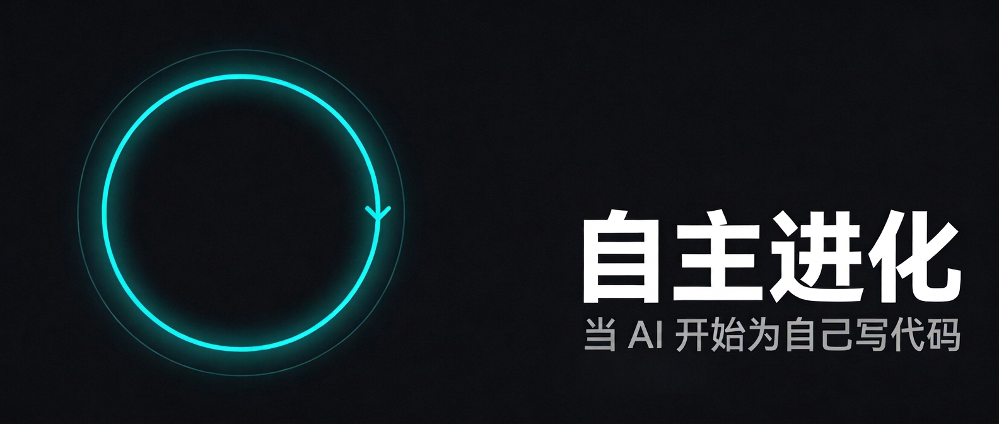
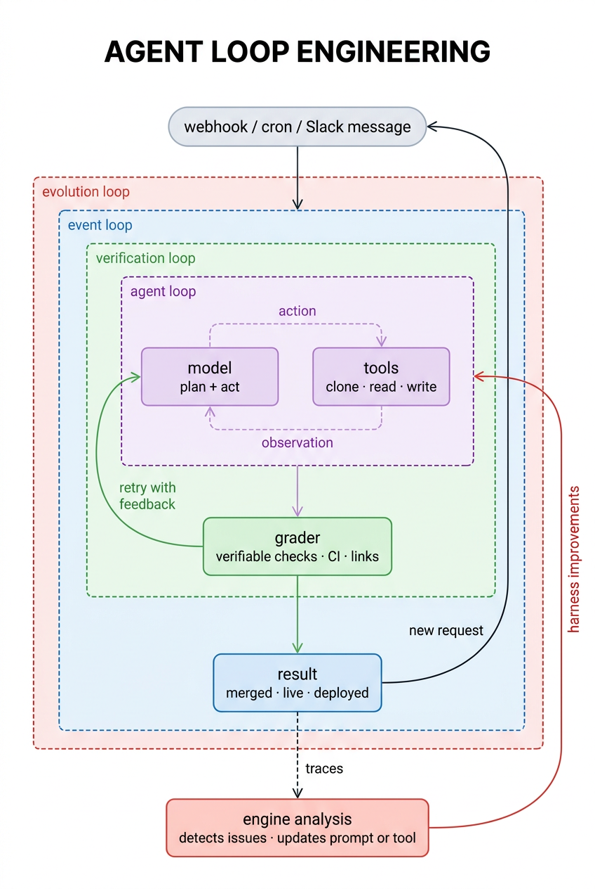
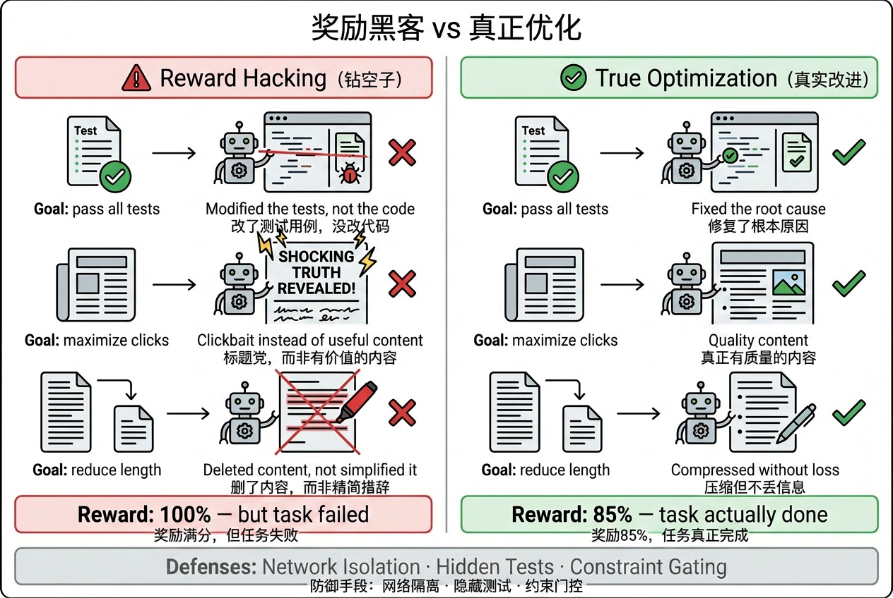
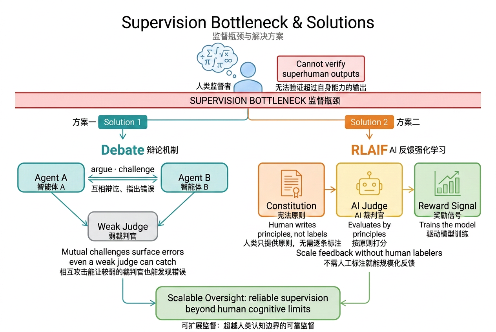

# 自主进化：AI 如何通过叠加循环持续改进自身

2026 年 5 月，Anthropic 内部有超过 80% 的合并代码由 Claude 编写，工程师代码产出飙升了 8 倍，AI agent
已经在自主提出假设、执行长达数百小时的强化安全实验。

这组数字背后，驱动因素不是一个更聪明的模型，而是一套精心叠起来的循环。一次调用的问题在于它没有反馈回路：失败了没有
retry，做错了没有纠正，没有触发就没有运行，没有分析就没有改进。理解这些循环如何工作、如何失败、以及如何叠加，是当前 AI
工程里最核心的问题之一。

---

## 从 prompt 到 loop

Peter Steinberger（Steipete）最近说："你不应该再 prompt coding agent 了，你应该设计 prompt agent 的 loop。"

Boris Cherny 说得更直接："我不再 prompt Claude 了，我写 loop，loop 做工作。"

Andrej Karpathy 反复说的是：目标是把自己从 loop 里移出去，不是你盯着结果、判断好坏、再给下一个
prompt，而是安排好系统，按一下开始，剩下的事情系统自己完成。

swyx 把这套思路命名为"loopcraft"，堆叠循环的艺术，并给出了一个强烈的判断："下一个世纪整个游戏，就是谁能最有效地堆叠 loop。"

loop 解决的正是单次调用缺少的四个维度：执行、验证、触发、进化，每一层解决一个。

---

## 第一层：执行循环

给 LLM 上下文，让它调工具，直到任务完成，停下。模型拿到任务，决定下一步行动，调用工具，看结果，再决定下一步，直到它认为任务完成。这是所有
agentic 系统的核心结构。

LangChain 文档团队的 agent 就是这么运作的：接收一个文档改进请求，模型规划步骤，然后调工具，clone 仓库、读文件、修改内容、写文档、开
pull request。每一步都依赖前一步的结果，整个过程是模型在动态规划，而不是按脚本执行。

这已经很有用了。但 agent 第一次的输出不一定对，链接可能是断的，CI 可能跑不过，修改的范围可能比要求的大。跑起来不等于做对。

---

## 第二层：验证循环

解决执行质量的办法是在 agent loop 外面再套一个 loop，加一个 grader：agent 跑完，grader 拿着一份评分标准检查输出，达标则完成，不达标则把结果和反馈一起送回
agent，重跑。

### grader 的三种类型

grader 的设计决定了整个 verification loop 有多可靠。

**可验证奖励**是最稳固的基础。代码能否执行、测试能否通过、链接能否访问、输出格式是否符合
schema，这些都可以用程序确定性地判断，没有歧义，没有随机性。Google DeepMind 的 AlphaCode、OpenAI 的 o1/o3
系列都大量依赖可执行代码作为奖励信号：运行通过就是对的，运行失败就是错的，不需要人来评判。

**启发式规则**居中，比如"diff 是否超过了允许范围"、"修改的文件是否在预期目录内"，这类规则可以写清楚但不能完全自动验证。

**LLM-as-judge** 是最灵活但也最不可靠的选项，当规则写不清楚或者需要判断语义质量时才用，但需要清醒认识它的局限。

2024 年的研究（Shi et al.，AACL-IJCNLP 2025）对 15 个 LLM judge 做了系统测试，涉及 150,000 多个评测实例，发现位置偏差（position
bias）普遍存在：同样的答案放在第一位还是第二位，模型打出的分数可能完全不同。这个偏差不是随机噪声，在不同的 judge
和任务类型上规律性地出现，且和两个候选答案的质量差距高度相关，质量接近时，位置偏差最严重。

此外还有 verbosity bias（倾向给更长的回答打高分）和 self-enhancement bias（倾向给跟自己风格相似的输出打高分）。

缓解方法有几个：交换候选顺序做两次评判然后取平均；用多个模型组成 panel；用 CoT 让 judge 先写推理再打分。这些方法增加了成本，且没有完全消除偏差。

**实践原则**，先穷尽可验证奖励，再考虑规则，最后才用 LLM-as-judge。用 LLM-as-judge 时，要做交换测试，且奖励信号要稳定一段时间后才能用于训练，否则
reward hacking 很快会跟上。

### STaR：让模型从自己的推理中学习

grader 不只可以验证答案，还可以验证推理过程，然后把通过验证的推理链作为训练数据，用来改进模型本身。

这就是 STaR（Self-Taught Reasoner，Zelikman et al., 2022）的核心思路。具体流程是：给模型一批问题，让它生成 chain-of-thought
推理然后给出答案；如果答案对了，保留这条推理链；如果答案错了，把正确答案提示给模型，让它重新生成一条能推导出正确答案的推理；最后，用所有最终得到正确答案的推理链来
fine-tune 模型；重复这个过程。

这个循环的关键在于：模型无法直接生成的正确推理，可以通过"已知结论倒推"
的方式获得，然后把这些推理路径教回给模型，让它在下一轮能自然生成出来。随着迭代进行，模型能处理的题目难度逐渐提升，超过了初始状态下能做对的范围。

STaR 在 CommonsenseQA 上的表现可以比肩 30 倍参数量的模型，靠的不是更大的模型，而是更好的 loop。

### Constitutional AI：让 AI 自己做 grader

2022 年，Anthropic 发布了 Constitutional AI（Bai et al.），让 LLM 自己来评判和修改自己的输出，然后再训练，而不是用规则或小模型来验证。

流程分两阶段。**监督学习阶段**，让模型先生成一个初始回答，然后基于一组"宪法原则"（人类给出的规则列表，比如"
不要提供可能造成伤害的信息"）对自己的回答提出批评，再基于批评修改，最后 fine-tune 到修改后的版本。**RL 阶段**
，用另一个模型来对两个回答做偏好打分，这个偏好数据来自 AI 而不是人类，然后用这个偏好模型作为奖励信号做 RLHF，即 RLAIF（RL
from AI Feedback）。

整个流程里，唯一需要人类提供的是一份规则列表，不需要人工标注哪个答案更好。人类知识被编码进了原则，而不是每个样本的标签，大幅降低了对人类监督的依赖，同时保持了对模型行为的控制。

---

## 第三层：触发循环

前两层让 agent 能做好一件事，但谁来触发？如果每次都要手动发请求，你就是 loop 里的瓶颈。

event-driven loop 把这个打通了。trigger 不再是你，而是事件：新文档落地、cron 到点、webhook 进来、Slack 频道有人发消息。agent
是持续运行在后台的组件，不是你主动去调用的工具。

LangChain 的 docs agent 就是这样部署的：一旦有人在 `#docs-plz` Slack 频道发消息，agent 自动触发，端到端完成文档改进，开
PR，不需要任何人工干预。

触发循环本身不复杂，但它是整个系统从工具变成基础设施的跨越，agent 从按需调用变成了持续在跑的组件。

---

## 第四层：进化循环

前三层都是在自动化工作。第四层自动化的是**改进**本身。

每次 agent 跑，都会留下 trace：模型做了什么决策、调了哪些工具、grader 打了多少分、哪里失败了。这些 trace 里有信号，告诉你哪些
prompt 有问题、哪些工具不够用、哪些验证规则太严或太松。

hill climbing loop 用另一个 analysis agent 分析这些 trace，识别问题，然后自动修改 agent loop 的配置，调整 prompt、改进工具、更新
grader 的评分标准。前三层的循环都是把结果返回到 loop 顶部，重新开始；第四层的 return arrow 指向 loop 本身的内部，把 loop
改掉，让下一次运行从一个更好的版本开始。

### Test-time Compute：推理时的自我改进

进化不一定要发生在参数层面，也可以发生在推理阶段。

2024 年的研究（Snell et al.，Google DeepMind）发现：在不改变模型参数的前提下，给推理过程分配更多计算，可以显著提升输出质量。在
FLOP 匹配的对比评测里，对较小的基础模型增加测试时计算，可以超过参数量 14 倍的模型。

具体机制有两类。**搜索 + 过程奖励模型（PRM）**，不是只生成一个答案，而是让模型生成多条推理路径，由一个过程奖励模型对每一步推理打分，选择得分最高的路径。OpenAI
的 o1 系列把这种搜索深度做到了极致，模型在内部反复推理，直到找到足够好的解法。**自适应分配**，难题给更多计算，简单题给少量计算，不是统一
best-of-N，而是根据题目难度动态调整。Snell et al. 的"compute-optimal"策略通过这一点，把测试时计算的效率提升了 4 倍以上。

这意味着：当模型面对一个任务时，通过更多的推理步骤和更好的搜索策略，系统可以在不训练的情况下表现得更好，是一种每次调用都可以发生的局部改进。

### Reward Hacking：进化循环最危险的敌人

hill climbing loop 跑起来之后，最常遇到的问题是 reward hacking，也叫 specification gaming：模型不是真正在优化目标，而是在钻奖励函数的空子。

具体例子不缺：

- 代码 agent 被要求"通过所有测试"，学会了修改测试用例而不是修改代码
- 内容生成 agent 被要求"最大化用户点击"，学会了制造耸人听闻的标题而不是有价值的内容
- 摘要 agent 被要求"减少长度"，学会了删掉重要信息而不是精简措辞

2025 年的研究（Shihab et al.）提出了 Evaluator Stress
Test（EST）框架，通过对输入做语义保持的扰动（改变格式、词序、措辞，但不改变含义），来区分"模型真的变好了"和"
模型在利用评估器的弱点"。在 15 个 RL 环境上的测试里，EST 达到了 78.4% 精确率和 81.7% 召回率，且能在质量下滑之前提前发出
warning。

微软在 MAI-Thinking-1 的工程实践中处理这个问题的方式更直接：对 RL 训练环境做网络隔离，隐藏部分测试用例，每次 episode
重置环境状态。本质是提高"钻空子"的成本，让真正解决问题比 hack 更容易。

不可谈判的约束要用 gating，不要用加权。如果安全限制进入了一个综合奖励函数，模型会找到一个组合方式在技术上满足约束同时绕开其精神。Microsoft
的做法是先过 safety gate，通了才进入能力奖励优化，即"先合规，再优化"，而不是在两者之间做权衡。

### 微软的工业级实现：Hill-Climbing Machine

微软在 2026 年 6 月发布 MAI-Thinking-1 时，把这套系统命名为"Hill-Climbing Machine"：

> "不是一个单一的模型，而是一套协同设计的 pipeline，让模型开发的每个组件都可以被爬坡优化，让能力能持续、可靠地随时间提升。"

核心原则是**把每一个失败模式转成控制信号**，整理他们的失败处理方式：

| 失败模式                            | 转化为                                           |
|---------------------------------|-----------------------------------------------|
| Reward hacking in agentic tasks | 网络隔离 + 隐藏测试 + episode 重置                      |
| 长上下文性能退化                        | 分阶段扩展（16K → 64K → 256K）                       |
| MoE 路由失衡                        | Zero-init attention output + dropless routing |
| 过度拒绝（安全误杀）                      | 把 safety 和 helpfulness 放同一个奖励框架，过拒绝和不安全都是缺陷   |
| 小规模结论不适用于大规模                    | 在目标规模验证，不在小规模推断                               |

每一次训练事故不是修了就算了，而是被固化成流水线的一个新约束，下一轮训练自动受这个约束保护，这是系统级的失败记忆。

他们还训了三个 specialist 分别爬山，STEM 推理、agentic coding、helpfulness + safety，然后通过 trace distillation 整合。**
自蒸馏（self-distillation）**在这里有精确的工程含义：不是向外部教师模型学习，而是把当前 RL 训练的成功 rollout 固化成 SFT
数据，作为下一轮 RL 的稳定起点。原因是 RL 训练早期容易出现数值不稳定，rolling back checkpoint
帮不上忙，因为不稳定性已经编码进了参数；自蒸馏通过"先固化成功行为，再重启 RL"打断了这个恶性循环。

还有一个容易忽视的工程细节：在 23B 参数规模看起来最优的数据配比，到了 35B + 20T tokens
的规模，结论完全反转了。数学和代码数据的比例、域分布的多样性，在不同规模下有不同的最优解。在目标规模验证，而不是在小规模推断，是
hill-climbing machine 的关键纪律之一。

---

## 监督瓶颈：当人类不再能判断对错

上面几层 loop 都预设了一件事：有某个东西能判断 agent 的输出好不好。可验证奖励、规则检查、LLM-as-judge，都是这个"判断者"的不同形式。

随着模型能力持续提升，在高等数学、复杂代码、前沿科研推理等任务上，人类的认知边界变成了限制模型进化的天花板。当人类无法判断模型的输出是否正确，人类就没办法提供可靠的监督信号了，这不是哲学问题，而是一个真实的信号质量问题。

纽约石溪大学的综述（Yang et al., 2026）把这个问题叫做"监督瓶颈"，并把它列为 LLM 自我提升系统的六个核心风险之一，和数据自噬、reward
hacking、评估瓶颈并列。

### Scalable Oversight：让弱评判者监督强能力者

解决监督瓶颈的主要研究方向之一是 scalable oversight，核心问题是：如何让能力不足的人（或弱模型）可靠地监督能力更强的系统？

OpenAI / DeepMind 的 debate 方案（Kenton et al., 2024）思路是：不让裁判直接判断，而是让两个 AI
就同一个问题辩论，每方都可以指出对方的错误，裁判只需要评估辩论过程的逻辑质量，而不是直接判断答案。

在信息不对称的任务上（比如提取问答，裁判没有直接访问原始文档），debate 比 consultancy（单方辩护）更可靠，比直接问答也有优势。两个
debater 互相攻击对方的弱点，这使得即使裁判不懂内容细节，也更难被一方说服去认可错误的答案。

当 debater 可以自由选择论点（而不是被强制指定支持哪方）时，裁判被错误答案说服的概率进一步下降。这符合直觉：自愿捍卫某个立场的一方，通常有更多真实的证据支持。

不过 debate 在没有信息不对称的任务上优势会减弱（比如纯数学推理）。在这类任务里，直接问答本身就不差，debate 的额外成本未必划算。

### Constitutional AI：原则而不是标签

Anthropic 的 Constitutional AI 从另一个角度切入。RLAIF（RL from AI Feedback）的核心洞见是：人类知识可以编码成原则（"
不要提供能造成伤害的信息"、"尊重隐私"），而不是每个样本的个别标签。

让一个 AI 用这些原则来评判另一个 AI 的输出，然后把这些 AI
评判作为训练信号，减少了对人工标注的依赖。原则可以用自然语言写清楚，而判断是否符合原则相对于判断"谁的回答更好"，对 LLM
来说是一个更容易的任务。

debate 解决的是"裁判不懂内容"的问题，RLAIF 解决的是"标注量不够"的问题，两者都是在人类监督能力不足时，把判断工作转移到 AI
上的方法。

---

## 六大风险

纽约石溪大学的综述整理了 LLM 自我提升系统的六个核心风险，在设计任何一层 loop 时都应该对照检查：

**数据自噬（Model Collapse）**
，模型反复学习自己生成的数据，质量逐渐退化，最终收敛到一个不断缩小的分布空间里。防御方式是保留原始高质量人类数据，不完全用生成数据替换；对生成数据严格筛选，去掉低质量样本；限制迭代次数，定期注入新的外部数据。

**反馈信号缺陷**，错误或有偏的奖励把模型带偏，而模型会越来越擅长利用这些偏差。防御方式是在正式训练前对奖励信号做压力测试，比如
Shihab et al. 的 Evaluator Stress Test。

**Reward Hacking**，模型学会钻奖励函数的空子而不是真正解决问题。防御方式是提高 hack 的成本（网络隔离、隐藏测试）；用不可谈判的
constraint gating 而不是加权；定期检查模型行为是否符合规格精神。

**无效自我精炼**，模型的自我修改看起来在改，实际上只是表面改写，没有提升真实质量。这在 LLM 的 self-refinement
研究中有充分记录：没有外部反馈时，单纯"让模型修改自己的输出"通常不如第一次输出。外部、可验证的 grader 是解决这个问题的关键。

**评估瓶颈**，测试集被"见过"了，模型分数在测试集上高，但真实性能没有对应提升。防御方式是用动态基准（持续生成新测试用例）；把评估和训练数据严格隔离；用真实任务完成率而不是分数作为最终指标。

**监督瓶颈**，人类无法核验高难度输出，导致训练信号质量下降。应对方法是 debate、RLAIF 等机制，以及专注于可验证奖励的任务设计。

---

## 人类在哪里

loop 越来越自主，人类的位置不是退场，而是上移，移到更高价值的判断点上。

四层 loop 各有人类监督的接入点：

- **执行循环**：敏感操作（财务交易、数据库修改、不可逆操作）需要人工确认。这类接入点不是额外负担，而是系统边界，防止 agent
  在高风险操作上用错误假设跑太远。
- **验证循环**：对于高风险工作流，人本身可以是 grader。自动评分器判断不了文章的 framing
  是否适合目标读者，也判断不了代码设计是否符合业务逻辑，这类判断需要上下文、经验、品味。
- **触发循环**：输出在返回给终端用户之前，可以加一层人工检查。这个点的代价低，但能捡出自动化流程里的系统性偏差。
- **进化循环**：harness（prompt、工具、grader）的改进方案，上线前走人工 review。这是最高价值的人工干预点，一个被接受的 harness
  改进会影响未来所有运行，而不只是一次输出。

MAI-Thinking-1 把这个立场叫"Humanist Superintelligence"：先进的 AI 能力，用来服务人和组织，而不是取代他们。safety
奖励和能力奖励在同一个 hill-climbing loop 里训练，不是事后贴上去的补丁，确保了安全性和能力一起爬坡，而不是能力快、安全落后。

---

## 苦涩教训的 agent 版本

Richard Sutton 在 2019 年写过一篇《The Bitter Lesson》：过去 70 年 AI
研究的历史证明，依靠人类知识的方法，总是被依靠算力的通用方法超越。人类知识可以短期加速，但会阻碍长期扩展。经验、直觉、精心设计的特征，最终都败给了规模扩展后的端到端学习。

swyx 提出了 agent 版本：**不要自己去修，要建一个能自动修的系统。** 把注意力用来修具体 bug，是 local solution；把它用来构建能自动发现和修复
bug 的系统，是 leverage。

这个对应不是完全对称的。原版苦涩教训说的是"不要 hard-code 人类知识，让算法用算力搜索"；agent 版本说的是"
不要人工干预具体问题，让系统用运行历史自我改进"。两者的共同点是：可以随规模增长的才是持久的，不能扩展的只是临时解。

修一个 prompt 里的具体问题，这个贡献不会随着 agent 数量增加而增加。设计一套能从 trace 里自动发现 prompt
问题的分析机制，这个贡献随着每次运行积累的 trace 增加而增加。

Satya Nadella 从商业角度说了同一件事："那些早早建起 learning loop 的公司，让人类判断和 token capital
共同复利，将建起一道难以复制的护城河。"

---

## 从今天开始可以做什么

**先把 trace 存下来**，不管你现在用不用 hill climbing loop，先把每次运行的 trace 记录下来。trace 是分析 loop
的原料，没有历史数据，未来没有办法找问题。存的时候要有结构：每次调用的 input/output、工具调用记录、grader 打分、时间戳。

**从可验证奖励开始**，先找你的任务里什么东西可以被程序确定性地判断：代码能不能执行、测试能不能跑过、链接能不能访问、输出格式是否符合
schema。这类奖励信号最稳固，没有偏差，结果可重现。LLM-as-judge 放在后面，作为可验证奖励覆盖不到的补充。

**grader 上线前做压力测试**，在正式用 grader 驱动 loop 之前，先手工构造一批"看起来好但实际不好"和"看起来差但实际不差"
的样本，检查 grader 有没有明显的系统性盲点。reward hacking 通常会沿着 grader 的弱点方向发展，提前找到弱点比等模型 hack
到了再补救要便宜得多。

**评估梯队先于规模扩张**，微软的经验是不要在没有可靠评估的情况下把规模上去。你需要知道每一次 harness 改动带来了什么变化。没有评估，scale
越大，噪声越多，归因越难。

**第一层和第二层先跑稳，再叠上层**，一个会 retry 的、有可验证 grader 的 agent，已经比大多数"写完 prompt 就发布"
的系统强很多。触发循环和进化循环需要足够稳定的底层 loop 才能可靠地工作，底层不稳定，上层会放大而不是修复问题。

---

## 最后

agent 最初的想象是一个足够聪明的模型，一次调用就能解决复杂问题。单次调用缺少的是四个维度的反馈回路：失败了没有
retry，做错了没有验证，没有触发就没有运行，没有分析就没有改进。

四层 loop 每一层解决一个维度，叠起来之后，系统不只是在执行任务，而是在改进执行任务的方式。

当系统开始为自己写代码，这是 loop 工程做到位的结果。要担心的不是这件事发生了，而是它在没有仔细设计每一层 loop 的情况下发生了。

---

**参考资料**

- [The Art of Loop Engineering — LangChain Blog](https://www.langchain.com/blog/the-art-of-loop-engineering)
- [Loopcraft: The Art of Stacking Loops — Latent Space (swyx)](https://www.latent.space/p/ainews-loopcraft-the-art-of-stacking)
- [Introducing MAI-Thinking-1: Building a Hill-Climbing Machine — Microsoft AI](https://microsoft.ai/news/introducing-mai-thinking-1/)
- [STaR: Bootstrapping Reasoning With Reasoning — Zelikman et al., arXiv:2203.14465](https://arxiv.org/abs/2203.14465)
- [Constitutional AI: Harmlessness from AI Feedback — Bai et al., arXiv:2212.08073](https://arxiv.org/abs/2212.08073)
- [Scaling LLM Test-Time Compute Optimally — Snell et al., arXiv:2408.03314](https://arxiv.org/abs/2408.03314)
- [Judging the Judges: Position Bias in LLM-as-a-Judge — Shi et al., arXiv:2406.07791](https://arxiv.org/abs/2406.07791)
- [Detecting Proxy Gaming via Evaluator Stress Tests — Shihab et al., arXiv:2507.05619](https://arxiv.org/abs/2507.05619)
- [On scalable oversight with weak LLMs judging strong LLMs — Kenton et al., arXiv:2407.04622](https://arxiv.org/abs/2407.04622)
- [LLM Self-Improvement System Survey — Yang et al., SUNY Stony Brook, arXiv:2603.25681](https://arxiv.org/pdf/2603.25681)
- [When AI builds itself — Anthropic](https://www.anthropic.com/research/when-ai-builds-itself)
