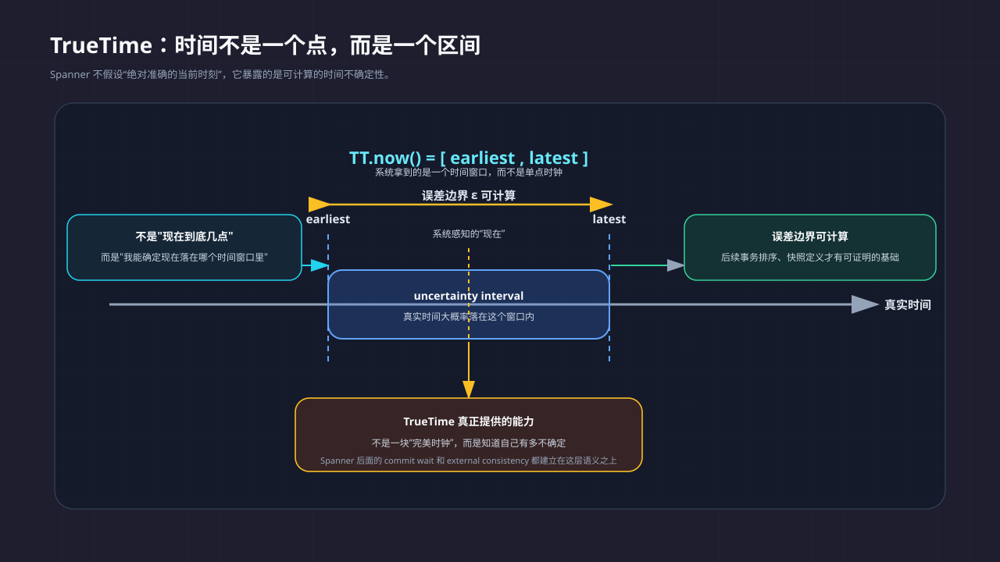
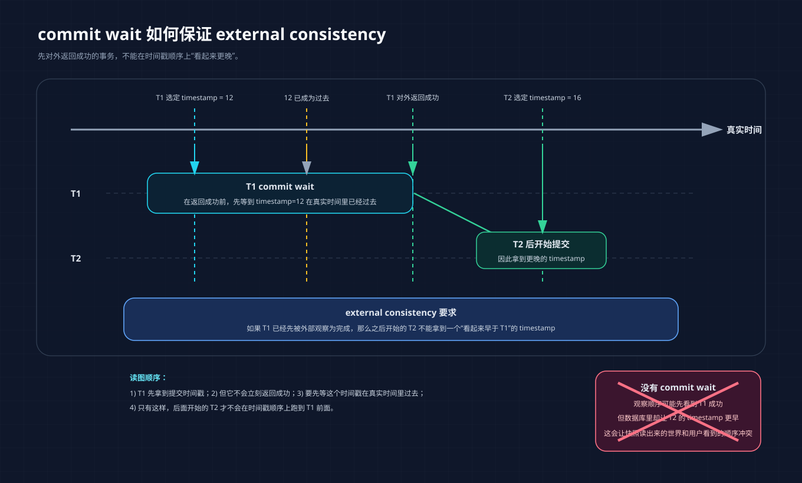
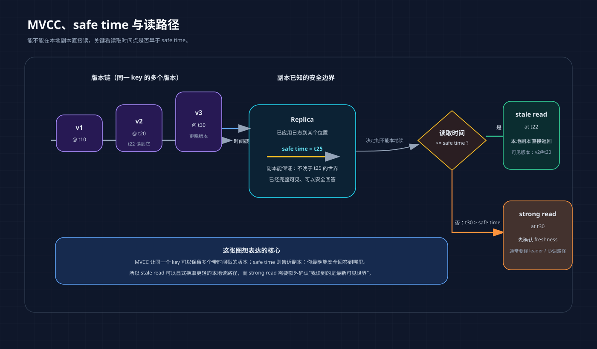
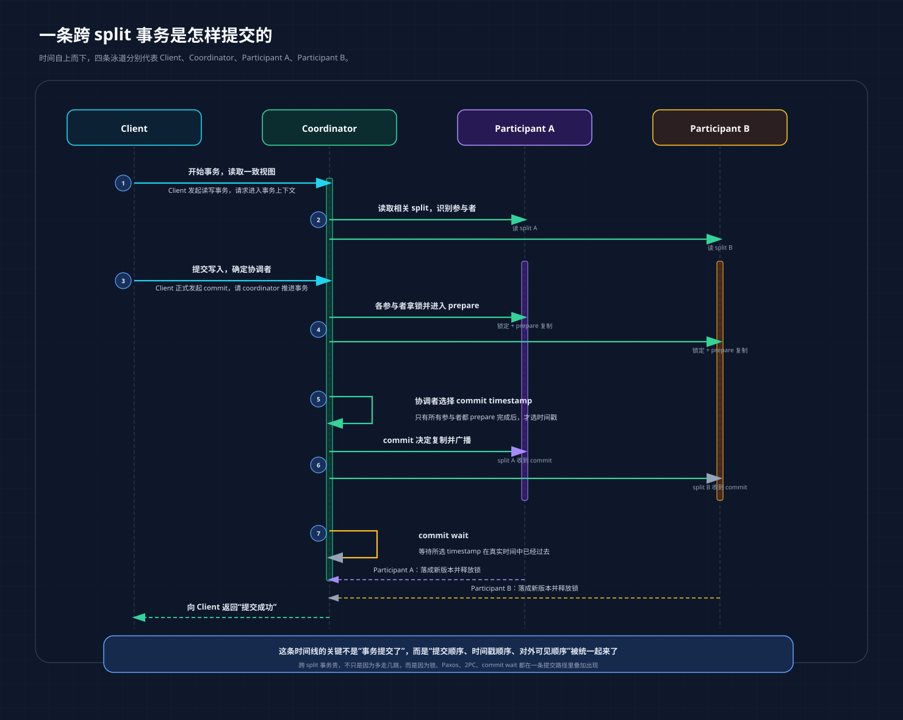

# Google Spanner：全球分布式数据库是怎么被工程化出来的

如果一个系统要同时服务美国、欧洲和亚洲的用户，数据就很难只放在一个地方。可一旦把数据放到多个机房，问题立刻就变了：副本之间怎么同步，事务顺序怎么算，网络抖一下时到底优先保证可用，还是优先保证一致？

很长一段时间里，这几个目标往往很难同时成立。你可以把数据复制到全球，但一致性会变弱；你也可以坚持强一致，但延迟和可用性体验通常会变得难看。Google
Spanner 之所以重要，是因为它把全球复制、强一致事务、工程可用性这三件长期互相牵制的事，变成了一个可以通过系统工程精细权衡的问题。很多人提到
Spanner，第一反应是 TrueTime，可如果只记住这个名词，其实很容易误解它。Spanner
真正重要的地方，是它把复制协议、时间语义、版本管理、事务路径和数据布局放进了同一个设计里，把每个难点都拆开，分别做到了足够可控。

## 它不是横空出世的系统

Spanner 不是 Google 第一次做大规模数据系统。它前面已经有了两代很重要的基础设施。

第一代是 Bigtable。Bigtable 解决的是超大规模结构化数据存储的问题：数据可以做到很大，机器可以很多，吞吐可以很高，schema 也足够灵活。它把 Google 很多业务真正带进了 PB 级数据和海量机器的世界。不过，Bigtable 更像一个可扩展存储系统，而不是一个全球强事务数据库。它擅长的是按键高效读写、扩展和容错，不擅长的是跨很多行、很多范围做带强语义的事务，也不打算提供传统数据库那种统一的关系模型和 SQL 体验。

第二代是 Megastore。Megastore 在 Bigtable 之上继续往前走，引入了跨数据中心复制、Paxos 和更强的事务语义，试图弥合"可扩展存储"
和"传统数据库"之间的落差。它已经很接近 Spanner 的方向了，但代价也很明显。Megastore 把一致性边界收得比较紧，开发者需要围绕
locality 和数据分组去设计模型。换句话说，系统确实给了你更强的保证，但你必须先接受一套更有约束的数据组织方式。

这段前史很关键。Google 在 Spanner 出现之前并不缺分布式存储能力，缺的是把更难的一件事彻底做通：在全球范围内同步复制数据，同时继续给应用提供接近单机数据库的使用体验。Bigtable
解决了"怎么存得下、怎么扩得开"，Megastore 解决了"怎么把部分事务语义补回来"，Spanner 要解决的，则是"
怎么让全球分布、强一致事务和数据库语义一起成立"。

## Spanner 真正想解决的是什么

Spanner 论文里的目标说得很直白：在全球规模上分布数据，做同步复制，并且继续支持 externally consistent distributed transactions。

这三件事放在一起，意思其实很重：数据要在全球范围内分布，复制要放进提交路径里而不是事后异步扩散，事务结果要和外部世界观察到的先后顺序一致。

这背后其实是在回答几个老问题：跨地域复制以后，怎么还保持强一致事务；事务顺序怎么和真实世界里的先后关系对齐；读不能因为写而全部阻塞，写也不能因为全局一致而彻底失去性能。而且这些基础设施问题不该一直由业务系统自己重复处理。一个全球系统如果每个应用团队都得自己兜底复制延迟、快照一致性、跨机房故障和提交顺序，复杂度迟早会失控。Spanner
要做到的，是让业务写事务时，不必每次都先把底层分布式问题重新想一遍。

## Spanner 是怎么把这件事做成的

### Key-range 分片与 Paxos 同步复制

Spanner 的第一层基础是 key-range 分片。数据不是按表或节点静态切开，而是按主键范围切成一个个 split，每个 split 再复制到多个副本上。每个
split 有一个 leader replica 负责协调写入，其他副本参与投票和追日志。写路径必须先把日志复制到多数副本，这次提交才算成立。

从实现上看，这还意味着系统要一直维护"键范围 → split → primary replica"的映射。API 层收到一次读写请求后，先要确定目标 key
落在哪个 split，再把请求路由到该 split 的主副本。一台机器通常会承载多个 split，所以 split
并不和物理机器一一绑定；当数据增长、热点变化或负载需要重新均衡时，split 可以继续切分、迁移，而上层请求只需要重新找到新的
owning split 即可。

如果再把 single-split write 拆开一点，会看到这条路径其实已经很像一个缩小版的分布式提交。primary replica 先尝试获取写锁，再基于
TrueTime 为这笔事务分配时间戳，然后把事务和时间戳复制到该 split
的其他副本。只有当多数副本把这条记录写入稳定存储，这笔事务才算逻辑上提交。注意这里"逻辑提交"和"数据版本已经在所有副本可读"
不是一回事：提交决定先成立，后续各副本再把变更真正应用到自己的数据副本上。

这套设计解决的是两个很具体的问题。第一，数据天然会增长、迁移、重分布，所以分片必须能按键范围继续切分和移动；第二，副本故障和
leader 切换不能破坏事务语义，所以复制协议必须把"谁说了算"和"哪些副本已经确认"写进提交路径本身。Spanner 的做法是，把副本一致性交给
Paxos，把范围切分交给 key-range
split。代价也同样明确：每次写入都至少要经过一轮复制仲裁，写路径天然更贵。[^spanner-osdi-2012][^life-reads-writes]

### TrueTime：把时钟误差变成系统接口

但只有同步复制还不够。分布式数据库真正难的地方，不只是"大家最后值一样"，还有"事务顺序到底按什么算"
。如果没有一个全局可比较的时间语义，系统就很容易落到这样一种状态：副本一致了，事务也都提交了，可快照读出来的世界还是可能和用户看到的先后顺序不一致。

TrueTime 经常被说成"Google 有一个特别准的时钟"，但这种说法并不准确。Spanner 的关键在于它承认时间有误差，并把这个误差显式暴露出来。TrueTime
返回的不是一个单点时间，而是一个带上下界的区间：

`TT.now() = [earliest, latest]`

它表达的意思是"真实时间一定不早于 earliest，也不晚于 latest"
。区间宽度本身就是系统此刻对时间的不确定性。分布式系统里真正麻烦的不是时钟有偏差，而是系统通常不知道这份偏差到底有多大。TrueTime
做的，是把这部分不确定性从隐含假设变成可计算对象。

按 Spanner 论文的描述，TrueTime 背后是一套专门的时间基础设施。Google 在数据中心里部署 time master，其中一部分直接接 GPS
接收器，另一部分接原子钟；机器上的时间守护进程会从多个 time master 取样，再结合本地时钟漂移估计，算出当前这台机器应该暴露的时间区间。Spanner
依赖的不是"所有机器时钟完全一样"，而是"每台机器都能给出一个可信的误差边界"。

TrueTime API 里还有两个判断接口：`TT.after(t)` 和 `TT.before(t)`
。它们给协议层一个确定答案：某个时间点是不是已经确定过去了，或者是不是还确定没到。只有误差边界是显式的，后面的事务排序和快照读语义才有机会做成可证明的性质。[^truetime-external-consistency][^spanner-osdi-2012]

### Commit wait：为什么提交后还要等一下

一旦误差边界可计算，commit wait 就有了明确含义。事务提交时，协调者会先挑一个提交时间戳 `s`，然后不会立刻返回成功，而是继续等到
`TT.after(s)` 为真。换句话说，只有当系统能够确定"真实时间已经晚于 s"
时，这笔事务才会对外宣布完成。这个等待听上去像是额外拖慢系统的一步，但它换来的是一个很具体的性质：事务对外可见的先后顺序，不会和数据库里的时间戳顺序打架。

这里要注意，commit wait 并不是在等复制完成。复制、2PC 决议和 commit timestamp 的选择都发生在它之前。commit wait
等的是另一件事：让事务的提交时间戳真正落到现实时间的过去。所以它和普通的网络等待不是一回事，它承担的是时间语义对齐的工作。

可以用一个很直观的例子理解这件事。假设账户 A 先做了一笔入账，事务 T1 已经返回成功；紧接着，用户又发起一笔扣款，事务 T2
开始提交。如果系统只是随手用各机器本地时钟给事务打时间戳，那么完全可能出现 T2 的时间戳比 T1
更早。这样一来，某个快照读就可能看到"钱已经被扣走了，但前面的入账还没发生"。从事务日志角度看，每个事务都合法；从用户角度看，这个世界明显不对。commit
wait 要解决的就是这种"日志没错、观察顺序却错了"的问题。它把 TrueTime 提供的时间边界真正落实到了提交协议里，也把"
先被外部看到完成的事务，必须拥有更早的提交时间戳"
这件事做成了协议保证。[^truetime-external-consistency][^life-reads-writes][^spanner-osdi-2012]

### External consistency：为什么比 serializability 更强

这也是 external consistency 的关键。它比一般意义上的 serializability 更强。serializability
只要求结果等价于某个串行顺序，并不关心这个顺序是否和外部观察到的先后关系一致；external consistency 则要求，如果事务 A
在外部已经被观察为先完成，事务 B 是之后才开始提交的，那么系统就不能给 B 一个看起来早于 A 的时间戳。更形式化一点说，如果
`commit(T1)` 在外部先于 `start(T2)` 被观察到，那么系统必须保证 `ts(T1) < ts(T2)`。在单对象、单操作场景里，这种语义可以近似看成
linearizability；一旦进入多对象、多操作事务，它的要求就比常见的"强一致读写"更高了。

这里的难点在于，数据库内部"找到一个合法串行顺序"并不够。真正棘手的是，这个顺序还得和客户端实际看到的先后关系对齐。Spanner 用
TrueTime 和 commit wait 把这件事变成了协议级保证，而不是把希望寄托在"机器时钟通常差不多准"
这种经验假设上。[^truetime-external-consistency][^spanner-osdi-2012]

### MVCC、safe time 与快照读

TrueTime 和 MVCC 是连在一起工作的。TrueTime 负责给事务一个能和现实时间对齐的提交时间戳，MVCC
负责把这个时间戳变成可读的多版本世界。写事务提交后，旧值不会被原地覆盖，系统会生成一个带提交时间戳的新版本；读事务则在某个时间点上读取"
这个时间点之前最后一个可见版本"。这样做的好处是，读不必总是和写抢锁，系统也能自然支持快照读、历史读和只读事务。

这套机制最关键的地方，不只是"能读旧版本"，而是它把"事务排序"和"快照定义"合成了一件事。只要时间戳分配是正确的，MVCC
里的每个快照就都可以被解释为数据库在某个全局时刻的状态。Spanner 因此能在跨多个 region
的情况下给出一致快照，而不是每个副本各读各的最新值，再由客户端自己猜哪份结果更可信。

这里还有一个常被忽略的实现点：safe time。它不是"这台机器现在的物理时间"，而是"
这个副本已经可以证明自己看全了某个时间点之前所有提交"的边界。副本如果要直接服务某个时间点 `t` 上的读取，必须能证明
`t <= safe time`；否则，它就可能还没看到某些理论上应该对这个快照可见的写入。

对 strong read 来说，这通常意味着还要额外确认 freshness，保证读到的是足够新的全局状态；对 stale read 来说，只要读取时间点早于副本已经确认安全的
safe time，就可以直接在副本本地完成，不必每次都去问 leader。也就是说，stale read 并不是 eventual consistency 式的"
先随便读一个差不多的结果"
，而是在一个明确、稳定、已经被证明安全的历史时间点上做快照读取。[^truetime-external-consistency][^life-reads-writes]

### 跨 split 事务：成本到底叠加在哪

单 split 写相对便宜：leader 拿锁、选时间戳、把日志复制到多数副本、commit wait、返回，没有跨 split 协调，路径短。跨 split 读写事务则把
Spanner 的所有重型机制串在一条路径上：wound-wait 死锁预防、每个参与者的锁状态通过 Paxos 持久化、所有参与者 prepare
完成后协调者才能选时间戳、commit 决定本身还要再复制一轮、最后 commit wait。系统一笔事务贵不贵，很多时候由它触碰了多少 split
决定，SQL 写成什么样反而不是主要因素。下面把这条路径完整拆开。[^spanner-osdi-2012][^life-reads-writes]

### 一条跨 split 读写事务的时间线

如果把一笔跨 split 的读写事务按时间摊开，大致会经过下面几步。

1. **事务开始，先读到一个一致视图。** 客户端先发起读写事务，API 层把读请求路由到相关 split 的 leader。被读取的 split 会先拿到对应的读锁，再把结果返回给客户端。到这一步，事务还没有提交时间戳，它只是先把自己读过哪些数据记下来。
2. **客户端提交写入，参与者被确定下来。** 当客户端真正提交时，事务里所有读过或写过的 split 都会成为参与者。写入目标所在的某个 split leader 会成为协调者，负责把这笔事务一路推到提交或中止。
3. **各参与者先进入 prepare。** 每个参与者会去拿自己需要的锁，比如读锁是否还有效、写锁能不能拿到；然后把"我已经准备好"这件事通过
   Paxos 复制到本 split 的多数副本。走到这里，事务还没有真正提交，但已经进入一种"要么一起成功，要么一起回滚"的状态。
4. **协调者选择提交时间戳。** 等所有参与者都确认准备完成后，协调者才会基于 TrueTime 选择一个提交时间戳。这个时间戳不是随便挑的，它必须足够晚，不能和已经提交过的相关事务顺序打架。
5. **提交决定先被复制，再变成全局事实。** 协调者把 commit
   决定复制到自己的多数副本，再通知其他参与者。逻辑上说，这时事务已经被决定为提交；但对客户端来说，它还不能立刻算"已经发生"。
6. **执行 commit wait。**
   协调者会继续等，直到系统能够确认刚才那个提交时间戳在真实世界里已经过去。只有这一步完成，客户端才会收到"提交成功"。这就是为什么
   Spanner 能保证：你先看到 T1 成功，再发起 T2，系统不会在时间戳顺序上把 T2 放到 T1 前面。
7. **各参与者把写入落成新版本并释放锁。** 后续各 split 会把这笔事务真正应用成带该时间戳的新版本，然后释放锁。对外语义上，事务的先后顺序在第 6 步就已经被固定住了；物理上的应用动作可以略有重叠，但不会再改变它在全局快照里的位置。

如果是一笔 single-split write，这条时间线会短很多。它不需要跨 split 协调者，也不需要完整的两阶段提交，很多成本都会被直接砍掉。所以
Spanner 的性能差异，常常不在"写"和"读"之间，而在"你的事务到底跨了多少 split"。[^life-reads-writes][^spanner-osdi-2012]

## 这套方案的代价是什么

Spanner 的强语义不是免费的，它最大的硬代价就是写延迟更高。

F1 是 Google 建立在 Spanner 之上的分布式 SQL 数据库，承载了 Google 广告系统的核心数据。F1 论文[^f1-vldb-2013]讲得很直接：Spanner
的同步跨数据中心复制会带来更高的提交延迟。这件事不是某个实现上的瑕疵，是整个系统设计的直接结果。只要你坚持多数副本同步确认，坚持跨
split 事务原子提交，坚持外部一致性，就得把复制、协调和等待都放在提交路径里。建立在 Spanner
之上的业务系统，不得不通过更讲究的数据模型和应用设计，去吸收这部分成本。代价没有消失，只是以更清楚的形式出现了。

数据建模也从"重要"变成了"性能核心"。在单机关系库里，schema 主要影响的是逻辑表达和局部性能；在 Spanner
这种系统里，数据是不是共址、主键怎么设计、热点会不会集中，直接决定一个事务是不是会跨 split，进而决定它要不要支付更高的协调成本。F1
之所以强调 hierarchical schema model，是因为它能把经常一起访问的数据放得更近，让一部分事务留在更便宜的路径上。分布式数据库的很多性能问题，往往先出现在主键和数据布局上，而不是
SQL 语句本身。

Spanner 对基础设施条件也有更强假设。Spanner 并没有绕过 CAP。Eric Brewer 在讨论 Spanner 和 CAP 时讲得很清楚：在真正的网络分区下，系统仍然要偏向
consistency over availability。Spanner 之所以在生产里表现出很强的可用性体验，是因为 Google
的网络现实、时钟同步能力和机房条件，把很多原本常见的极端情况压低了。工程条件做得足够强，某些权衡在现实里就会变得更可接受，但这不是
CAP 被推翻了。TrueTime 也不是魔法，它只是让时间边界变得可计算，让系统能少做一部分原本必须依靠通信才能完成的排序工作。

系统内部复杂度也显著上升。Spanner 的第一篇论文更多讨论的是分片、复制、事务和时间语义。但很快 Google 就不得不继续往 SQL
系统的方向推。查询路径也是同样的分层逻辑：单 split 查询在本地完成，多 split 查询拆成根节点和叶子节点并行执行，再加上 range
extraction、query restart、resume token
这些能力，把查询故障恢复也收进了数据库内部。从应用层收回的复杂度，必然在系统层落地。[^spanner-sql-system]

## 为什么 F1 很关键

如果说 Spanner 证明了"全球强一致事务数据库可以被做出来"，那么 F1 证明的就是：这样的系统不仅可以存在，而且真的能被核心业务用起来。

F1 建立在 Spanner 之上，本身就是一个强信号。它说明 Google 最重要的一类业务系统，愿意接受同步复制带来的额外延迟，换取更强的一致性和更统一的数据库语义。但 F1 也同时暴露了现实一面：业务不是只要一个分布式事务引擎就够了，它还需要更完整的 SQL 能力、对 schema 演进的支持、对查询路径的优化，以及对延迟成本的持续消化。

F1 的价值，恰恰在于它把这些系统层代价变成了应用层真实问题。它要面对的是广告业务这种规模巨大、结构复杂、持续在线的场景，数据库不仅要能做事务，还要能做关系查询、在线
schema 变更、变更跟踪和数据发布。一个只会做全球分布式事务的底层存储，对这类业务还不够。

这也是为什么后来的 Spanner 论文不再只谈事务，而开始强调"Becoming a SQL System"
。一个底层分布式事务系统，最终还是会被业务团队逼着长成更完整的数据库产品。否则，复杂度只会重新回到应用层。

## Spanner 留下的真正启发

回过头看 Spanner 的设计，最容易被低估的一点是：它的有效性不在某一层特别强，而在各层之间咬合得足够紧。Paxos
管副本一致，但解决不了时间顺序如何表达；TrueTime 给出可比较的时间语义，但没有 MVCC 就无法变成可读的多版本快照；MVCC
让读写不必互相阻塞，但如果数据布局不对，跨 split 事务的协调成本照样吃掉收益。这套系统之所以成立，靠的是这些机制被放到同一个设计里一起权衡，而不是某个环节单独突破。

Spanner 在代价暴露上也比很多系统诚实。它默认给强语义，同时把不同路径的成本摊开：single-split write 和 multi-split
transaction 的差异，strong read 和 stale read 的差异，都有清晰的边界和选择空间。这种做法比"系统看起来很快，复杂度留给业务"
更适合关键场景。

更大层面上，Spanner 改变的是一种预期。很多长期被认为"在分布式环境里不现实"
的数据库语义，比如全球分布下的强事务、跨分片原子提交、外部一致性，不是理论上不可能，是工程上太贵。Spanner
证明，如果愿意在时钟、网络、复制和数据布局上做足够深的系统投入，这些目标可以同时追求。后来的 NewSQL 系统，无论有没有
TrueTime，本质上都在回答 Spanner 提出的问题：怎么逼近外部一致性，怎么把跨分片事务成本压低，怎么让 SQL 继续做默认接口，怎么把正确性和延迟的
trade-off 做成显式选择而不是隐含陷阱。

## 结语

十多年过去，Spanner 论文里讨论的问题没有过时。全球规模下，一致性、延迟和可用性之间的张力，至今仍然是分布式数据库设计里最核心的问题。Spanner
没有给出一个一劳永逸的答案，它给出的是一种方法：把这些张力拆成可工程化的子问题，让每个子问题有明确的机制和明确的代价，然后让使用者根据自己的场景做选择。

这可能也是它作为一篇论文最有价值的地方，不是说"我们做到了"，而是说"做到是有条件的，条件是这些，代价是这些"。

## 参考文献

1. James C. Corbett et al. *Spanner: Google's Globally-Distributed Database*. OSDI 2012.
2. Google Cloud. *Life of Spanner Reads & Writes*.
3. Google Cloud. *Spanner: TrueTime and External Consistency*.
4. Sudipto Das et al. *Spanner: Becoming a SQL System*. SIGMOD 2017.
5. Jeff Shute et al. *F1: A Distributed SQL Database That Scales*. VLDB 2013.

[^spanner-osdi-2012]: James C. Corbett et al., *Spanner: Google's Globally-Distributed Database*, OSDI 2012.
[^life-reads-writes]: Google Cloud, *Life of Spanner Reads & Writes*.
[^truetime-external-consistency]: Google Cloud, *Spanner: TrueTime and External Consistency*.
[^spanner-sql-system]: Sudipto Das et al., *Spanner: Becoming a SQL System*, SIGMOD 2017.
[^f1-vldb-2013]: Jeff Shute et al., *F1: A Distributed SQL Database That Scales*, VLDB 2013.
