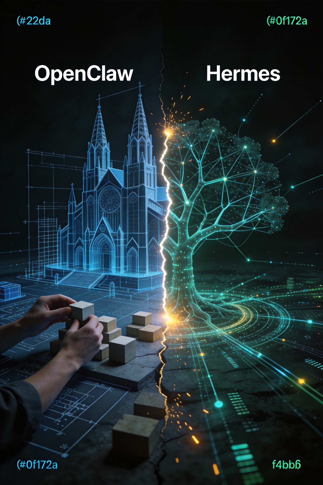
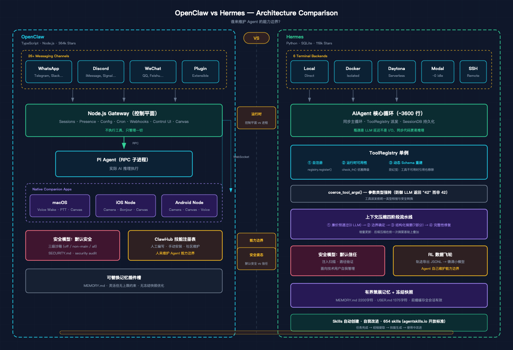

# 谁来维护 Agent 的能力边界？OpenClaw 与 Hermes 的工程哲学对比



> 本文从源码架构出发，分析两个最受关注的开源 AI Agent 框架的根本分歧。

---

## 一、一条迁移命令背后的故事

Hermes Agent 的 README 里有这样一条命令：

```bash
hermes claw migrate
```

它会从 OpenClaw 的配置目录里导入 SOUL.md、MEMORY.md、用户创建的技能、命令白名单、消息设置和 API
Keys【1】。一个框架专门为另一个框架的用户准备迁移工具，说明两者的关系不是并行发展，而是直接竞争。OpenClaw 有 364k Stars，Hermes
有 118k Stars【2】，但 star 数量反映的是用户规模，不是工程深度。本文只看架构。

---

## 二、运行时形态：控制平面 vs. 执行进程



两个项目的运行时形态差异，最直接体现在语言选择上，而语言选择背后是对"这个东西应该长什么样"的根本判断。

### OpenClaw：Node.js Gateway 作为 WebSocket 控制平面

OpenClaw 的核心是一个 Node.js Gateway 进程，它不执行工具，它管理一切：会话、存在感、配置、Cron、Webhooks、Control UI 和
Canvas。实际的 AI 推理由 Pi Agent（通过 RPC 连接的子进程）完成【3】。

配套有完整的原生应用：macOS 菜单栏应用（Voice Wake + PTT、Talk Mode overlay）、iOS Node（Canvas、Voice Wake、相机、屏幕录制、Bonjour
设备配对）、Android Node（连接、聊天、语音、Canvas、相机/屏幕录制）【3】。

选 TypeScript 不是偶然的。Gateway 需要 WebSocket 控制平面、实时事件推送和 Canvas 渲染，Node.js 的事件循环和 npm
生态是最自然的选择；同时整个项目要支撑 macOS/iOS/Android 多端应用，TypeScript 的类型系统和统一工具链让跨端协作成本更低【3】。代价是整个系统更重，部署
OpenClaw 意味着运行一个 Gateway 进程，可能还有伴侣应用和 Node。

### Hermes：Python 单体进程 + SQLite

Hermes 的入口是 `hermes` 命令，启动后是一个 Python 进程加上一个 SQLite 文件。核心是 `run_agent.py` 里的 `AIAgent` 类，约
3600 行，包含完整的对话循环【1】。

选 Python 是因为它要做的事情：批量轨迹生成、Atropos RL 环境集成、轨迹压缩，Python 在 ML
工具链里的生态是无可替代的【4】。同步主循环（而非异步）也是刻意的设计决策：AI Agent 的瓶颈是 LLM API 延迟而不是 I/O
并发，同步代码更容易推理、调试和维护，并行需求通过 `ThreadPoolExecutor` 显式实现【1】【2】。代价是：不能做 Voice
Wake，不能直接控制设备端摄像头，前端体验有明显天花板。

### 这个选择锁定了什么

两种运行时形态决定了各自能走的路【2】：

|            | OpenClaw          | Hermes                      |
|------------|-------------------|-----------------------------|
| 适合的部署      | 消费级产品，多设备         | 开发者自托管，$5 VPS               |
| 能做但另一方很难做的 | 设备端原生能力（语音/相机/屏幕） | RL 训练集成，批量轨迹生成              |
| 空闲成本       | Gateway 进程长驻      | Daytona/Modal 无服务器休眠，接近零【1】 |
| 部署复杂度      | 较高（多个组件）          | 低（Python 进程 + SQLite）       |

---

## 三、工具系统：防幻觉工程

### Hermes 的三连击

Hermes 的工具系统围绕一个单例 `ToolRegistry` 构建，注册表本身不复杂，价值在三个叠加的设计模式上【2】。

**自注册**，每个工具文件在被导入时调用 `registry.register()`，声明自己的
Schema、处理器、工具集归属和可用性检查函数。添加新工具只需要三步：创建文件、添加导入、加入工具集。注册表不依赖任何工具文件（无循环导入），工具文件依赖注册表【2】。

**运行时可用性检查**，每个工具可以注册一个 `check_fn`。需要 API Key 的工具，在 Key 未配置时自动从工具列表消失，不是抛异常，而是从一开始就不出现【2】。

**动态 Schema 重建**，是三个模式里最微妙、影响最深远的。`get_tool_definitions()` 不是简单地返回已注册工具的 Schema
列表，它会根据当前实际可用的工具动态修改 Schema 内容。具体例子：`execute_code` 工具的描述会列出"沙箱中可用的工具"，如果
`web_search` 的 API Key 未配置，它就不会出现在这个列表里。更关键的是，`browser_navigate` 的描述中有"优先使用 web_search"
这句话；当 `web_search` 不可用时，这句话会被自动移除【2】。原因很直接：LLM 会照着工具描述里提到的工具去调用，即使那个工具根本不存在。许多
Agent 框架的工具描述是静态写死的，工具不可用时描述仍然存在，LLM 照着描述调用，就产生幻觉。Hermes
在工具注册层解决这个问题，而不是靠提示词或运行时错误处理【2】。

还有一个经常被忽视的防御性细节：`coerce_tool_args()` 函数。LLM 经常把数字作为字符串返回（`"42"` 而不是 `42`），Hermes
在派发工具调用前对每个参数做类型强转，将参数值与工具注册的 JSON Schema 对比，发现类型不匹配就尝试安全转换【2】。这能避免大量在生产中难以重现的工具调用失败。

### OpenClaw 的工具权限分级

OpenClaw 的工具系统侧重点不同，它更关注权限边界。

沙箱系统支持三级模式：`off`（主机直接执行，默认）、`non-main`（非主会话在 Docker 沙箱中运行）、`all`
（所有会话沙箱化）。每个沙箱有专用的允许/拒绝列表：默认允许 `bash`、`process`、`read`、`write`；默认拒绝 `browser`、`canvas`、
`nodes`、`cron`【3】。

插件信任模型有一个值得注意的地方：安装或启用一个插件，就授予它与 Gateway
主机上本地代码相同的信任级别【3】。技术用户能理解这个风险，普通用户可能不行，这是消费级产品和技术工具之间的重要差异。

Hermes 的工具系统核心问题是：如何让工具系统和 LLM 的行为保持一致（防幻觉，运行时可用性，动态 Schema）。OpenClaw
的核心问题是：如何让工具系统和用户的信任边界保持一致（沙箱，权限分级，插件信任模型）【2】。

---

## 四、记忆系统：有界 vs. 可替换

### Hermes 的有界策展记忆

Hermes 的记忆系统由两部分构成：策展式记忆文件（MEMORY.md + USER.md）和会话搜索（SQLite FTS5 全文搜索）【1】。

MEMORY.md 上限 2200 字符，USER.md 上限 1375 字符【2】。这两个数字不是随意定的，足够大到能存有意义的信息，又足够小到迫使 Agent
在写入新条目前清理旧的。字符计数而非 token 计数，模型无关。接近上限时，Agent 必须替换或删除已有条目才能添加新内容，这个约束直接改变了
Agent 的行为：它被迫学会什么信息值得长期保存【1】。

更有意思的是"冻结快照"模式：`MemoryStore`
在会话开始时从磁盘加载记忆并注入系统提示，这个快照在整个会话期间保持不变。会话中途写入新记忆会立即持久化到磁盘，但不改变当前会话的系统提示【1】【2】。这个设计解决了一个成本问题：Anthropic
的前缀缓存依赖系统提示的稳定性，如果系统提示在会话中途变化，缓存失效，每次 API 调用都要重新计算整个提示的
token。冻结快照保证了前缀缓存在整个会话期间有效，新记忆在下一个会话才可见【2】。

底层实现上，写入使用 `os.replace()`（原子重命名），读取不需要文件锁，并发写入通过 `fcntl.flock` 文件级独占锁保护【1】。

### OpenClaw 的可替换记忆插件槽

OpenClaw 把记忆设计成一个可替换的插件槽，同一时间只能有一个记忆插件活跃，但可以换成不同的实现【2】。`MEMORY.md` /
`memory/*.md` 作为工作区级记忆文件，是当前的默认实现。这种设计更灵活，但失去了有限资源约束 Agent 行为的特性，也没有冻结快照的缓存优化。

无限记忆看似更强大，但会导致系统提示膨胀（增加推理成本）、检索噪声增大（降低相关性）、缓存频繁失效（进一步增加成本）。Hermes
的有界设计是工程上的克制，不是能力上的退让。

---

## 五、上下文压缩：Hermes 工程复杂度最高的模块

随着对话变长，上下文窗口终究会耗尽。常见的处理方式是丢弃早期消息，或者用一个 LLM 调用做简单摘要。Hermes 做了一个四阶段的精细流程【2】。

**第一阶段：廉价预通过（零 LLM 调用），**
把旧的工具结果替换为占位符。工具输出往往是上下文里最占空间的部分，但不一定需要保留全文，一个"
执行了什么工具、返回了什么类型的结果"的占位符通常就够了，这一步不调用任何 LLM，纯文本替换【2】。

**第二阶段：边界确定，**保护头部（系统提示 + 首次交互）和尾部（基于 token 预算的最近上下文，约 20K token）。这里用的是 token
预算而不是固定消息数，如果一条消息里有大量工具输出，它会占用更多保护配额；短消息则不浪费配额【2】。

**第三阶段：结构化摘要，**用辅助 LLM（廉价/快速模型）对中间轮次进行摘要，摘要按固定模板分为 7
个部分：目标、约束与偏好、进度（已完成/进行中/阻塞）、关键决策、相关文件、下一步、关键上下文。摘要的 token 预算是被压缩内容量的
20%，上限是模型上下文窗口的 5% 或 12,000 token 取较小值【2】。

**第四阶段：完整性修复，**压缩可能破坏 tool_call/tool_result 配对，LLM API 要求每个工具调用都必须有对应的工具结果，否则报错，这一步修复压缩后的孤立配对【2】。

第二次及后续压缩不是从头摘要，而是在前一次摘要的基础上做增量更新。这保证了跨多次压缩的信息不会被清洗掉，第一次压缩的结论会作为上下文参与第二次压缩【2】。

关于 OpenClaw 的上下文压缩机制，现有资料没有覆盖到足够的技术细节，这里无法进行对比。`/compact` 命令存在，但实现细节不清楚。

---

## 六、谁来维护 Agent 的能力边界

**OpenClaw 的答案：人来维护。**ClawHub 是 OpenClaw 的技能注册表，社区贡献技能，用户安装和启用【3】。原生 macOS/iOS/Android
应用、Voice Wake、Canvas，这些是人类工程师专门为特定平台构建的能力，不会自动出现，需要持续维护。在这个模型里，Agent
的能力边界由生态决定：有多少人愿意为这个平台写技能和插件，Agent 就有多强大。OpenClaw 用 364k Stars 和活跃的社区证明了这条路能跑通。

**Hermes 的答案：Agent 自己来维护。**Hermes 的技能（Skills）不是预先由人类写好的，它们由 Agent 在完成复杂任务后自动创建，存储为
Markdown 文档，在后续类似任务中自动调用，并在使用过程中自我改进【1】【4】。技能中心现有 654 个技能，覆盖 4 个注册表（74 内置 + 59
可选 + 521 社区 + 16 Anthropic + 505 LobeHub），采用开放的 `agentskills.io` 标准，支持基于上下文的自动激活【5】。

更有前瞻性的是 RL 数据飞轮设计。Hermes 包含 `tinker-atropos` 子模块，支持导出完整的 Agent 交互轨迹（系统提示、用户消息、模型推理、工具调用及其结果）为
JSONL 格式【4】。预期的使用路径是：用大模型（Claude）通过 Hermes 完成任务，导出轨迹，用这些轨迹微调小模型，逐渐降低 API
成本同时保持性能【4】。轨迹压缩工具（`trajectory_compressor.py`）专门处理训练数据的格式问题：保护首轮次和最后 N
轮次，压缩中间轮次，保证压缩后的轨迹仍然是可训练的对话记录【1】【4】。

这个设计让 Hermes 不只是 LLM 的调用方——它用自己的执行轨迹训练下一代定制模型，把工具使用的经验转化为训练数据。多数 Agent
框架在问"我怎么更好地调用 LLM"，Hermes 在问"我怎么用自己积累的轨迹让下一个模型更便宜"【4】。

这个哲学差异渗透到每一处工程决策，前面几节已经逐一展开，这里不再重复。

---

## 七、安全模型：默认安全 vs. 默认信任

### OpenClaw：完整的信任边界文档

OpenClaw 明确定义了它的信任模型："个人助手信任模型"，一个受信操作者，可能多个 Agent，不是共享多租户总线【3】。

安全文档（SECURITY.md）是目前开源 AI Agent 项目中最完整的之一：定义信任边界、明确列出"不属于安全漏洞"的场景（比如运行在受信
Agent 上下文中的工具可以访问文件系统）、漏洞报告流程【3】。`openclaw security audit --deep`
可以扫描当前配置的安全风险并提供自动修复建议【3】。沙箱分级（off/non-main/all）+ 工具文件系统硬化（`workspaceOnly`）+ DM
配对机制，这三层防御覆盖了消费级产品面对的主要威胁面【3】。

### Hermes：注入扫描 + 路径验证 + 命令审批

Hermes 的安全模型更轻量，假设用户是技术人员，能理解和管理自己的安全边界【2】。

记忆注入扫描值得单独说：所有外部注入的内容（记忆文件、上下文文件、AGENTS.md）在进入系统提示前都经过威胁模式扫描，检测 prompt
注入、角色劫持、数据窃取模式和不可见 Unicode 字符【2】。这是提示安全在代码层面的具体实现，在很多框架里是缺失的。Cron
脚本路径验证防止路径遍历攻击：脚本必须位于 `HERMES_HOME/scripts/` 目录下，执行有超时限制【2】。

两种安全模型都是理性的，因为它们在回答不同的问题。OpenClaw 在问：如果一个非技术用户部署了这个系统，可能出现什么安全问题，如何默认防护？Hermes
在问：如果一个技术用户部署了这个系统，他需要在 Agent 执行路径里防护哪些攻击向量？【2】

---

## 八、六个值得借鉴的工程模式

以下六个模式解决了在需要工具调用和状态管理的 Agent 系统里都会遇到的问题。

**1. 动态 Schema 重建（防幻觉），**不要在工具 Schema 里硬编码对其他工具的引用。工具的描述应该在运行时根据当前实际可用的工具动态生成，工具不可用时，引用它的描述也要同步移除【2】。

**2. 冻结快照记忆（缓存成本优化），**在会话开始时把记忆注入系统提示，整个会话期间不再修改。会话中途的记忆更新只写磁盘，下一个会话才生效，保证前缀缓存的命中率，避免记忆更新导致的缓存失效成本【1】【2】。

**3. 有界记忆的约束，**给记忆设定上限，不是因为无法做到无限大，而是因为有限的资源约束会改变 Agent
的行为，它被迫学会什么值得记住。无限记忆会带来提示膨胀、检索噪声和缓存失效【1】【2】。

**4. 参数类型强转（防御性编程），**在工具派发前统一做参数类型强转。LLM 经常把整数作为字符串返回，这类错误在生产中难以重现，在工具层面统一处理比在每个工具里分别处理要好【2】。

**5. 子 Agent 全局状态保护，**任何使用进程全局变量的系统，在引入并行子任务时都要保存和恢复这些状态。Hermes 在委托系统里的做法：创建子
Agent 前保存父 Agent 的工具列表，子 Agent 执行完后恢复，防止子 Agent 的工具集污染父 Agent 的全局状态【2】。

**6. 单一真相源的命令注册表，**Hermes 的 `COMMAND_REGISTRY` 定义了所有斜杠命令，CLI、Gateway、Telegram 菜单、Slack
子命令路由、自动补全，所有消费者都从这个注册表派生。添加一个新命令，所有平台自动获得支持【2】。命令定义和命令实现之间的分离，是大型多平台系统维护成本的关键节点。

---

## 九、结语

OpenClaw 证明了一件事：把 AI Agent 做成消费级产品，人们会参与共建它的能力边界。364k Stars 是这条路跑通了的证明。

Hermes 在试验另一个假设：Agent 能从自己的工作里学习，能力边界会自己生长。这件事还没有在规模上被验证，但技术路径和 RL
飞轮的逻辑都是自洽的【4】。

两者对"Agent 应该是什么"有不同的答案，并且把这个答案落实到了每一个工程决策里——语言选择、工具注册、记忆上限、安全模型。架构是最诚实的意图声明。

现在最值得观察的问题是：Hermes 自动创建的技能，质量能不能经受时间检验【4】。

---

## 参考来源

- 【1】Hermes Agent GitHub README — https://github.com/NousResearch/hermes-agent
- 【2】Hermes Agent 深度架构剖析与 OpenClaw 工程化对比 — echovic.com
- 【3】OpenClaw GitHub README — https://github.com/openclaw/openclaw
- 【4】Hermes Agent 深度解读：NousResearch 开源自进化 AI Agent — ai-insight.org
- 【5】Hermes Agent Skills Hub — https://hermes-agent.nousresearch.com/docs/skills/
