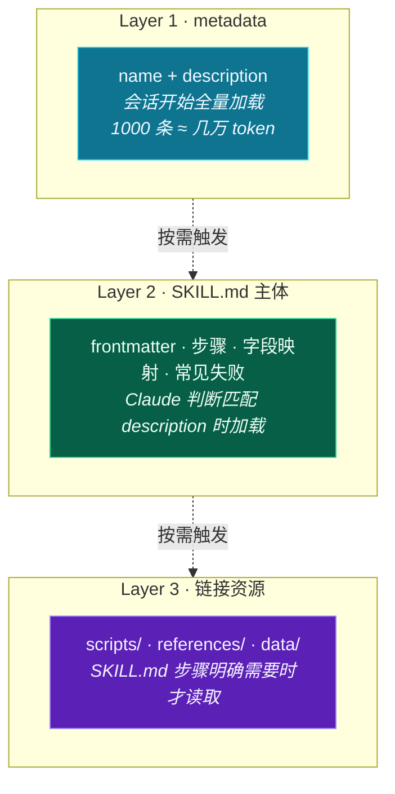
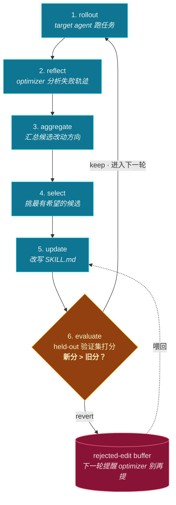

# 像训练神经网络一样训练 Skill

2025 年 10 月 16 日，Anthropic 发布 Agent Skills，把 Claude 用 skill 这件事变成了一个有名字、有规范、有运行时的工程对象。一份
skill 是一个文件夹，里面放一个 `SKILL.md`，加上可选的脚本和资源。Claude 跑任务时按需加载，不需要全部塞进 system
prompt。

这套系统解决了 skill 怎么用，没解决 skill 怎么写才有效。

七个月后，2026 年 5 月，微软研究院给出了答案，分两篇论文。SkillLens 做诊断：自动生成的 skill 在五个领域的实测里有 25% 概率让
agent 表现变差，LLM 自己看 skill 文本判断好坏的准确率只有 46.4%。SkillOpt 做治疗：把 skill 文档当作 frozen
模型的可训练状态，用类似深度学习的训练循环优化它，在 GPT-5.5 上把六个 benchmark 平均提升 19 到 25 个百分点。

Karpathy 的 autoresearch 在同一时期出现，是一个最简实现，让 agent 自主修改一个训练脚本，只保留让指标下降的修改。社区里的
darwin-skill 把这套思路搬到 Claude Code Skill 优化上，加了 human-in-the-loop 节点。

把这几件事并排放在一起，会看到一条工程主线：模型权重冻结，skill 文档（一份 Markdown）是新的可训练参数，验证集得分代替梯度，LLM
改写代替反向传播。

这篇文章把这条主线讲清楚，每个项目给一份能跑的安装指针，最后一份「自己实现 mini 训练循环」的 Python 代码可以拿走改。

***

## 一、Anthropic Skills：运行时三层结构

Anthropic Skills 的设计叫 progressive disclosure（渐进式披露），分三层：

* **metadata**，name 和一段 description，会话开始时所有 skill 全量加载。一千条 skill 也只占几万 token。
* **SKILL.md 主体**，Claude 判断当前任务匹配 description 时才完整加载。
* **链接资源**，SKILL.md 引用的脚本、文档、数据，按需读取。



description 是召回信号，太抽象（"处理财务文件"）召不上，太窄（"2024 年北京增值税专票"）覆盖不全。SKILL.md
主体里有两处后面会反复用到的设计，一是指令必须可执行（"校验金额能转 Decimal"，不要"合理校验"
），二是显式列出已知失败路径（写成"当 X 发生时做 Y 不要 Z"）。这两条第二节会用 SkillLens 论文展开。

skill 怎么用搞清楚了。skill 写得好不好、跑出来效果怎样，是另一回事。

***

## 二、SkillLens：你写的 skill 真的有用吗

微软研究院的 SkillLens（arXiv 2605.23899）是这条主线里第一个系统检验 skill 实际效果的工作。它的实验设计：

* 在五个领域跑：ALFWorld（具身智能）、SpreadsheetBench（电子表格）、SWE-bench-Verified（软件工程）、SEAL-0（搜索问答）、BFCL-v4（工具调用）
* 用「提取者」LLM 从历史经验里抽出 skill 文档
* 让「消费者」LLM 在测试任务上使用这份 skill，对比有 skill 和没 skill 的分数

三个发现。

**发现一，平均有用，25% 的情况会变差**。skill 在 75% 的实验组合里能提升 agent 表现，25% 出现负迁移（negative transfer），加
skill 之后 agent 表现反而比裸跑差。工业界凭感觉推送的 skill 库里，相当一部分实际在拖后腿。这个数字够高，「写一份
skill 大概率有帮助」这个假设站不住，每一份 skill 都得实测。

**发现二，LLM 看不出 skill 的好坏**。让 GPT-5.4 只看 skill 文本判断质量，准确率 46.4%，和瞎猜没有显著差异。读起来漂亮、结构工整、措辞专业的
skill，跑出来效果有时候反而更差。

这一条直接否决了一个常见做法：用 LLM 评估 skill。如果你想搭一套「LLM 写 skill + LLM 评分 +
自动迭代」的循环，要知道评分这一步几乎没有信号，整个循环会原地打转。

**发现三，强模型不一定写得出好 skill**。SpreadsheetBench 上，轻量级的 Gemini-3.1-Flash-Lite 在「skill
提取效率」这个指标上排名最高，比基础任务能力更强的 GPT-5.4 还高。能做不代表能教别人做。

什么样的特征对实际效果有预测力？研究者用元技能（meta-skill）引导提取，找到三个稳定有效的维度。

**失败机制编码（Failure Mechanism Encoding）**，把已知的失败路径显式写进去，不是简单一句「别犯错」。

```markdown
NO: 注意工具可能返回空值
OK: 当 search 工具返回空数组时，agent 历史上会重试三次然后调用 delete_tmp。
这个路径必须截断：第一次返回空数组就停止，向用户报告 "no results"。
```

**可执行具体性（Actionable Specificity）**，每条指令具体到 agent 不思考就能执行。SkillLens 论文里明确指出，「视情况而定」「灵活处理」「建议尝试」这类措辞在
skill 里是毒药。

```markdown
NO: 根据情况选择合适的解析方式
OK: 文件后缀是 .json 用 json.loads；.yaml 用 yaml.safe_load；
其他后缀返回错误 "unsupported format: {ext}"
```

**高风险行动黑名单（High-Risk Action Blacklist）**，`rm -rf`、`git reset --hard`、`force push` 这类操作显式列禁。

```markdown
## 禁止事项

- 不要用 git reset --hard 回滚，用 git revert
- 不要用 rm -rf 删除目录，先 ls 确认内容再用 rm -i
- 不要 force push 到 main 分支
```

实测数字：用包含这三个维度的 meta-skill 引导提取，平均效果提升 1.55 个百分点。用一个看起来合理但没经过验证的通用质量评分引导，效果反而下降
0.59 个百分点。两者相差约 2 个百分点，方向相反。凭感觉设计的评分标准，可能在系统性地把 skill 引导向更差的方向。

到这里要做的事变得很具体：实测、按已知三维度发力、把分数和改写连起来。SkillOpt 做的就是后一件。

***

## 三、SkillOpt：完整训练循环和验证门控

SkillOpt（arXiv 2605.23904，github.com/microsoft/SkillOpt）的核心是六步训练循环：

```
rollout → reflect → aggregate → select → update → evaluate
```



`target` agent 跑一批任务（rollout），得到带分数的轨迹。一个独立的 `optimizer` LLM
分析这些轨迹（reflect），把可能的改动方向汇总（aggregate），从候选里挑最有希望的（select），用它来更新 skill 文档（update），然后用
held-out 验证集打分（evaluate）。

只有当新版 skill 在验证集上分数严格高于旧版时，更新才被保留。这是 validation-gated edits（验证门控编辑），整套方案最关键的设计。

为什么这一步关键？不靠门控，优化器会往 skill 里堆越来越多内容。每一条新规则在训练集上几乎总能多救几个
case，训练分数一直涨。这样写出来的 skill 在新数据上会立刻翻车，机器学习领域研究了几十年的过拟合。

加了门控之后，每次更新都要在 held-out 数据上证明有效才能活下来。

SkillOpt 还引入了三个让训练稳定的工程机制。

**文本学习率（textual learning rate）**，每次更新限制改动的字数和幅度，比如「最多改两段」「最多增删 200 字」。防止单步改过头，把好不容易稳定下来的
skill 一次性破坏掉。对应神经网络里的 learning rate。

**拒绝编辑缓冲区（rejected-edit buffer）**，把验证集淘汰的改动记录下来，下一轮喂给 optimizer 看：「以下这些方向你已经试过，没用。」这样
optimizer 不会反复提同样的无效改动。对应强化学习里的 negative replay buffer。

**slow / meta update**，每个 epoch 末尾做一次更大幅度的整体重构，避免被局部最优困住。对应学习率衰减或周期性重启。

部署的产物是一份 `best_skill.md`，通常 300 到 2000 token，注入到目标模型的 system prompt 里，不需要改模型权重，不增加推理时的
API 调用。

实测数字（GPT-5.5）：

* direct chat 场景：+23.5 分
* Codex CLI（agentic loop）：+24.8 分
* Claude Code CLI：+19.1 分

在 6 个 benchmark、7 个目标模型、3 种执行方式上跑，总共 52 个评测格子，SkillOpt 在每一个格子上都是最优或并列最优。

更值得记的是迁移性。GPT-5.5 上训出来的 skill，在更小规模的同系列模型上直接用仍然有效；Codex 上训出来的 skill，搬到 Claude
Code 上仍然有效；某个 benchmark 上训出来的 skill，搬到相邻 benchmark 上也保持收益。训出来的是结构化的领域知识，跨模型、跨执行框架、跨任务都保持收益。

装一下试试：

```bash
# PyPI 安装
pip install skillopt

# 配置 LLM 后端（这里用 Azure OpenAI，OpenAI / Claude / Qwen / MiniMax 都支持）
export AZURE_OPENAI_ENDPOINT="https://your-resource.openai.azure.com/"
export AZURE_OPENAI_API_KEY="your-key"

# 用仓库自带的 SearchQA split 跑一遍（最小数据集已经在 repo 里）
git clone https://github.com/microsoft/SkillOpt
cd SkillOpt

python scripts/train.py \
    --config configs/searchqa/default.yaml \
    --split_dir data/searchqa_id_split \
    --optimizer_model gpt-5.5 \
    --target_model gpt-5.5 \
    --num_epochs 2
```

跑完会输出 `outputs/<run_name>/best_skill.md`，可以直接拿来用。

config 文件控制了训练循环的所有超参：

```yaml
# configs/searchqa/default.yaml 节选
train:
  train_size: 400
  batch_size: 40
  accumulation: 1
gradient:
  minibatch_size: 8
  merge_batch_size: 8
optimizer:
  learning_rate: 4    # 文本学习率
env:
  name: searchqa
  skill_init: skillopt/envs/searchqa/skills/initial.md
  max_turns: 1
  workers: 24
```

`batch_size`、`learning_rate`、`accumulation`，全是从神经网络训练借过来的。SkillOpt 把 prompt 优化的工程语言对齐到了深度学习。

仓库 ckpt 目录里有训出来的真实 skill。看一份 SearchQA 的 `gpt5.5_skill.md` 节选：

```markdown
# Question Answering Skill

## Concise Answer Normalization

- Prefer the shortest unambiguous answer that directly satisfies the question.
- For natural geographic features, preserve conventional feature designators
  such as "Lake," "River," "Bay," "Gorge," "Mount," or "Island"...

## Common Clue Traps

- Watch for inverse relationships: if the clue says "His third wife was Jiang Qing,"
  the requested answer is the husband, not Jiang Qing.
```

读这份 skill 会发现里面有相当多条款是人类不会想到要写的。「Lake、River、Bay 这些地理类型词要保留」「问 his third wife
时回答的是丈夫不是妻子」，都是从大量失败 case 里反推出来的具体规则。靠人工写不出这种规则密度。
--------------------------------------------------

## 四、autoresearch：最简实现

Karpathy 的 autoresearch 不是 skill 优化项目，但它把 SkillOpt 的核心机制用最少的代码讲清楚了。

整个仓库三个关键文件：`prepare.py`（数据和评估，只读）、`train.py`（模型 + 训练循环，agent 唯一可改的文件）、`program.md`（人写给
agent 的指令）。program.md 在概念上对应 SKILL.md。优化机制和 SkillOpt 一样：

* 单一指标：val\_bpb（validation bits per byte）
* 固定 5 分钟时间预算让不同实验可比较
* 只允许改一个文件，限制搜索空间
* git ratchet：只保留让指标下降的修改

agent 跑一轮实验，把 commit hash、val\_bpb、是否保留、改了什么写进 `results.tsv`。这就是 SkillOpt
训练循环的最简形式：rollout、evaluate、keep or discard。

为什么固定 5 分钟而不是固定 step 数？因为时间预算跨架构可比较。换了模型大小、batch size、attention 模式，5 分钟还是 5 分钟。如果用
step 数，agent 把模型缩小一半就能跑更多 step，结果不可比。让实验可比较比让实验跑得快重要，和 SkillOpt 用 held-out
验证集做门控是同一种思路。

## 仓库地址 github.com/karpathy/autoresearch，需要 NVIDIA GPU，MacOS 和 AMD 都有 fork。

## 五、darwin-skill：human-in-the-loop 的版本

darwin-skill（github.com/alchaincyf/darwin-skill）是把这套思路搬到 Claude Code Skill 优化上的落地版本。它和 SkillOpt
选了不同位置：SkillOpt 全自动，跑完输出 best\_skill.md；darwin-skill 把流程切成五个阶段，关键节点强制暂停等用户确认。理由是
skill 的好坏比 validation loss 更微妙。

整体设计的关键几条：

* **9 维度评估**，4 个静态结构维度（清晰度、完整性、逻辑组织、可执行具体性）+ 5 个运行时维度（准确性、鲁棒性、失败机制编码、边界情况、高风险行动黑名单）。后四条对应
  SkillLens 论文的实证发现，darwin-skill 把研究结论翻译成可执行的评估清单。
* **多评委独立审查 + 评委不复用**，每轮两个独立子 agent 评分，下轮换新评委，避免锚定效应。
* **早停 + 棘轮**，单轮涨幅 < 1 自动停手避免凑分；新分高于旧分才保留，否则 git revert（禁用 git reset --hard）。
* **8 条反模式黑名单**，明文禁止"同一 AI 又改又评""为凑分堆冗余""一轮改多个维度"等已知陷阱。完整清单在仓库 SKILL.md 里。

实测数据：作者的图片生成 skill（huashu-gpt-image）从 80.8 → 91.5 → 91.65，两轮共涨约 11 分（六位独立评委共识）。darwin-skill
自身也被自己优化过一轮：86.05 → 92.7。

## 绝对涨幅比 SkillOpt 小是场景差异。SkillOpt 测标准 benchmark 有客观答案，darwin-skill 测的是实际 skill，分数靠 LLM 评委打。两者方法论一致：把验证集分数和 skill 改写连起来。

## 六、把这条主线连起来看

四个项目的位置：

| 层                 | 项目               | 角色                          |
|-------------------|------------------|-----------------------------|
| 运行时               | Anthropic Skills | skill 怎么存、怎么发现、怎么按需加载       |
| 诊断                | SkillLens        | skill 实际效果是什么样、什么特征有效       |
| 训练                | SkillOpt         | 完整训练循环、验证门控、稳定机制            |
| 最简实现              | autoresearch     | 不在 skill 场景，但展示了同一套机制最干净的形式 |
| human-in-the-loop | darwin-skill     | SkillOpt 的工程变体，关键节点暂停等人     |

把这些放到神经网络训练的术语里映射一下：

| 神经网络            | Skill 训练             |
|-----------------|----------------------|
| 模型权重            | SKILL.md 文档          |
| 前向传播            | agent 跑任务（rollout）   |
| Loss            | benchmark 得分或评委评分    |
| 反向传播            | optimizer LLM 分析失败轨迹 |
| 优化器步骤           | LLM 改写 SKILL.md      |
| 学习率             | 文本学习率（限制单次改动幅度）      |
| Negative replay | rejected-edit buffer |
| 验证集             | held-out 任务集         |
| Early stopping  | 单轮涨幅 < 阈值停手          |

每个组件都有对应物。SkillOpt 论文直接说自己是在把 skill 文档当作 frozen 模型外的可训练状态。深度学习社区花了二十年总结出来的工程纪律（验证集裁判、学习率控制、early
stopping），在文本工件优化领域被一条一条搬过来。

也有不能直接搬的部分：

* **梯度信号被替换成自然语言反馈**，神经网络的梯度是数值，每次只传递一个数；LLM 的反馈是结构化文本，一次能传递整个失败的归因链。GEPA
  那篇论文（arXiv:2507.19457）的实测说法是：在六个任务上，GEPA 平均比 GRPO 高 6 个点、最多高 20 个点，rollout 样本最多少 35
  倍。同等预算下文本反馈跑得到的位置 RL 远跑不到。
* **优化器不是固定的算子，是另一个 LLM**，优化器自己也可以被优化（Promptbreeder 就在做这件事），整个系统比固定算子的优化更灵活。
* **可解释性变差**，SkillOpt 训出来的 skill 里某些条款是有效的（验证集分数证明了），人类看不出来为什么有效。和神经网络的可解释性问题类似，发生在文本层面。

## skill 训练借用了神经网络训练的工程纪律，是另一套体系。

## 七、先写一份 70 分 baseline

训练循环跑得起来的前提是有一份能跑的初始 skill。这一份不需要好看，只要不离最优解太远，让训练循环有个起点。

写 baseline 的工程节奏：

**第一步，把任务的检查清单写出来，再回头反推 skill**。拿客服回复举例：先列「合格回复必须包含什么」，道歉、问题归因、下一步动作、补偿（如适用）。这份清单本身就是
skill 的骨架。skill 文档的第一稿，把每条清单展成两三句具体说明就行。

**第二步，用三五个真实例子手动跑一遍**。对着 skill 自己当一回 agent，假装自己是模型，按 skill
的指令一步步处理。哪一步说不清楚、走不下去，就是 skill 该补的地方。这一步比任何静态评估都准。

**第三步，把模糊措辞全部消掉**。通读一遍，圈出"视情况"、"灵活"、"建议"、"合适的"、"必要时"，全部替换成具体条件。"必要时升级人工"
换成"客户连续两次表示不满意时升级人工"。

**第四步，加一节「常见失败」**。凭印象列三五条已知会出错的情况，写成"当 X 出现时做 Y 不要 Z"
的形式。这一节往往是 baseline 立刻能涨分的部分，对应 SkillLens 的 Failure Mechanism Encoding 维度。

写到这里就停，剩下的交给训练循环。

一份合格的 70 分 baseline 长度通常在 200-500 token 之间。再长意味着开始凭空想象，那部分大概率会被训练循环淘汰。

把这份 baseline 跑一遍验证集，记下分数，作为后续的对照基线。这一步对应神经网络训练的 Xavier
initialization，不在乎它多高，在乎它给训练循环留了上升空间。
-------------------------------------

## 八、设计一个不偏的 judge

整个训练循环里最容易出问题的是 judge。judge 偏一分，整个训练就走偏。

四个工程要点。

**要点一，judge 模型最好和 target 模型不同家**。SkillLens 的实证结论：LLM 自评准确率
46.4%，跟瞎猜没显著差异。原因是模型有自评偏差，倾向于打高分给自己生成的内容、自己习惯的措辞。target
用 Claude，judge 换 GPT-5.5 或 Gemini，能把这个偏差降下来。Claude 训出来的 skill 在 GPT 上跑分也一致，这份 skill 才算真的好用。

**要点二，judge 的 prompt 用结构化检查清单，不要让它自由打分**。错的写法："给这次回复打 0-10 分。"对的写法：

```
按下面的清单逐项检查，每满足一项 +2 分（满分 10 分）：
[1] 是否表达了歉意（明确的"抱歉/不好意思"）？
[2] 是否给出了物流查询入口（链接/路径/操作步骤）？
[3] 是否提供了补偿方案（具体金额/优惠券/补救动作）？
[4] 是否回避了模糊承诺（不写"尽快/我们会/可能"）？
[5] 是否在三句话内完成回复？

输出 JSON：{"items": [0|1, 0|1, 0|1, 0|1, 0|1], "total": int}
```

结构化输出降方差，下游可以稳定 parse、累加。

**要点三，三 judge 取中位数，不取平均**。中位数对 outlier 鲁棒。某个 judge
偶尔抽风给个极端分数，中位数不受影响，平均会被拉偏。代码上一句话就能做到：

```python
scores = [score(resp, task) for _ in range(3)]
return sorted(scores)[len(scores) // 2]
```

**要点四，judge prompt 要和 target prompt 物理隔离**。不能让 judge 看到 target 的 system prompt（即被评估的
skill）。否则 judge 会在评分时无意识地按 skill 自己的标准对照检查回复，等于让被告自带辩护词，评分丧失独立性。

判断 judge 设计是否过关：把同一份 skill、同一批任务跑两遍，两次平均分差距应该在 0.3
分以内。差距大于这个数，judge 方差太高，整个训练会在噪声里跳。先把 judge 调稳，再开始训练。
----------------------------------------------------

## 九、设计验证集

baseline、judge 都到位之后，最后一块前置工作是验证集。这一件最费功夫。SkillOpt 论文的 validation-gated edits
之所以是关键设计，是因为验证集是唯一能反对一次"看起来不错"的修改的力量。

### 三集分离，不要只用两集

跟神经网络训练一样，要分三个集合：

* **训练集（train, 30-100 题）**，optimizer 看失败 case 的来源。允许 skill 在这里"过拟合"。
* **验证集（val, 20-40 题）**，每轮 ratchet 打分裁决。被反复看。
* **测试集（test, 30-50 题）**，训练全程不看，跑完最后跑一次给绝对分数。

为什么不能只用两集（train + val）？因为 val 被反复看。20 轮 ratchet 后，留下的 skill 已经在 val 上"间接训练"过了，分数偏乐观。test
没被看过，是干净基线。常见的失败模式就是 train 涨、val 涨、上线翻车。

总量 80-200 题。少于 80 方差大、单题影响过大；多于 200 边际收益下降、judge 调用变贵。

### 切分原则：六条反污染规则

任务来源按优先级排：真实生产日志 > 业务负责人写的典型问题 > 故障复盘记录 > LLM 合成（垫底选项）。收齐之后切分，三集一旦污染所有指标都失效：

1. **哈希切分，不按顺序切**，`hash(task_id) % 10 < 5 → train; < 8 → val; 其余 → test`，可重复、无序。按时间切容易把一批近期相似主题全塞进同一集。
2. **同源不跨集**，同一个客户、同一份原文档拆出的多个任务全归一集，否则 train 和 val 会通过共享上下文泄漏。
3. **去模板重复**，"我昨天买的 X 还没发货"和"我前天买的 Y 还没发货"是同一模板，跨集等于送分。
4. **难度均匀**，每集都要有简单 / 中等 / 困难三档（baseline 跑一遍按分三等分）。
5. **类目均衡**，多类子任务的 skill（客服里的退款 / 物流 / 退货），每集类目分布一致，否则会在某些类目上过拟合。
6. **test 冻结**，写盘后立刻 git commit，文件设只读。最容易破坏 test 的不是恶意，是"调试时打开看了几个例子，调了 skill
   让它们过"。

### 噪声底：验证集能不能用的量化判据

开训前先体检：拿同一份 baseline，连续跑三次验证集（每次重调 judge），算三次分数的标准差 σ。

* σ < 0.3：稳定，可以用作 ratchet 信号。
* σ 在 0.3-0.7：勉强用，ratchet 阈值要抬到 1.5σ（比如 σ=0.5 时，新分必须 > 旧分 + 0.75 才 keep）。
* σ > 0.7：不能用。常见原因有 judge 不稳（回第八节）、val 太小、判分标准太主观。

ratchet 的最小可识别改进等于 1.5σ。低于这个阈值 keep 进来的，大概率只是噪声。

### 验证集要不要随训练演化

默认全程冻结。冻结的 val 才能稳定跨轮比较。例外是跑了一轮发现 val 漏掉了某个线上才暴露的真实类目，这时做一次有记录的扩集，新类目加进
val，所有历史轮次用保存的 skill 版本重跑一遍重建曲线，改动原因和时间记进 README。绝不允许"为了让某次回归 keep 而调整 val"
，这是 ML 工程里最严重的违规。test 永远冻结，要补就建新 test，不动旧的。

三件前置工作都到位：baseline、judge、val 集。

## 十、自己实现一个 mini 训练循环

如果你手头的场景这几个项目都不直接覆盖（比如想优化一个客服回复 skill、一个代码审查 skill、一个数据清洗
skill），可以自己写一份最简的训练循环。

### 方法论：六个工程决定

写代码之前先想清楚六件事，是把"优化 skill"这个模糊目标转成可跑训练循环要做的全部决定。

**决定一，把 skill 当唯一可训练参数**。不动模型，不调采样温度，不改 system prompt 的其他部分。每一轮跑下来，能解释分数变化的只有
SKILL.md 这一份文件。变量越少，归因越准。这对应 SkillOpt 的核心主张，也对应 autoresearch 只让 agent 改 train.py 这一个设计。

**决定二，单一可量化指标**。skill 在测试任务上的平均分。每个任务由 judge LLM 按检查清单（ground\_truth）打 0-10
分。指标定下来之后整个训练过程围绕它跑，不要中途切换。指标不准 skill 就训歪，指标的设计比训练循环本身重要。

**决定三，三集分离，验证集每轮只用来裁决**。训练集喂 optimizer 看失败 case；验证集每轮 ratchet
打分；测试集最后跑一次给绝对分数。怎么切、多大、怎么避免污染，见第九节。

**决定四，棘轮（ratchet），只保留改进**。每次 optimizer 提一个改写候选，在验证集上打分。新分严格大于旧分才 keep，否则
revert。分数只能涨，不能掉。这一步对应 SkillOpt 的 validation-gated edits、autoresearch 的 git ratchet、darwin-skill 的棘轮机制。

**决定五，限制单步改动幅度（textual learning rate）**。每次只改 1-2 段，不允许整篇重写。一是防止 optimizer 一步把 skill
改坏；二是让分数的归因可追踪，新版变差时知道是哪一段引起的。对应神经网络的 learning rate，幅度太大训练不稳定。

**决定六，用 rejected buffer 给 optimizer 加记忆**。验证集淘汰的改动方向记下来，下一轮喂给 optimizer 看：「这些方向你已经试过没用。」否则
optimizer 会反复提同样的无效改动，浪费 API 调用。对应强化学习的 negative replay buffer。

把这六个决定串起来就是一轮训练：

```
读取当前 SKILL.md
  → 在训练集上跑，收集 score < 阈值的失败 case
  → optimizer 看失败 case + rejected buffer，提改写候选
  → 在验证集上给候选打分
  → 新分 > 旧分？keep + 写盘 : revert + 加进 rejected buffer
  → 早停判断（连续 N 轮不涨就停）
  → 下一轮
```

把这套逻辑翻译成 Python 就是下面这段代码。

### 实现

按上面六个决定写出来的代码长这样。

### 文件结构

```
my-skill-trainer/
├── skill.md             # 起始 SKILL.md（baseline，自己写一份 70 分的）
├── train_tasks.json     # 训练集任务（用来生成改进方向）
├── val_tasks.json       # 验证集任务（用来打分裁决）
├── trainer.py           # 训练循环
└── outputs/             # best_skill.md、history.json 输出在这里
```

### 训练任务格式

`train_tasks.json` 和 `val_tasks.json` 都是这个格式：

```json
[
  {
    "id": "t01",
    "prompt": "用户问：「我昨天买的耳机怎么还没发货？」",
    "ground_truth": "需要 (1) 道歉 (2) 提供物流查询路径 (3) 给补偿方案"
  },
  {
    "id": "t02",
    "prompt": "用户问：「这个产品支持七天无理由退货吗？」",
    "ground_truth": "需要 (1) 明确说支持 (2) 给出操作入口 (3) 提示注意事项"
  }
]
```

`ground_truth` 不是字面答案，是「评判这次回复对不对」的检查清单。

### 训练循环

`trainer.py`：

```python
import json
import random
from pathlib import Path
from anthropic import Anthropic

client = Anthropic()
MODEL = "claude-sonnet-4-5"

def load_tasks(path):
    return json.loads(Path(path).read_text())

def rollout(skill_text, task):
    """让 target agent 用当前 skill 处理一个任务"""
    msg = client.messages.create(
        model=MODEL,
        max_tokens=1024,
        system=skill_text,
        messages=[{"role": "user", "content": task["prompt"]}]
    )
    return msg.content[0].text

def score(response, task):
    """让 judge LLM 按 ground_truth 打分（0-10）"""
    judge_prompt = f"""判断这次回复是否满足检查清单。
检查清单：{task["ground_truth"]}
回复内容：{response}

返回 0-10 的整数分数。每满足一项 +3 分，不满足扣分。
只返回数字，不要解释。"""
    msg = client.messages.create(
        model=MODEL,
        max_tokens=10,
        messages=[{"role": "user", "content": judge_prompt}]
    )
    try:
        return int(msg.content[0].text.strip())
    except ValueError:
        return 0

def evaluate(skill_text, tasks):
    """在一组任务上跑完，返回平均分"""
    scores = []
    for task in tasks:
        resp = rollout(skill_text, task)
        s = score(resp, task)
        scores.append(s)
    return sum(scores) / len(scores)

def collect_failures(skill_text, train_tasks, threshold=7):
    """收集训练集上得分低的轨迹，作为反向传播信号"""
    failures = []
    for task in train_tasks:
        resp = rollout(skill_text, task)
        s = score(resp, task)
        if s < threshold:
            failures.append({
                "task": task["prompt"],
                "expected": task["ground_truth"],
                "actual": resp,
                "score": s
            })
    return failures

def propose_edit(skill_text, failures, rejected_edits):
    """让 optimizer LLM 提出一个改进版 skill"""
    failure_text = "\n\n".join([
        f"任务：{f['task']}\n期望：{f['expected']}\n"
        f"实际回复：{f['actual']}\n得分：{f['score']}"
        for f in failures[:5]  # 只用最差的 5 个，避免上下文爆炸
    ])
    rejected_text = "\n".join([f"- {r}" for r in rejected_edits[-10:]])

    prompt = f"""你是一个 skill 文档的 optimizer。
当前 skill 文档：
---
{skill_text}
---

下面是 agent 用这份 skill 处理任务时失败的几个 case：
{failure_text}

下面这些方向之前试过，没用，不要再提：
{rejected_text}

请提出一个具体的改进方案：直接给出改写后的完整 skill 文档。
要求：
1. 只改 1-2 段，不要整篇重写（textual learning rate）
2. 必须显式编码失败路径（"当 X 发生时，做 Y，不要 Z"）
3. 禁用模糊措辞（"视情况"、"灵活"、"建议"）
4. 保留 frontmatter

直接输出新的 skill 文档，不要解释。"""

    msg = client.messages.create(
        model=MODEL,
        max_tokens=4096,
        messages=[{"role": "user", "content": prompt}]
    )
    return msg.content[0].text

def train(skill_path, train_path, val_path, num_steps=10, out_dir="outputs"):
    Path(out_dir).mkdir(exist_ok=True)
    skill = Path(skill_path).read_text()
    train_tasks = load_tasks(train_path)
    val_tasks = load_tasks(val_path)
    rejected_edits = []
    history = []

    # 基线分
    best_score = evaluate(skill, val_tasks)
    best_skill = skill
    print(f"[step 0] baseline val_score = {best_score:.2f}")
    history.append({"step": 0, "val_score": best_score, "action": "baseline"})

    for step in range(1, num_steps + 1):
        # rollout + reflect
        failures = collect_failures(best_skill, train_tasks)
        if not failures:
            print(f"[step {step}] no failures on train set, stopping")
            break

        # propose
        candidate = propose_edit(best_skill, failures, rejected_edits)

        # evaluate (validation-gated)
        cand_score = evaluate(candidate, val_tasks)

        # ratchet：只保留改进
        if cand_score > best_score:
            print(f"[step {step}] {best_score:.2f} -> {cand_score:.2f} ✓ keep")
            best_score = cand_score
            best_skill = candidate
            history.append({"step": step, "val_score": cand_score, "action": "keep"})
            Path(f"{out_dir}/best_skill.md").write_text(best_skill)
        else:
            print(f"[step {step}] {best_score:.2f} -> {cand_score:.2f} ✗ revert")
            # 提取改动方向加入 rejected buffer（简化版，实际可以让 LLM 总结）
            rejected_edits.append(candidate[:200])
            history.append({"step": step, "val_score": cand_score, "action": "revert"})

        # early stopping：连续 3 步不涨就停
        recent = history[-3:]
        if len(recent) == 3 and all(h["action"] == "revert" for h in recent):
            print(f"[step {step}] 3 consecutive reverts, stopping")
            break

    Path(f"{out_dir}/history.json").write_text(json.dumps(history, indent=2))
    print(f"\nfinal best_score: {best_score:.2f}")
    return best_skill

if __name__ == "__main__":
    train("skill.md", "train_tasks.json", "val_tasks.json", num_steps=10)
```

### 跑起来

```bash
pip install anthropic
export ANTHROPIC_API_KEY="sk-ant-..."

# 准备 skill.md / train_tasks.json / val_tasks.json
# 训练集 30 个任务，验证集 10 个左右就够起步

python trainer.py
```

输出大概长这样：

```
[step 0] baseline val_score = 5.20
[step 1] 5.20 -> 6.50 ✓ keep
[step 2] 6.50 -> 6.10 ✗ revert
[step 3] 6.50 -> 7.30 ✓ keep
[step 4] 7.30 -> 7.30 ✗ revert
[step 5] 7.30 -> 8.00 ✓ keep
[step 6] 8.00 -> 7.80 ✗ revert
[step 7] 8.00 -> 7.90 ✗ revert
[step 8] 8.00 -> 7.95 ✗ revert
[step 8] 3 consecutive reverts, stopping

final best_score: 8.00
```

`outputs/best_skill.md` 就是训出来的 skill。

### 这份代码做对了什么

把 SkillOpt 的核心机制都包进去了，但删到最简：

* **rollout / reflect / evaluate 三步循环**：`collect_failures` 是 rollout + reflect，`evaluate` 是 evaluate
* **validation-gated edits**：训练集找改进方向，验证集打分裁决，这两个集合严格分离
* **ratchet（棘轮）**：只在 `cand_score > best_score` 时 keep，否则 revert
* **rejected-edit buffer**：失败的方向加入 `rejected_edits`，下一轮告诉 optimizer 别再提
* **textual learning rate**：在 propose\_edit 的 prompt 里明确「只改 1-2 段，不要整篇重写」
* **early stopping**：连续 3 步 revert 自动停

每个机制都对应 SkillOpt 论文里的一项。差距在哪：

* **没有 slow / meta update**。SkillOpt 每个 epoch 末尾会做一次大重构跳出局部最优，这版没做。可以加一个分支：每 5 步如果都没涨，让
  optimizer 重写整篇而不是 1-2 段
* **judge 用的是同一个模型**。SkillLens 警告这有自评偏差。生产用的话 judge 换一个不同家的模型（比如 target 用 Claude，judge
  用 GPT-5.5）
* **score 函数粗暴**。让 LLM 返回单个数字，方差大。可以让 judge 返回结构化的逐项检查（每项 0/1），加起来算总分

### 可以扩展的方向

跑通最简版之后，几个值得加的功能：

```python
# 1. 加 batch：每步用 train 集采样 K 个任务，平均分作为信号
def collect_failures_batched(skill_text, train_tasks, batch_size=8, threshold=7):
    batch = random.sample(train_tasks, min(batch_size, len(train_tasks)))
    return collect_failures(skill_text, batch, threshold)

# 2. 加多 judge：避免单 judge 偏差
def score_ensemble(response, task, n_judges=3):
    scores = [score(response, task) for _ in range(n_judges)]
    scores.sort()
    return scores[len(scores) // 2]  # 中位数

# 3. 加 SkillLens 的三个维度静态评分作为辅助信号
def static_score(skill_text):
    """让 judge 评估失败机制编码、可执行具体性、高风险黑名单三个维度"""
    # 完整 prompt 见 darwin-skill 的 SKILL.md
    pass

# 4. 加 git 集成：每次 keep 自动 commit，方便回溯
def commit_skill(message):
    import subprocess
    subprocess.run(["git", "add", "skill.md"])
    subprocess.run(["git", "commit", "-m", f"skill train: {message}"])
```

跑过几轮就会感觉到，整套机制最关键的是验证集。验证集准了，optimizer 怎么提案影响不大；验证集不准，再聪明的
optimizer 也会走偏。

***

## 十一、训练循环的几个工程细节

第十节的 trainer.py 跑得起来，里面四个地方实际生产时要改。按代码顺序补齐。

### 1. failure threshold 不该写死

trainer 里 `threshold=7` 是占位符。生产用法是动态调：

```python
def adaptive_threshold(history, val_score, percentile=0.6):
    """让 threshold = 当前 val 分数的某个分位"""
    # 早期 val 低（baseline 阶段）→ threshold 低 → 多收 case
    # 后期 val 高（接近收敛）→ threshold 高 → 只看真正难的
    return val_score * percentile
```

逻辑：训练初期 baseline 分低，6.0 分的回复已经算"还行"，threshold 设高了会把 train 集所有 case 都算失败，optimizer
看不出重点。后期 val 涨到 8.5，threshold 还停在 7，6.5 分的 case 不会被收，优化没了驱动力。让 threshold 跟着当前
val 分数走，永远盯着比当前水平差 30-40% 的那批 case。

合成 task 或者 judge 不够稳的场景，threshold 还要再宽一档（percentile=0.5），避免噪声 case 浪费 optimizer 上下文。

### 2. optimizer prompt 要分五块

trainer 里那个 prompt 只列了三条要求。生产 prompt 至少分五块，缺一会出问题：

```
你是 skill 文档的 optimizer。

[1 现状] 当前 skill 文档：…
[2 证据] 训练集失败 case（按分数升序，最差的在前）：…
[3 禁区] 以下方向已验证无效：…
[4 工程约束]
   - 只改 1-2 段（textual learning rate）
   - 必须显式编码失败路径（"当 X 时做 Y 不要 Z"）
   - 禁用模糊措辞（"视情况"/"灵活"/"建议"）
   - 必须在 SkillLens 三维度其一发力：失败机制编码 / 可执行具体性 / 高风险黑名单
   - 保留 frontmatter
[5 输出] 直接输出新 skill 文档，不解释，不写 diff。
```

最容易漏的是 \[4]
里"在三维度其一发力"。不写这条，optimizer 会堆"语气更友好""增加同理心"这种没法实测的东西，浪费一轮。明确锚定到三个已验证维度上，提案质量明显升一档。

### 3. rejected buffer 要存"方向"不是"原文"

trainer 里 `rejected_edits.append(candidate[:200])` 存的是被拒 skill 的前 200 字。问题在于 optimizer 下一轮看到的是
skill 文本片段，没法识别哪个方向无效。改法：

```python
def summarize_rejection(old_skill, candidate, score_delta):
    """让 LLM 用一句话总结这次改动的方向和它失败了"""
    prompt = f"""旧 skill 和新 skill 的差异是什么？这次改动方向用一句话概括（≤30 字）。
旧：{old_skill}
新：{candidate}
分数变化：{score_delta:+.2f}（已被验证集拒绝）"""
    return llm_call(prompt)  # 比如 "尝试增加同理心表达，未通过"

rejected_edits.append(summarize_rejection(best_skill, candidate, cand_score - best_score))
```

buffer 容量上限设 20。超出后 FIFO 丢最旧的，避免无限增长喂爆 optimizer 上下文。还有一个细节：有时改动方向是对的，分数没涨是因为
val 噪声。对策是 rejected buffer 里只放连续两轮都拒掉的方向，一次拒不进 buffer，给那个方向一次申诉机会。

### 4. meta update：跳出局部最优

ratchet 跑久了会卡。某轮新 skill 可能要先在 val 上掉 0.5 分、再涨 1.5 分，但 ratchet 在第一步就拒了。这是 SkillOpt 的
slow / meta update 解决的问题。每个 epoch 末尾允许一次破坏性重写：

```python
def meta_update(skill, all_history, val_tasks, current_best):
    """大改：让 optimizer 看到全部 history，重构 skill"""
    prompt = f"""当前 skill 在 val 上分数 {current_best:.2f}，连续 5 轮 ratchet 拒接。
全部历史改动和分数：{all_history}
请整体重构这份 skill，允许大改（>50% 内容变动）。
目标：跳出当前局部最优。"""
    candidate = llm_call(prompt)
    # 关键：meta update 也要过 ratchet，新分必须严格高于旧分才 keep
    return candidate

# 触发条件：连续 5 轮 revert 时调用一次 meta update
if len([h for h in history[-5:] if h["action"] == "revert"]) == 5:
    candidate = meta_update(best_skill, history, val_tasks, best_score)
    cand_score = evaluate(candidate, val_tasks)
    if cand_score > best_score:
        best_skill, best_score = candidate, cand_score
```

注意 meta update 的产物必须照样过 ratchet，大改不等于免检。SkillOpt
论文里 meta update 的接受率比小步 update 低（约 40% vs 65%），被接受的那 40% 通常带来分数台阶式跃升。

## 四块加完，trainer 从 demo 变成可用的训练循环。

## 十二、几个常见的坑

第七、八、九、十一节已经把主要工程问题讲清楚了，下面是边缘但有人踩的几个。

**坑 1，评委用的是同一个模型**。SkillLens 实测 LLM 自评准确率 46.4%。skill 的目标模型是 GPT-5.5，评委也用
GPT-5.5，会有自评偏差。最好用一个不同家的模型当评委（对应第八节要点一）。

**坑 2，盯着 benchmark 分数，忽略真实任务分布**。验证集分数升了不一定意味着真实场景表现升了。真实任务往往有验证集覆盖不到的形态。要做线上
A/B。

**坑 3，把 SKILL.md 写成日记**。优化循环跑久了，SKILL.md 会越来越长。SkillOpt 论文里 best\_skill.md 经验值是 300-2000
token。每隔几轮做一次「精简 epoch」，把重叠的规则合并、不再需要的特殊 case 删掉。

**坑 4，把 description 写得太抽象**。description 是 Claude 决定召不召这条 skill
的唯一信号。「处理文本」「分析数据」会被绝大多数任务误召。具体到「从扫描的中文增值税发票里抽取金额、税号、日期」就不会。

**坑 5，训练集和验证集分布不一致**。第九节讲了切分原则，最容易出现的失败是 train 偏简单、val 偏难。会表现为 ratchet 拒接率

> 70%，optimizer 提的方案在 train 里有效但 val 一直不通过。重新切分让 baseline 在两集上得分接近。

***

## 十三、还没解决的问题

**多 skill 之间的相互作用**。SkillOpt 和 SkillLens 都专注于单一合并型 skill。Anthropic Skills 的运行时支持成百上千条
skill 共存，skill 之间可能冲突、重叠、有依赖关系。一份 skill 的优化会不会干扰另一份？目前没有公开数据。维护一个 skill
库（>50 条）的话，需要自己设计冲突检测机制。

**主观任务的验证门控**。任务的"分数"需要主观判断时（写作质量、设计风格、用户体验），自动评分本身就是没解决的问题。darwin-skill
用 human-in-the-loop 绕过这个问题，扩展性差，一份 skill 可以人工验证，一百份就难了。

**优化的 skill 是不是能解释**。SkillOpt 训出来的 best\_skill.md 里有些条款明显有效（验证分数证明了），人类读不出为什么。和神经网络的可解释性问题类似。生产环境出
bug 时，不知道该改哪一条规则。

**和模型权重训练的边界**。prompt 优化和 RLHF / SFT 在很多任务上效果接近，但成本差一个数量级。GEPA 实测样本效率高 35
倍。哪些能力应该放进权重，哪些应该放进文本工件？目前主要靠工程直觉划，没有理论框架。
------------------------------------------

## 十四、把 Skill 当参数训练，意味着什么

把这几个项目放在一起看，重点是工程心态的转变。

从前写 skill 像创作：想用户场景、梳理经验、用 markdown 排好、提交。把 skill 当参数训练之后，写只是初始化。一份用得久的 skill
是训出来的，不是写出来的。

对个人开发者，花两小时写 70 分 baseline，准备 30 个测试任务，让 trainer 跑一晚，第二天的 skill 比手写好。优化的活外包给循环。

对组织，skill 库可以系统性管理，不只是依赖几个老员工的经验沉淀。SkillLens 的三个维度给了一套可检查的标准，SkillOpt
的训练循环给了一套可扩展的优化流程，darwin-skill 给了一套可介入的人工节点。skill 库的质量管理变得可工程化。

模型权重训练的工程纪律（验证集裁判、学习率控制、early stopping）花了二十年从研究走到生产。skill
训练正在重走同一条路，被优化的对象从张量换成了 markdown，反向传播换成了 LLM 反馈。

这条路才走了五年，下一个尺度还看不清。但方向已经定了：模型权重是冻结的执行单元，优化转移到外面那一层。

## 参考来源

*
Anthropic. [Agent Skills (engineering blog)](https://www.anthropic.com/engineering/equipping-agents-for-the-real-world-with-agent-skills).
2025-10-16.
* Anthropic. [anthropics/skills](https://github.com/anthropics/skills). GitHub.
* Huang, Z. et al. [SkillLens: From Raw Experience to Skill Consumption](https://arxiv.org/abs/2605.23899). Microsoft
  Research, 2026.
* Microsoft
  Research. [SkillOpt: Executive Strategy for Self-Evolving Agent Skills](https://arxiv.org/abs/2605.23904) · [microsoft/SkillOpt](https://github.com/microsoft/SkillOpt).
  2026.
* Karpathy, A. [autoresearch](https://github.com/karpathy/autoresearch). GitHub, 2026.
* Alchain. [darwin-skill](https://github.com/alchaincyf/darwin-skill). GitHub, 2026.
* Agrawal, L. A. et
  al. [GEPA: Reflective Prompt Evolution Can Outperform Reinforcement Learning](https://arxiv.org/abs/2507.19457).
  arXiv:2507.19457, 2025.
